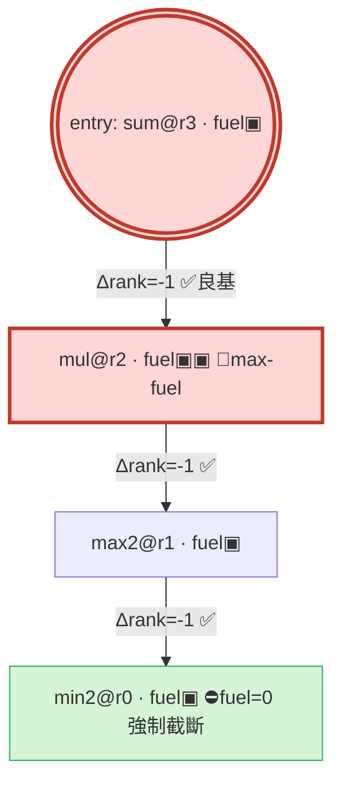

# SDD_improving_Automation_26 — Phase Y 規劃藍圖（meta⁸ 良基終止互遞迴呼叫圖人類視覺化儀表板 / 可解釋性轉向）

**主題**：暫停向 meta⁹（真圖靈完備）垂直加塔，**橫向加固**——把 Phase W 在 meta⁸ 產出的「可證良基終止（Well-Founded Termination）」與「互遞迴呼叫圖（Mutual Recursion Graph）」開發成一套**與 `RecursiveOperator` AST 同構的人類視覺化儀表板 / 拓樸結構輸出工具**，把高度抽象的算子代數與遞減計數器（Rank/Fuel）狀態，自動轉化為人類舵手一眼看懂的視覺拓樸與審批介面。核心哲學：**「再高深的數學與自治閉環，若人類掌舵者無法直觀理解與審批，即視為架構失控。」**

**徵用**：**ACT-159~161 與 Rule 9.37**（取自 `governance/ID_REGISTRY.yaml` `next_free` = act 159 / rule 9.37，單調取號）。
**建立日期**：2026-06-06
**前置基線**：Phase X 完整版收官（`_25` / tag `v2026.06.05-06`(執行) + `v2026.06.05-07`(QA)，merge `46ab481`→main；pytest **1435 passed / 4 skipped**〔non-chaos PR gate〕；chaos 34 passed〔100 輪 bounded 含 `EMBODIED_GROUNDING_FLAP`〕；五軌 TLC 全 No error：`SDD_FSM` 42 reachable / 831 distinct、`META_FSM` 13 distinct、`FLEET_FSM` 7、`COMPOSITION_FSM` 21、`OPTIMIZATION_FSM` 12；`arch_fitness` structural fail=0）
**執行紀律（鏡像 Phase X，使用者授權後生效）**：**TLA+ 先行（ACT-159）→ 五軌 TLC 全綠（META 13 distinct 不回歸 + `VisualizationBounded` PASS）→ REPORT_GATE 回報 → 再撰寫 Python 執行層（ACT-160~161）→ 測試 + chaos → QA 抓漏 + 修復 → 收官 ID 翻牌 + tag + merge**。
**絕對紀律**：禁止破壞現有五軌 TLC 全綠、禁止增加 Token 預算上限（沿用 Rule 9.2 四階）、嚴禁觸碰 meta-oracle（`embodied_grounding_oracle` 人類凍結）、不增第六形式化軌、不新增 META_FSM 狀態變數、不碰 meta⁹。

> 🔴 **編號徵用告示**（承 `ID_REGISTRY.yaml` `next_free` = act 159 / rule 9.37）：本藍圖徵用 **ACT-159~161 與 Rule 9.37**（單調取號）。**收官（ACT-161）獲 signoff 並執行至全綠時**，才由 `id_registry` 翻牌（act 159→162 / rule 9.37→9.38）+ `test_id_registry.py` 守門固化；R-9.37.yaml + RULES_INDEX + CLAUDE.md §9 禁令 #27 + INIT 一律於收官 ACT 同步。

> 🟦 **本文件三部分**：**§A** Phase Y 藍圖（GAP-Y1 動機 / 三支柱 / 架構資料流 / 降維 / 狀態漂移防護 / ACT 分解 / DoD / horizon）；**§B** ACT-159 `VisualizationBounded` TLA+ 註解 + `.cfg` 精確 diff（**供先行審閱；本份不觸 live 檔，待 signoff 後於 ACT-159 套用並跑五軌 TLC**）；**§C** `recursion_topology_view.py` 函式簽章 + `verify_topology_consistency` 介面骨架（**僅契約、不實作；待 signoff 後於 ACT-160 落地**）。

---

# §A — Phase Y 藍圖

## A.1 背景與動機（GAP-Y1：可證性遠超可審批性）

Phase L~W 把元迴圈自我演化推到 meta⁸（互遞迴自我發明 + 良基停機證書），Phase X 把評估接地到具身觀測。但所有停機證書一路是 **machine-readable / machine-verified、從未 human-auditable**：

- `operator_recursion_genesis.py` 的 `termination_certificate()` 回傳 `TerminationCertificate(terminating, acyclic, well_founded, fuel, max_cost, n_nodes, reason)`——對 TLC/pytest 是真理，對人類舵手是不可審批的咒語。
- CLAUDE.md Rule 8 要求所有 🔴 確認點人工確認、Rule 9.20.6 要求人類維持「設計環境舵手」高度；但當被審批物是一張帶 rank 的互遞迴呼叫圖，舵手**事實上只能盲簽**。

**GAP-Y1**：meta⁸ 的可證性已遠超可審批性 → 人類掌舵者被擠出迴圈 = 架構失控。Phase Y 把「可審批性」提升為與「可證性」對等的第一等公民。

## A.2 三大支柱（承既有反 Goodhart 對抗分離地基）

| 支柱 | 內容 | 對應既有機制 |
|------|------|--------------|
| **PY-1 AST 同構投影** | 渲染器是純函式 `f: RecursiveOperator.to_dict() → Mermaid/Markdown/JSON`；每個視覺元素可逆回溯到 `to_dict()` 一個欄位；**禁止任何拓樸獨立再推導** | 沿用 `steersman_renderer.py` 純函式→Markdown advisory 合約 |
| **PY-2 拓樸防偽稽核（對抗）** | `verify_topology_consistency()` 反解析渲染輸出回 (nodes,edges,ranks)，與 `to_dict()` 原圖做**圖同構斷言**；不一致 → fail-closed → MFSM_ESCALATION | 同型於 `guard_embodied_grounding`「獨立重算、不盲信標籤」 |
| **PY-3 Bulletproof 有界渲染** | render budget 硬上限（node/edge/depth/char）+ 確定性截斷 + 分頁；接地視圖無客觀觀測 → fail-closed 灰佔位不 false-green | 同型於 Phase X「沙箱硬 timeout 不 wall-clock wait」+ `EmbodiedGroundingBounded` |

> **核心紀律**：視覺化模組**結構性不 import 任何 generator**（`operator_*_genesis` / `dimension_semantics_synthesizer` / `vocabulary_genesis`）與 `embodied_grounding_oracle`；只消費**序列化 dict**（`to_dict()` / cert dict / observation dict），由 AST import 隔離斷言守。渲染器絕不自評、絕不影響 oracle/verdict、絕不寫 FSM-STATE、絕不 churn。

## A.3 架構與資料流

### A.3.1 模組佈局（新增，與既有 fsm_runtime 一致）

| 新檔 / 函式 | 角色 | 落地 ACT |
|------------|------|----------|
| `tools/fsm_runtime/recursion_topology_view.py` | 拓樸特徵抽取 + Mermaid/JSON/Markdown 渲染（純函式、deterministic、零 LLM、零外網）+ `verify_topology_consistency` | ACT-160 |
| `meta_halt/meta_halt_monitor.guard_visualization_bounded()` | render budget + 拓樸同構 fail-closed 守門（與 TLA 100% 同構） | ACT-160 |
| `steersman_renderer.render_recursion_topology_dashboard()` | 人類舵手交接 wrapper（advisory，K=1 signoff） | ACT-161 |
| `formal/META_FSM.tla` + `.cfg` | 補 `VisualizationBounded` 歸約不變量（§B） | ACT-159 |
| `chaos_runner.py` | `VISUALIZATION_FLAP` + `VISUALIZATION_TOPOLOGY_DRIFT_FLAP` + `_is_bounded` | ACT-161 |
| `governance/rules/R-9.37-*.yaml` + RULES_INDEX + CLAUDE.md §9 #27 + INIT | 治理 | ACT-161 |
| `tools/fsm_runtime/tests/test_phase_y.py` | 同構/防偽/有界/fail-closed 測試 | ACT-160~161 |

### A.3.2 資料流（meta⁸ AST → 人類審批介面）

```
 ┌─ meta⁸ 真理來源（既有，唯讀，不改）─────────────────────────────┐
 │ RecursiveOperator.to_dict()  → {name, n_nodes, fuel, combine, entry, ranks, cost,
 │                                  edges:[[i,[callees]]], terminating, acyclic,
 │                                  well_founded, probe, fingerprint}
 │ verify_recursion_closure()   → RecursionClosureReport(total, terminating, max_cost…)
 │ embodied_grounding_oracle    → GroundedVerdict(observation, oqs, baseline_oqs,
 │   .GroundedVerdict（Phase X，唯讀） sandbox_timed_out, spec_defect, grounded_verdict, reason)
 └────────────────────────────────────────────┬───────────────────────────────────────────┘
                                               │ (序列化 dict；無 generator/oracle import)
                  ┌────────────────────────────▼─────────────────────────────┐
                  │ recursion_topology_view.extract_topology(op_dict,          │
                  │      grounding, budget) → TopologyView（有界、截斷、分頁）   │
                  │   · fuel_consumed/node、critical path、Δrank/edge、folding  │
                  └────────────┬───────────────────────────┬──────────────────┘
                               │                           │
       ┌───────────────────────▼──────┐     ┌──────────────▼───────────────────────┐
       │ render → Mermaid + Markdown   │     │ verify_topology_consistency(render,   │
       │  + JSON（3 視圖：拓樸/終止/接地）│     │   op_dict) → 圖同構斷言（PY-2 防偽）   │
       └───────────────┬───────────────┘     └──────────────┬───────────────────────┘
                       │                                    │ 不一致 → raise
        ┌──────────────▼─────────────┐      ┌───────────────▼─────────────────────┐
        │ guard_visualization_bounded │──────│ fail-closed: budget 逃逸 / 拓樸漂移   │
        │ （render budget + 同構稽核）  │      │  / 零觀測 false-green → MFSM_ESCALATION│
        └──────────────┬─────────────┘      └──────────────────────────────────────┘
                       │ allowed
        ┌──────────────▼──────────────────────────────────────┐
        │ steersman_renderer.render_recursion_topology_dashboard│ → 人類 K=1 signoff（advisory）
        └──────────────────────────────────────────────────────┘
```

> **Playwright / 沙箱接地**：接地視圖之 `ExecutionObservation` 來自 `sandbox_runner.py`（`SandboxSpec.timeout_sec` 硬截斷）。本環境 `SDD_SANDBOX_BACKEND=local` → stub 零觀測 → OQS `inconclusive` → 接地視圖渲染「⚠️ 無客觀觀測（沙箱未實跑）」灰色佔位，**絕不綠勾**（複用 Phase X fail-closed）。活體 Playwright 軌跡需 HTTP，受 OPEN-10.6 封鎖 → 列 horizon（OPEN-Y.1）。

## A.4 視覺化與降維策略（確保大圖也能被人腦消化）

### A.4.1 三正交視圖（各自有界渲染，無單一視圖會爆）

**① 拓樸視圖（呼叫圖）— Mermaid**，含 critical path 高亮 + Δrank 標註：



**② 終止視圖（rank 格 / fuel 階梯）— Markdown**，良基測度嚴格遞減的視覺證明（3 種 ranking function 以多欄呈現）：

```
fuel 階梯（計數器歸零 = 強制打斷迴圈）
 node0 ▣▣▣▣ rank=3 ┐
 node1 ▣▣▣   rank=2 ├ Δrank 嚴格遞減 ⇒ 良基無環 ⇒ 必終止
 node2 ▣▣    rank=1 │
 node3 ▣     rank=0 ┘ ⛔ rank→0 ∧ fuel→0：迴圈在此被計數器強制截斷
```

**③ 接地視圖（沙箱 OQS）— Markdown**（複用 `render_embodied_grounding_proposal` 既有欄位）：OQS baseline/candidate/Δ、runtime 錯誤數、nonzero_exit、sandbox_timed_out、grounded_verdict；無觀測 → 灰佔位。

### A.4.2 降維機制（解認知超載）

| 機制 | 觸發 | 行為 |
|------|------|------|
| **Critical Path Highlighting** | 永遠 | 🔴 標 max-fuel 算子；每條回邊標 `Δrank`；fuel 階梯標 `⛔` 歸零點 |
| **Folding** | nodes > `SDD_VIZ_NODE_BUDGET`(24) | 鏈狀子圖／SCC 塌縮為 `[+k more]` 可折疊 Mermaid subgraph |
| **Bounded Truncation** | edges/depth/char 超界 | 確定性截斷（rank 升序保留最關鍵 budget 內節點）+ `truncated:true` |
| **Paginated Disclosure** | 截斷後 | `page:{cursor,total_pages}` 游標分頁，逐頁揭露，每頁有界 |

### A.4.3 JSON Schema（機讀契約，三源同出於同一 `TopologyView`）

```jsonc
{
  "schema_version": 1,
  "view": "recursion_topology",
  "operator_fingerprint": "recursion-genesis:<sha12>",
  "operator_name": "rec::mul[...]@...|n=4",
  "render_budget": { "node_budget": 24, "edge_budget": 48, "depth_max": 8, "char_budget": 8000 },
  "truncated": false,
  "page": { "cursor": 0, "total_pages": 1 },
  "termination": { "terminating": true, "acyclic": true, "well_founded": true,
                   "fuel": 4, "max_cost": 4, "n_nodes": 4,
                   "reason": "良基停機證書通過（每條呼叫邊嚴格遞減下有界 rank…）" },
  "nodes": [ { "id": 0, "base": "sum::…", "rank": 3, "fuel_consumed": 1,
               "calls": [1], "critical": false, "entry": true, "folded": false } ],
  "edges": [ { "src": 0, "dst": 1, "rank_decrement": 1, "kind": "forward", "well_founded": true } ],
  "critical_path": { "max_fuel_node": 1, "fuel_at_node": 3,
                     "longest_chain": [0,1,2,3], "break_point": "rank→0 ∧ fuel→0 @ node3" },
  "grounding": { "has_observation": false, "grounded_verdict": "inconclusive",
                 "oqs": null, "baseline_oqs": null, "runtime_errors": null,
                 "nonzero_exit": null, "sandbox_timed_out": false,
                 "note": "⚠️ 無客觀觀測（local-stub）→ fail-closed 佔位，不 false-green" },
  "consistency": { "topology_audit": "pass", "audit_digest": "sha256:…" }
}
```

## A.5 狀態漂移防護（三/四源絕對一致）

四真理來源：① TLA+（`RecursionClosureBounded` 證明）② Python（`apply()`/`termination_certificate()` 真實求值）③ 儀表板渲染（人看到的）④ 沙箱（真跑的 `ExecutionObservation`）。鐵律：**單一來源投影**——渲染器是 `to_dict()` cert 的確定性純投影，無獨立拓樸推導。

| 一致對 | 機制 | 驗收 |
|--------|------|------|
| **②Python ↔ ③渲染** | render 為 cert 的確定性全投影 | golden-file property test：同 cert → byte-stable render |
| **③渲染 ↔ ②（反向防偽）** | `verify_topology_consistency` 反解析 → 圖同構斷言 | chaos `VISUALIZATION_TOPOLOGY_DRIFT_FLAP`：竄改渲染（刪邊/偽 rank）必攔 |
| **①TLA+ ↔ ②Python** | 不改 ①②；`VisualizationBounded` 歸約 ↔ guard 100% 同構 | 五軌 TLC 全綠 + guard 路徑覆查 |
| **④沙箱 ↔ ③渲染** | 接地視圖只從真實 observation 渲染；None/inconclusive → 灰佔位 | fail-closed 守門測試（零觀測不綠勾）|

## A.6 ACT 分解（ACT-159~161，鏡像 Phase X 完整版「TLA+ 先行」）

| ACT | Pillar | 內容 | 驗收 |
|-----|--------|------|------|
| **ACT-159**（TLA+ 先行） | 形式化 | `META_FSM.tla` + `.cfg` 補 `VisualizationBounded`（§B 完整註解：read-only 不漂移 + render 有界 + 不增狀態變數）；五軌 TLC | 五軌全 `No error`；**META 13 distinct 不回歸**；SDD 831/FLEET 7/COMPOSITION 21/OPTIMIZATION 12 不變；`VisualizationBounded` PASS；**REPORT_GATE 回報**待續行 |
| **ACT-160** | 執行層 + 防偽 | `recursion_topology_view`（§C：有界 budget、folding、critical path、3 視圖、`verify_topology_consistency` 圖同構）；`guard_visualization_bounded`（render budget + 同構 fail-closed，與 TLA 100% 同構）；對抗分離 AST/import 隔離；接地視圖零觀測 fail-closed | pytest 子集綠；對抗分離斷言 PASS；同構稽核 PASS；budget 逃逸/拓樸漂移 fail-closed 守門測試 |
| **ACT-161**（收官） | 掌舵 + 治理 | `render_recursion_topology_dashboard`（K=1 advisory）；chaos `VISUALIZATION_FLAP`（10⁶ 節點圖→`_is_bounded()==True`）+ `VISUALIZATION_TOPOLOGY_DRIFT_FLAP`（竄改必攔）；治理（R-9.37.yaml + RULES_INDEX + CLAUDE.md §9 #27 + INIT + ID 翻牌 159→162 / 9.37→9.38）；`test_phase_y` + 全量 pytest | 五軌 TLC + chaos 100 輪 `bounded_ratio==1.0`（含兩新 FLAP）+ 全量 pytest 0 回歸；`id_registry validate [OK]` |

## A.7 Self-Verification（15 算子 / 多重環 / 3 ranking function 極端案例）

| 驗收點 | 設計行為 | 結果 |
|--------|----------|------|
| **不卡死 / token 不爆炸** | 15（或 10⁶）節點 → 渲染器**不假設輸入有界**，套自身 `SDD_VIZ_NODE_BUDGET=24` 截斷 + folding + 分頁；`VISUALIZATION_FLAP` 驗 `_is_bounded()==True` | ✅ 有界、確定性截斷、`truncated:true` + 分頁 |
| **看出哪算子吃最多 fuel** | per-node `fuel_consumed`，🔴 critical 標 max-fuel；JSON `critical_path.max_fuel_node` | ✅ 一眼可見 |
| **看出迴圈如何在計數器歸零打斷** | fuel 階梯標 `⛔ rank→0 ∧ fuel→0 @ node_k`；回邊標 `Δrank` 嚴格遞減 ⇒ 良基無環 ⇒ 必終止 | ✅ 良基測度遞減可視化 |
| **3 種 ranking function** | rank 渲染為 per-node 字典序測度，終止視圖多欄分列三遞減條件 | ✅ 全部嚴格遞減可視 |
| **防視覺欺騙（畫≠跑）** | `verify_topology_consistency` 反解析→圖同構；`VISUALIZATION_TOPOLOGY_DRIFT_FLAP` 注入竄改必攔 | ✅ fail-closed |

## A.8 紅線禁令（R-9.37 草案，併入 CLAUDE.md §9 絕對禁令 #27）

> `recursion_topology_view` / `guard_visualization_bounded` 自動 signoff 納入繞過人工 K=1、視覺化模組**寫 FSM-STATE / 影響 churn / 影響 meta-loop 狀態**（破 read-only）、**import 任何 generator 或 `embodied_grounding_oracle` 並影響其輸出**（破對抗分離）、**渲染拓樸與 `to_dict()` 不同構卻放行**（破 PY-2 拓樸防偽——視覺欺騙：畫的圖比跑的更良基/更簡單）、`guard_visualization_bounded` 盲信 renderer 輸出標籤而不獨立從 `to_dict()` 反解析重算圖比對、**渲染逃逸 render budget 造成 token 爆炸 / OOM**（破 `VisualizationBounded`——可審批性的停機反諷：為讓人類看懂而引入「渲染無界大圖可能爆炸」這個新不停機源，須有界截斷 + 分頁而非無界渲染）、**接地視圖以零觀測 false-green 渲染綠勾**（破 Phase X fail-closed 接地）、把 visualization 元迴圈併入單軌 `SDD_FSM.tla` 或新增第六軌污染五軌 reachable、未經 OPEN-Y.x 私自開 HTTP 外聯做活體 Playwright 軌跡渲染（破 OPEN-10.6）、或藉視覺化「簡化呈現」實質繞過 meta⁹ / meta-oracle 紅線。

R-9.37.yaml 骨架（鏡像 `R-9.36`）：`trigger_states: [LEARNING_COMMIT, MEMORY_CONSOLIDATION]`、`severity: high`、`maturity: active`、`test_ref: tools/fsm_runtime/tests/test_phase_y.py`、`scaffold_roi:{fire_count:0,catch_count:0,false_positive_count:0}`。

## A.9 DoD（Definition of Done）

**技術實作**
- [ ] `recursion_topology_view.py`：純函式、deterministic、零 LLM、零外網；3 視圖；critical path + folding + bounded truncation + pagination
- [ ] `guard_visualization_bounded`：render budget 守門 + `verify_topology_consistency` 圖同構 fail-closed；接地視圖零觀測 fail-closed
- [ ] `render_recursion_topology_dashboard`：advisory、K=1 signoff、沿用既有 render_* Markdown 合約
- [ ] env 旋鈕：`SDD_VIZ_NODE_BUDGET`(24)/`SDD_VIZ_EDGE_BUDGET`(48)/`SDD_VIZ_DEPTH_MAX`(8)/`SDD_VIZ_CHAR_BUDGET`(8000)，皆 clamp、有預設

**形式化同構**
- [ ] `VisualizationBounded` 入 `META_FSM.tla` + `.cfg`（採 §B Option B；舵手如選 Option A 則以結構論證文件取代）
- [ ] 五軌 TLC 全 `No error`；**META 13 distinct 不回歸**；SDD 831/FLEET 7/COMPOSITION 21/OPTIMIZATION 12 不變
- [ ] `guard_visualization_bounded` 逐路徑覆查 ↔ `VisualizationBounded` 100% 同構（無 fail-open）

**對抗分離 + 防偽**
- [ ] AST import 隔離斷言：`recursion_topology_view` / `guard_visualization_bounded` 不 import 任何 generator / `embodied_grounding_oracle`
- [ ] golden-file property test：同 cert → byte-stable render（②↔③）
- [ ] topology-consistency 反解析圖同構測試（③↔②）

**Token 預算稽核**
- [ ] chaos `VISUALIZATION_FLAP`：10⁶ 節點對抗圖 → 渲染終止、輸出 ≤ char_budget、`_is_bounded()==True`
- [ ] chaos `VISUALIZATION_TOPOLOGY_DRIFT_FLAP`：竄改渲染 100% 被稽核攔下
- [ ] chaos 100 輪 `bounded_ratio==1.0`（含兩新 FLAP）；不增 Token 預算上限

**UI/UX 審批 + 治理收官**
- [ ] Self-Verification 15 算子案例：舵手可指認 max-fuel 算子 + 迴圈計數器歸零打斷點 + 3 ranking function 遞減
- [ ] 無客觀觀測 → 灰佔位不綠勾；渲染 advisory，**絕不自動 signoff / commit / 寫 FSM-STATE**
- [ ] R-9.37.yaml + RULES_INDEX + CLAUDE.md §9 #27 + INIT 同步；ID 翻牌 159→162 / 9.37→9.38；`id_registry validate [OK]`
- [ ] `test_phase_y` + 全量 pytest（1435 基線 → 新增全綠、4 skip 不變、0 回歸）；`arch_fitness` structural fail=0
- [ ] 獨立 QA（或對抗式 self-QA）0 BLOCKER；`_25` slice → archive、`_26` → active；tag + merge main + push

## A.10 誠實 Horizon

- **OPEN-Y.1 活體 Playwright 軌跡**：接地視圖 observation 維持本地/docker no-HTTP（守 OPEN-10.6）；活體瀏覽器軌跡渲染需 HTTP，需放寬 OPEN-10.6，承 OPEN-X.x 列 horizon。
- **OPEN-Y.2 不碰 meta⁹ / meta-oracle**：Phase Y 是橫向可解釋性加固；**嚴禁藉「簡化視覺呈現」實質繞過 meta⁹（R-9.35.5 紅線）/ meta-oracle 自演化（人類凍結）**（已入 §A.8 禁令）。
- **OPEN-Y.3 互動式儀表板**：本份產出靜態 Markdown/Mermaid/JSON（git-friendly、可審批、可 diff）；互動式 Web UI 列 horizon，需另評渲染端不停機源。

---

# §B — ACT-159 `VisualizationBounded` TLA+ 註解 + `.cfg` 精確 diff（供先行審閱）

> ⚠️ **本份不觸 live 檔**。以下為 ACT-159 待套用之精確 diff，供舵手先行審閱；signoff 後才於 ACT-159 套用並跑五軌 TLC 驗 `META 13 distinct 不回歸`。

## B.1 設計決策：是否需要新 `VisualizationBounded` 證明？

視覺化是 **read-only 投影、永不 churn**，但引入了新不停機源（渲染無界圖）。在「不增狀態變數、META 13 distinct」鐵律下，只能用 `<<mstate, churn, cap>>` 三變數表達。

| | Option A（純結構論證，不動 TLA+） | **Option B（推薦：加歸約不變量）** |
|---|---|---|
| 形式化新不停機源（渲染爆炸） | ❌ 僅 runtime guard | ✅ 有形式化家（與 P~X 一致） |
| 形式化「read-only 不漂移」安全性質 | ❌ | ✅ |
| 破壞五軌綠風險 | 0 | 極低（不增狀態變數，13 distinct 不回歸；同 ACT-156 已驗同型） |
| 文化一致性 | 低（首次不為新機制加 Bounded） | 高 |

**作者推薦 Option B**：`VisualizationBounded == churn <= MAX_CHURN` 之歸約恆真的**理由比 genesis 更強**（read-only ⇒ churn 永不變動 ⇒ ≤ MAX_CHURN），而此「更強理由」本身正是要斷言的安全性質：**儀表板是純觀察者，渲染不會漂移 meta-loop 狀態**。緊語意（render-output 有界截斷 + 拓樸同構稽核 + 零觀測 fail-closed）由 `guard_visualization_bounded` + chaos enforce。

## B.2 `META_FSM.tla` diff（插入點：`EmbodiedGroundingBounded`〔現 line 359〕之後、`ReadoptGated`〔現 line 361〕之前）

```diff
 EmbodiedGroundingBounded == churn <= MAX_CHURN
 
+(* Phase Y / ACT-159 — VisualizationBounded（Rule 9.37，可審批性渲染有界停機）.        *)
+(* Phase L~X 把元迴圈自我演化推到 meta⁸ + 具身接地，但其全部停機證書（良基 ranking      *)
+(* function、fuel、grounded-verdict）一路 machine-readable / machine-verified、**從未      *)
+(* human-auditable**——當被人類 K=1 signoff 的是一張帶 rank 的互遞迴呼叫圖時，舵手事實上 *)
+(* 只能盲簽（GAP-Y1：可證性遠超可審批性）。Phase Y 開發一套與 RecursiveOperator AST      *)
+(* 同構的視覺化儀表板（recursion_topology_view），把算子代數 + rank/fuel 轉成人類看得懂   *)
+(* 的拓樸/終止/接地三視圖。儀表板是元迴圈狀態的 **read-only 投影**，結構性永不 churn      *)
+(* （churn UNCHANGED ≤ MAX_CHURN 恆真）——此歸約恆真的理由比 genesis 各 *Bounded 更強：    *)
+(* read-only ⇒ 渲染不漂移 meta-loop 狀態，這正是要斷言的安全性質「儀表板是純觀察者」。    *)
+(* 每個視覺化事件為一個 `visualization:` 命名空間指紋（若未來涉採納），與既有 SLV/scorer- *)
+(* profile/value-dimension/vocab/operator/alphabet/depth/recursion/embodied-grounding 共用 *)
+(* 本軌同一 churn 預算（**不增第六軌、不新增狀態變數**，故本軌 reachable 計數不回歸——維持 *)
+(* <<mstate, churn, cap>> 三變數 / 13 distinct）。                                          *)
+(* 註：可審批性的停機反諷在於——為讓人類看懂而引入「渲染無界大圖可能 token 爆炸 / OOM」   *)
+(* 這個新不停機源（同 Phase X「真實沙箱可能 hang」結構）。故與 churn 正交的『渲染有界停機』*)
+(* 緊語意——(i) render-output 受 render budget（node/edge/depth/char）硬截斷 + 分頁，逃逸    *)
+(* fail-closed；(ii) verify_topology_consistency 反解析渲染回 (nodes,edges,ranks) 與        *)
+(* to_dict() 原圖圖同構斷言，不一致（視覺欺騙）→ fail-closed → MFSM_ESCALATION；(iii) 接地  *)
+(* 視圖無客觀 ExecutionObservation → 灰佔位不 false-green（複用 Phase X fail-closed）——是   *)
+(* **更緊的 runtime/結構精煉**，由 meta_halt_monitor.guard_visualization_bounded +          *)
+(* recursion_topology_view 有界渲染 + chaos(VISUALIZATION_FLAP / VISUALIZATION_TOPOLOGY_     *)
+(* DRIFT_FLAP) enforce/驗收；本軌的 single-counter 抽象刻意不展開渲染維度，故在此記為對既有 *)
+(* 界的形式化強化引用（恆真，不增狀態/變數）。Phase Y 是橫向可解釋性加固，不碰 meta⁹、     *)
+(* 不碰 meta-oracle。                                                                     *)
+VisualizationBounded == churn <= MAX_CHURN
+
 (* ESCALATION 非過早：進入元迴圈停機點必因 churn 或 cap 預算耗盡。*)
 ReadoptGated == (mstate = "MFSM_ESCALATION") => (churn = MAX_CHURN \/ cap = MAX_CAP)
```

## B.3 `META_FSM.cfg` diff（插入點：INVARIANT 區塊 `EmbodiedGroundingBounded`〔現 line 38〕之後）

```diff
     RecursionGenesisBounded
     RecursionClosureBounded
     EmbodiedGroundingBounded
+    VisualizationBounded
 
 \* Liveness：元迴圈最終必抵不動點 MFSM_STABLE 或人工閘 MFSM_ESCALATION（不永久 churn）。
 PROPERTY
     EventuallyMetaStable
```

## B.4 ACT-159 驗收（套用後跑五軌 TLC 須滿足）

- 五軌全 `No error`（exit 0）。
- `META_FSM` 仍 **13 distinct**（不增狀態變數 ⇒ reachable 不回歸）+ `VisualizationBounded` 列入 INVARIANT 且 PASS。
- 其餘四軌 distinct 不變（SDD 831 / FLEET 7 / COMPOSITION 21 / OPTIMIZATION 12）。
- REPORT_GATE 回報 TLA+ 進度，待舵手綠燈再推 ACT-160~161。

---

# §C — `recursion_topology_view.py` 函式簽章 + `verify_topology_consistency` 介面骨架（僅契約、不實作）

> ⚠️ **本份為契約骨架（僅簽章 + docstring + `raise NotImplementedError`）**，供先行審閱；待 signoff 後於 ACT-160 落地為 live 模組。型別/欄位已對齊 `RecursiveOperator.to_dict()` / `TerminationCertificate` / `output_quality_scorer.ExecutionObservation` / `embodied_grounding_oracle.GroundedVerdict`。

## C.1 `tools/fsm_runtime/recursion_topology_view.py`（契約）

```python
"""Phase Y / ACT-160 — Recursion Topology View（meta⁸ 互遞迴呼叫圖人類視覺化，契約骨架）.

⚠️ 契約骨架：僅簽章 + docstring，待 ACT-160 signoff 後實作。對應藍圖 _26.md §A/§C；Rule 9.37。

對抗分離（Rule 9.37，承 Phase X）：本模組結構性**不 import** 任何 generator
（operator_*_genesis / dimension_semantics_synthesizer / vocabulary_genesis）與
embodied_grounding_oracle——只消費序列化 dict（RecursiveOperator.to_dict() / cert dict /
ExecutionObservation dict）。純函式、deterministic、零 LLM、零外網、零 FSM-STATE 寫入。
"""
from __future__ import annotations

import os
from dataclasses import dataclass
from typing import Mapping, Optional, Tuple

# render budget 預設（env 可調、clamp 保護；緊語意 = VisualizationBounded runtime enforce）
_DEFAULT_NODE_BUDGET = 24      # SDD_VIZ_NODE_BUDGET   clamp[4, 256]
_DEFAULT_EDGE_BUDGET = 48      # SDD_VIZ_EDGE_BUDGET   clamp[4, 512]
_DEFAULT_DEPTH_MAX = 8         # SDD_VIZ_DEPTH_MAX     clamp[2, 32]
_DEFAULT_CHAR_BUDGET = 8000    # SDD_VIZ_CHAR_BUDGET   clamp[1000, 65536]


@dataclass(frozen=True)
class RenderBudget:
    """渲染有界預算（PY-3 bulletproof 渲染 / VisualizationBounded 緊語意）。"""
    node_budget: int = _DEFAULT_NODE_BUDGET
    edge_budget: int = _DEFAULT_EDGE_BUDGET
    depth_max: int = _DEFAULT_DEPTH_MAX
    char_budget: int = _DEFAULT_CHAR_BUDGET


def render_budget() -> RenderBudget:
    """讀 SDD_VIZ_* env（皆 clamp，有預設）構造 RenderBudget。"""
    raise NotImplementedError("ACT-160 契約骨架")


@dataclass(frozen=True)
class TopoNode:
    """拓樸節點（投影自 RecursiveOperator.to_dict() 的 ranks/edges + base）。"""
    id: int
    base: str                 # nodes[i].base.name 短名
    rank: int                 # to_dict()["ranks"][i]
    fuel_consumed: int        # 該節點在 apply 走訪中消耗的 fuel（critical path 用）
    calls: Tuple[int, ...]    # to_dict()["edges"][i][1]
    critical: bool = False    # 是否為 max-fuel 算子（🔴）
    entry: bool = False       # i == to_dict()["entry"]
    folded: bool = False      # folding 塌縮 super-node 標記


@dataclass(frozen=True)
class TopoEdge:
    """拓樸邊（投影自 to_dict()["edges"]；rank_decrement = rank[src]-rank[dst]）。"""
    src: int
    dst: int
    rank_decrement: int       # > 0 ⇒ 良基（嚴格遞減）
    kind: str                 # "forward" | "back-candidate" | "folded"
    well_founded: bool        # rank[dst] < rank[src]


@dataclass(frozen=True)
class CriticalPath:
    max_fuel_node: int
    fuel_at_node: int
    longest_chain: Tuple[int, ...]
    break_point: str          # e.g. "rank→0 ∧ fuel→0 @ node3"


@dataclass(frozen=True)
class GroundingView:
    """接地視圖（投影自 embodied_grounding_oracle.GroundedVerdict 及其 .observation；零觀測 fail-closed）。"""
    has_observation: bool
    grounded_verdict: str                 # grounded_pass/grounded_fail/spec_defect/inconclusive
    oqs: Optional[float]
    baseline_oqs: Optional[float]
    runtime_errors: Optional[int]
    nonzero_exit: Optional[bool]
    sandbox_timed_out: bool
    note: str = ""


@dataclass(frozen=True)
class TopologyView:
    """有界、可分頁、可稽核的拓樸投影（三視圖共用單一來源；PY-1 AST 同構）。"""
    operator_fingerprint: str
    operator_name: str
    budget: RenderBudget
    truncated: bool
    page_cursor: int
    total_pages: int
    termination: Mapping[str, object]     # TerminationCertificate 投影（terminating/…/reason）
    nodes: Tuple[TopoNode, ...]
    edges: Tuple[TopoEdge, ...]
    critical_path: CriticalPath
    grounding: GroundingView
    audit_digest: str = ""                # sha256(正規化 (nodes,edges,ranks))，供 PY-2 稽核


def extract_topology(
    op_dict: Mapping[str, object],
    *,
    grounding: Optional[Mapping[str, object]] = None,
    budget: Optional[RenderBudget] = None,
    page_cursor: int = 0,
) -> TopologyView:
    """從 RecursiveOperator.to_dict() 抽取**有界**拓樸特徵（PY-1 AST 同構投影 + PY-3 有界）.

    · 不假設輸入來自有界文法（防禦縱深：對抗者可餵 10⁶ 節點圖）→ 一律套 budget 截斷 + 分頁。
    · 計算 per-node fuel_consumed、critical path（max-fuel 算子）、每邊 rank_decrement。
    · nodes > node_budget → folding 塌縮 + truncated=True + total_pages 分頁。
    · grounding 為 None / inconclusive → GroundingView fail-closed 灰佔位（不 false-green）。
    · audit_digest = 正規化圖指紋，供 verify_topology_consistency 反向稽核。
    **絕不 import generator/oracle、絕不寫盤、絕不 churn。**
    """
    raise NotImplementedError("ACT-160 契約骨架")


def render_mermaid(view: TopologyView) -> str:
    """① 拓樸視圖：Mermaid flowchart，critical path 高亮 + 每邊 Δrank 標註 + fuel=0 ⛔。有界。"""
    raise NotImplementedError("ACT-160 契約骨架")


def render_termination_ladder(view: TopologyView) -> str:
    """② 終止視圖：rank 格 / fuel 階梯 Markdown，良基測度嚴格遞減的視覺證明（多 ranking 多欄）。"""
    raise NotImplementedError("ACT-160 契約骨架")


def render_grounding_panel(view: TopologyView) -> str:
    """③ 接地視圖：沙箱 OQS baseline/candidate/Δ + runtime 錯誤 Markdown；零觀測灰佔位不綠勾。"""
    raise NotImplementedError("ACT-160 契約骨架")


def render_json(view: TopologyView) -> dict:
    """機讀 JSON（schema_version=1，見 _26.md §A.4.3）；與 Mermaid/Markdown 同出於同一 view。"""
    raise NotImplementedError("ACT-160 契約骨架")


# --- PY-2 拓樸防偽稽核（對抗：渲染圖 ≠ 真跑圖 → fail-closed）---

class TopologyConsistencyError(RuntimeError):
    """PY-2：渲染輸出反解析後與 to_dict() 原圖不同構（視覺欺騙）→ fail-closed → MFSM_ESCALATION。"""


def verify_topology_consistency(
    render_json_obj: Mapping[str, object],
    op_dict: Mapping[str, object],
) -> bool:
    """反解析渲染 JSON → (nodes, edges, ranks)，與 op_dict 原圖做**圖同構斷言**（PY-2 防偽）.

    · 同型於 guard_embodied_grounding「獨立重算、不盲信 renderer 標籤」：稽核器**不信任**渲染，
      獨立從 op_dict["edges"]/["ranks"] 重建正規化圖指紋，與 render_json_obj 反解析圖比對。
    · 一致 → True；不一致（節點/邊/rank 集合相異、被偷偷簡化/刪邊/偽 rank）→
      raise TopologyConsistencyError（呼叫端轉 MFSM_ESCALATION）。
    · 純函式、deterministic、零 import generator/oracle。
    """
    raise NotImplementedError("ACT-160 契約骨架")
```

## C.2 `meta_halt/meta_halt_monitor.guard_visualization_bounded`（契約，與 TLA 100% 同構）

```python
@dataclass
class VisualizationGuardResult:
    allowed: bool             # 全部通過 → True（可呈現給舵手 signoff）
    truncated: bool
    n_rendered_nodes: int
    audit_ok: bool
    reason: str = ""


class VisualizationViolation(RuntimeError):
    """Rule 9.37 VisualizationBounded fail-closed（→ MFSM_ESCALATION）。"""


def guard_visualization_bounded(view, op_dict) -> VisualizationGuardResult:
    """Rule 9.37 VisualizationBounded 守門——與 TLA+ VisualizationBounded **100% 同構** fail-closed 三段：

      (i)  **render budget 不可逃逸**：render_json 字元數 > char_budget，或 nodes > node_budget 而
           view.truncated 為 False（宣稱未截斷卻超界）→ raise VisualizationViolation。
      (ii) **拓樸同構**：呼叫 verify_topology_consistency(render_json(view), op_dict)；不同構（視覺
           欺騙）→ raise（guard 自證，不盲信 renderer 標籤）。
      (iii)**接地不 false-green**：grounding.grounded_verdict == "grounded_pass" 但 has_observation
           為 False（零觀測卻綠）→ raise（複用 Phase X 接地 fail-closed）。

    全通過 → VisualizationGuardResult(allowed=True…)。惰性 import recursion_topology_view；**不**
    import 任何 generator / embodied_grounding_oracle（對抗分離）。
    """
    raise NotImplementedError("ACT-160 契約骨架")
```

## C.3 `steersman_renderer.render_recursion_topology_dashboard`（契約，沿用 render_* 合約）

```python
def render_recursion_topology_dashboard(view, *, capability: str = "互遞迴自我發明能力") -> str:
    """Phase Y 舵手介面：把 meta⁸ 良基終止互遞迴呼叫圖渲染為人類 K=1 signoff 儀表板（advisory）.

    組合 render_mermaid + render_termination_ladder + render_grounding_panel 為單一 Markdown 交接，
    把舵手抬到「可審批 meta⁸ 終止證書」的高度——不必讀程式碼即可看出：呼叫圖拓樸、哪算子吃最多
    fuel（🔴 critical）、迴圈如何在 rank→0 ∧ fuel→0 被強制打斷、具身接地是否退步。

    沿用既有 render_* 合約：**純函式 → Markdown、advisory、絕不自動 signoff / commit / 寫 FSM-STATE**；
    呈現前須過 guard_visualization_bounded（budget + 同構 + 接地 fail-closed）。
    """
    raise NotImplementedError("ACT-161 契約骨架")
```

---

**藍圖狀態**：✅ **已執行收官**（2026-06-06，舵手 signoff：Option B / ACT-159~161 / budget 預設）。

## §D — 執行收官結果（2026-06-06）

- **ACT-159（TLA+ 先行）**：`META_FSM.tla` + `.cfg` 補 `VisualizationBounded`；五軌 TLC 全 `No error`、**META 13 distinct 不回歸**（SDD 831 / FLEET 7 / COMPOSITION 21 / OPTIMIZATION 12）；REPORT_GATE 回報獲綠燈。
- **ACT-160**：`recursion_topology_view.py`（extract_topology / 3 視圖 / render_json / **verify_topology_consistency 拓樸防偽**〔窗格錨定只採信任來源 op_dict + 服務端權威 budget，攔丟節點/縮窗/空渲染/偽 budget-cursor 的「畫的圖比跑的簡單」〕）+ `guard_visualization_bounded`（與 TLA 100% 同構 fail-closed：真實大小誠實 + render budget + 拓樸同構 + 接地零觀測 false-green）+ 對抗分離 AST 隔離。
- **ACT-161**：`render_recursion_topology_dashboard`（K=1 advisory）+ chaos `VISUALIZATION_FLAP`（10⁶ 節點有界截斷）/ `VISUALIZATION_TOPOLOGY_DRIFT_FLAP`（竄改必攔）+ 治理（R-9.37.yaml + RULES_INDEX + CLAUDE.md §9 #27 + 速查表 + INIT + ID 翻牌 159→162 / 9.37→9.38）。
- **驗收**：pytest **1473 passed / 4 skipped / 0 回歸**（基線 1435 → +38 test_phase_y）；chaos **34 passed**（100 輪 bounded 含兩新 FLAP）；五軌 TLC 全 `No error`、META 13 distinct；`id_registry validate [OK]`。
- **QA**：兩輪獨立 general-purpose 子代理對抗稽核 → M-1（verify fail-open，採信不可信 render 欄位）+ m-1（空 dict false-green）+ m-2（死碼）+ m-3（錯字）+ BYPASS-1/2/3+（偽 budget/cursor 自洽縮窗）+ OBSERVATION（手構惡意 view）**全修復 + 全綠複驗**；最終終驗 render_json 攻擊面 10/10 BLOCKED、無殘留繞過 PASS。
- **歸檔**：`_25`（Phase X）+ `_25_WORKFLOW` 已 `git mv` 入 `build/planning/archive/`。
