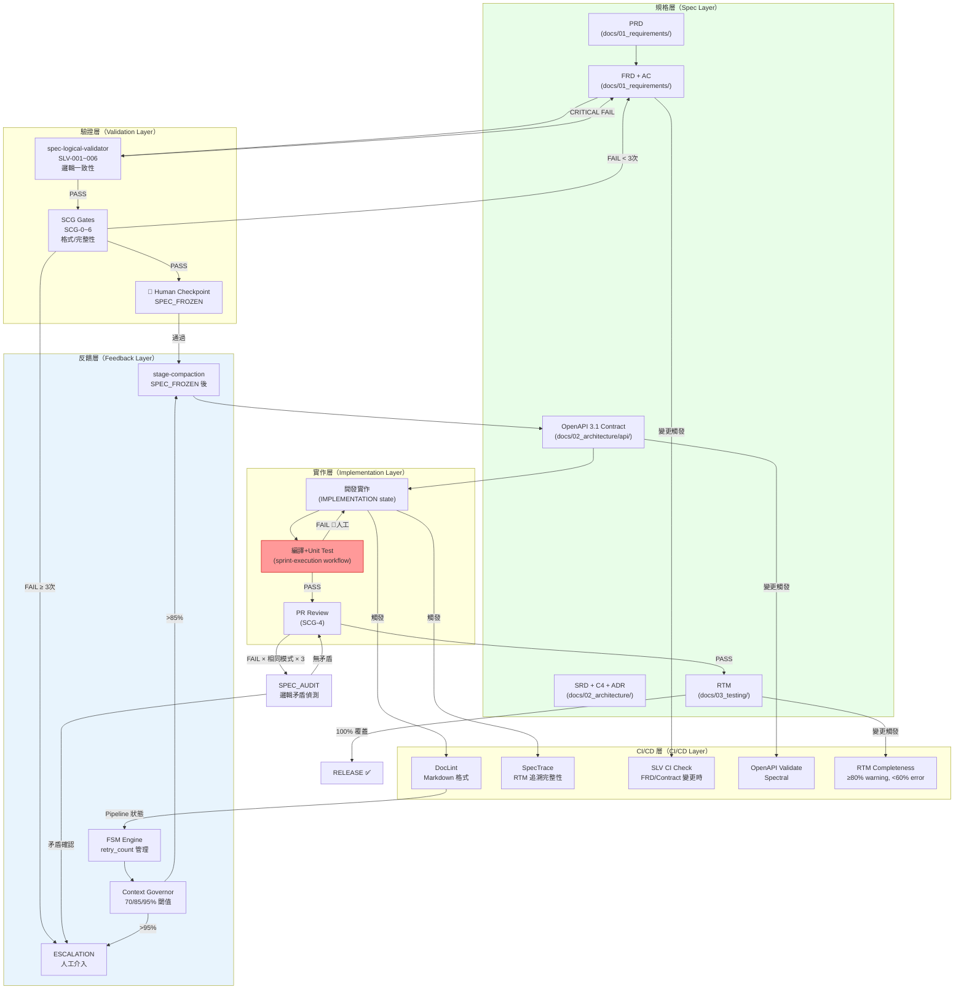

# SDD 自動化閉環架構健檢報告
# SDD Closed-Loop Architectural Audit — Automation_02

**版本**: v1.0
**建立日期**: 2026-04-19
**文件類型**: 架構健檢規劃文件（Architectural Audit）
**評審角色**: 軟體架構師（Martin Fowler 風格）
**基於版本**: AISDLC-SDD v0.01（Phase A 閉環防護強化後）
**前置文件**: `SDD_improving_Automation_01.md`（Phase A/B 閉環元件建立）

---

## 壹、架構健檢摘要（Architectural Health Summary）

### 1.1 總體評分

| 面向 | 評分（/10） | 說明 |
|------|-----------|------|
| **Spec 作為單一真理來源** | 8.5 | RTM + SCG + SLV 三層保護強健，但 SCG 編號跨文件不一致 |
| **AI 生成程式碼與測試的能力** | 5.0 | 框架定義「要生成什麼」但未定義「如何自動生成」——缺少 Code Gen 閉環 |
| **測試結果自動化反饋** | 4.0 | CI/CD 有測試執行步驟，但測試失敗結果無法**自動** feed 回 AI 修正迴路 |
| **AI 自我修正能力** | 6.5 | FSM retry_budget 設計紮實，但 IMPLEMENTATION 階段的自我修正是人工驅動 |
| **有界停機（Bounded Termination）** | 9.0 | ESCALATION/TERMINATED/Token Budget 三重保護，設計最為成熟 |
| **節點間 I/O 標準化** | 6.0 | 報告格式為 Markdown，缺少機器可讀的結構化 schema |
| **整體閉環完整性** | 6.2 | Spec→Validate→Human Approve 路徑紮實；Implement→Test→AI Fix 仍是弱環 |

### 1.2 核心發現

**最強設計**：FSM 形式化狀態機 + retry_budget + ESCALATION 三層保護，成功解決了 Phase A 識別的「無限迴圈」問題。

**最大缺口**：閉環定義的第 3、4 點（測試結果自動反饋給 AI、AI 自動修正程式碼）目前是**概念性規格**，缺乏可執行的技術橋接機制。換言之，Spec→Code 段是文件驅動的，而 Test→Fix 段是人工驅動的——這兩個半圓尚未接合。

**緊急一致性問題**：`AISDLC_SDD_INIT.md` 與 `SDD_SPEC_FIRST_GATE.md` 的 SCG 編號定義存在系統性衝突（SCG-0 vs SCG-1 起點，內容完全不同），這是操作性的 Breaking Change。

---

## 貳、資料流與反饋路徑圖（Data Flow & Feedback Path）

### 2.1 現有閉環資料流（Mermaid.js）



### 2.2 反饋路徑完整性分析

| 反饋路徑 | 自動化程度 | 問題 |
|---------|-----------|------|
| Spec 邏輯錯誤 → SLV → 阻塞 SCG | ✅ 全自動 | 僅限文件層面，無 runtime 檢測 |
| SCG 格式失敗 → retry_count → ESCALATION | ✅ 全自動 | retry_count 存儲機制未明定 |
| PR Review 失敗 → SPEC_AUDIT → 矛盾偵測 | ✅ 全自動 | SPEC_AUDIT 無次數限制（潛在震盪點） |
| 編譯失敗 → AI 修正 | 🔴 **人工驅動** | FSM 無 COMPILE_FAIL 狀態 |
| 單元測試失敗 → Spec 比對 → AI 修正 | 🔴 **人工驅動** | 缺少 TestResult→SpecRef 自動映射 |
| CI/CD 失敗 → FSM 狀態更新 | 🟡 部分 | 僅 Token Budget Check 輸出 Warning |
| RTM 覆蓋不足 → 阻塞 Pipeline | 🟡 部分 | <60% 才中斷，80~60% 僅警告 |
| 生產監控指標 → Spec 回饋 | 🔴 **完全缺失** | 無 SLO 違反 → PBS 更新機制 |

---

## 參、漏洞與脆弱點分析（Vulnerability Analysis）

### 3.1 CRITICAL 級問題

#### VUL-001：SCG 編號跨文件系統性衝突

**位置**：`AISDLC_SDD_INIT.md` vs `AISDLC_SDD_v0.01/workflow/sdd-spec-first-gate/SDD_SPEC_FIRST_GATE.md`

**問題描述**：
```
INIT.md 定義（CLAUDE.md 採用此版本）：
  SCG-0 = 需求凍結前（PRD/FRD）
  SCG-1 = 設計凍結前（SRD + API Spec）
  SCG-3 = Contract Freeze（OpenAPI 3.1）
  SCG-4 = PR Review（實作一致性）

SDD_SPEC_FIRST_GATE.md 定義：
  SCG-1 = Requirement Spec Gate（FRD 完成前）
  SCG-2 = Architecture Spec Gate（SRD）
  SCG-3 = API Contract Gate
  SCG-4 = Test Strategy Gate  ← 與 INIT.md 衝突！
  SCG-5 = Security Spec Gate  ← INIT.md 的 SCG-5 是 RTM！
```

**影響**：Agent 執行 SCG-4 時，兩份文件給出不同的驗證標準，造成操作歧義。任何依賴 SCG 編號的 CI/CD 腳本都可能驗證錯誤的文件。

**嚴重程度**：🔴 CRITICAL — 這是 Single Source of Truth 原則的直接違反。

---

#### VUL-002：IMPLEMENTATION 階段不在 FSM 覆蓋範圍內

**位置**：`SDD_FSM_ENGINE.md`（IMPLEMENTATION 狀態定義）vs `sprint-execution.md`（實際執行流程）

**問題描述**：
FSM 定義 IMPLEMENTATION 為一個黑盒 workstate，缺少子狀態：
```
FSM 看到的：SPEC_FROZEN → IMPLEMENTATION → PR_REVIEW

實際發生的：
  IMPLEMENTATION:
    → 開發 → 編譯失敗 → 修正 → 重新編譯 → ...
    → 單元測試失敗 → 查閱 AC → 修正實作 → ...
    → 整合測試失敗 → 可能是 Spec 問題？或實作問題？
```

**影響**：編譯失敗、測試失敗的 retry 次數未被 FSM 追蹤。若 AI 在 IMPLEMENTATION 內無限迴圈（例如：錯誤理解 AC → 修正 → 測試失敗 → 再修正），FSM 不會觸發 ESCALATION。

**嚴重程度**：🔴 CRITICAL — 閉環在 IMPLEMENTATION 階段是開放的（Open Loop）。

---

#### VUL-003：測試結果無法自動映射回 Spec 節點

**位置**：`sprint-execution.md`（步驟 2-3）、`SDD_FSM_ENGINE.md`（PR_REVIEW 狀態）

**問題描述**：
當單元測試或整合測試失敗時，系統無法自動判斷：
- 失敗原因是**實作錯誤**（需修正程式碼）
- 失敗原因是**AC 邏輯錯誤**（需更新 Spec）
- 失敗原因是**測試本身的前置條件問題**（SLV-005 範疇）

目前路徑：Test Fail → 人工判斷 → 手動修正

缺失的路徑：Test Fail → 自動查詢 RTM[test_id].ac_id → 比對 FRD[ac_id] → AI 決策修正方向

**嚴重程度**：🔴 CRITICAL — 這是閉環定義第 3、4 點的核心缺口。

---

#### VUL-004：retry_count 狀態的持久化機制未定義

**位置**：`SDD_FSM_ENGINE.md`（所有 gatekeep 狀態）

**問題描述**：
FSM 定義了 retry_count 的增減規則，但未定義：
1. retry_count **存儲在哪裡**（記憶體？文件？build/reports/?）
2. Session 中斷後（HUMAN_PENDING 跨 conversation），**如何讀取上次的 retry_count**
3. SPEC_FROZEN 重置 retry_count 時，**歷史記錄是否保留**（防止策略性重置）

CONTEXT_SNAPSHOT 雖然記錄 retry_count，但僅在 TERMINATED 時產出。正常 HUMAN_PENDING 跨 session 時，retry_count 可能丟失並重置為 0。

**嚴重程度**：🟡 HIGH — 正常跨 session 場景即可觸發此問題。

---

### 3.2 HIGH 級問題

#### VUL-005：SPEC_AUDIT 無次數限制，存在震盪風險

**位置**：`SDD_FSM_ENGINE.md`（SPEC_AUDIT 狀態）

**問題描述**：
```
PR_REVIEW（相同模式 × 3） → SPEC_AUDIT → 無矛盾 → PR_REVIEW（retry_count 重置）
→ 再次相同模式 × 3 → SPEC_AUDIT → ...（無限震盪）
```

SPEC_AUDIT 發現「無矛盾」時重置 retry_count，但如果失敗根本原因是**實作品質而非 Spec 邏輯**，系統會持續在 PR_REVIEW ↔ SPEC_AUDIT 之間震盪，每次都重置計數器。

**嚴重程度**：🟡 HIGH — 在特定場景下可繞過 retry_budget 保護。

---

#### VUL-006：CI/CD 失敗與 FSM 狀態更新缺少橋接

**位置**：`SDD_CICD_BASE_LAYER.md`（Token Budget Check 步驟）

**問題描述**：
CI/CD Pipeline 有多個驗證步驟，但其結果**不會自動更新 FSM 的 retry_count**：
- DocLint 失敗：Pipeline 中斷，但 FSM 不知道
- SpecTrace 失敗：僅警告，FSM 無感
- SLV CI Check 失敗：Pipeline 中斷，但 SCG_VALIDATION 的 retry_count 不會增加

這意味著 CI/CD 與 FSM 是**平行運行的兩個系統**，而非整合的閉環。

**嚴重程度**：🟡 HIGH — CI/CD 驗證失敗可能被繞過而不觸發 ESCALATION。

---

#### VUL-007：SpecTrace 警告模式弱化 SSoT 原則

**位置**：`SDD_CICD_BASE_LAYER.md`（SpecTrace 步驟，`fail_on_error: false`）

**問題描述**：
RTM 追溯鏈不完整（SpecTrace FAIL）時，Pipeline 僅輸出警告而不中斷。這允許**沒有完整追溯的程式碼合併到主分支**，直接違反「Spec 是唯一真理來源」原則。

特別危險的場景：每個 Sprint 都積累一些「待修正」的 SpecTrace 警告，最終 RTM 覆蓋率在量化上達標（60%）但實際連結是斷裂的。

**嚴重程度**：🟡 HIGH — 追溯完整性是 SDD 的核心保證，不應允許降級。

---

### 3.3 MEDIUM 級問題

#### VUL-008：Stage Compaction 後的重讀可能誘發 Token 螺旋

**位置**：`SDD_CONTEXT_GOVERNOR.md`（Stage 壓縮策略）

**問題描述**：
Compaction 後，Stage 7~11（IMPLEMENTATION）需要按需讀取已壓縮的規格文件。
若多個功能需要頻繁對照 FRD + API Contract，每次 Read 消耗大量 token，可能在 Compaction 後快速回升至 85% 閾值，觸發再次 Compaction，形成**壓縮→讀取→壓縮的螺旋**。

**嚴重程度**：🟠 MEDIUM — 在複雜 IMPLEMENTATION 階段有真實風險。

---

#### VUL-009：Session 恢復後的上下文歷史缺失導致決策偏差

**位置**：`AISDLC_SDD_INIT.md`（session_resume 流程）、`SDD_ESCALATION_PROTOCOL.md`

**問題描述**：
CONTEXT_SNAPSHOT 記錄 FSM 狀態與文件路徑，但**不記錄關鍵決策的推理過程**。
新 session 從 Snapshot 恢復後，可能做出與原 session 不同的架構決策，導致已凍結規格的隱性不一致。

**嚴重程度**：🟠 MEDIUM — 長週期專案（多次 session 接力）風險較高。

---

#### VUL-010：生產監控到 Spec 的反饋路徑完全缺失

**位置**：整個框架設計

**問題描述**：
SDD 定義了 PBS（效能基準規格）和 SLO/SLA，但沒有定義：
- 生產環境違反 SLO 時，如何觸發 PBS 更新流程
- 生產監控告警與哪個 US/NFR 對應
- 實際效能數據如何回饋到下一次 Sprint 的 FRD

這意味著閉環只到「部署前驗證」，而非真正的「運行時閉環」。

**嚴重程度**：🟠 MEDIUM — 屬於框架的下一代演進需求。

---

## 肆、紅隊演練（Red Teaming）

### 4.1 針對本報告建議的潛在問題

| 建議方向 | 潛在反效果 | 避險方案 |
|---------|-----------|---------|
| 將 IMPLEMENTATION 拆為子 FSM | 子 FSM 增加複雜度，Agent 理解成本倍增 | 只追蹤「IMPLEMENTATION 總迭代次數」而非每次編譯 |
| 強制 SpecTrace 為阻塞 | PR 流程變慢，開發者可能走旁路 | 分階段：Sprint 1 降低門檻，Sprint 3 後強制 |
| 自動化 Test→Spec 映射 | 映射錯誤可能導致錯誤的 Spec 被修改 | 映射結果僅作為 AI 建議，Human 確認後才修改 |
| 增加 SPEC_AUDIT 次數限制 | 可能在 Spec 確實需要多輪審查時過早 ESCALATION | 設定「總 SPEC_AUDIT 次數 ≤ 2」而非「每輪」 |
| 標準化 SCG 報告 Schema | JSON Schema 維護成本，與現有 Markdown 生態不符 | 採用 YAML Front Matter + Markdown 混合格式 |

### 4.2 潛在無限迴圈場景（Infinity Loop Scenarios）

**場景 A：SPEC_AUDIT 震盪（已識別 VUL-005）**
```
觸發條件：PR 失敗原因是「實作品質」而非「Spec 邏輯」
路徑：PR_REVIEW × 3 → SPEC_AUDIT（無矛盾）→ PR_REVIEW（reset）→ × 3 → ...
現有保護：無（SPEC_AUDIT 不計入 PR_REVIEW retry_budget）
建議保護：全局 SPEC_AUDIT_count ≤ 2，超限則 ESCALATION
```

**場景 B：Compaction 螺旋（已識別 VUL-008）**
```
觸發條件：IMPLEMENTATION 需頻繁讀取多份大型規格文件
路徑：COMPACTION → 讀取 FRD(30K) + SRD(40K) → 85% → COMPACTION → ...
現有保護：Token Budget Check（Warning Only）
建議保護：每個 Stage 設定「文件讀取預算上限」，超限時切換到 ID-only 模式
```

**場景 C：retry_count 重置濫用**
```
觸發條件：人工故意（或非故意）觸發 SPEC_FROZEN 而未真正修正問題
路徑：SCG FAIL × 2 → 觸發 SPEC_FROZEN（重置）→ SCG FAIL × 2 → ...
現有保護：SPEC_FROZEN 需要 Human Checkpoint，理論上人工應確認修正
建議保護：記錄 cumulative_retry_history（不因重置而消失），若累計超過閾值觸發審計
```

---

## 伍、閉環強化方案（Actionable Architectural Improvements）

### 優先級 P0（立即修正 — 一致性問題）

#### ACT-001：統一 SCG 編號定義

**目標文件**：`workflow/sdd-spec-first-gate/SDD_SPEC_FIRST_GATE.md`

**行動**：將 SDD_SPEC_FIRST_GATE.md 的 SCG 閘門表格，對齊 AISDLC_SDD_INIT.md 的 SCG-0~6 定義。
目前 SDD_SPEC_FIRST_GATE.md 的「閘門類型」表（SCG-1~6）應重新編號為 SCG-0~6，並更新對應內容。

**驗收標準**：所有文件中 SCG-N 指向相同的閘門定義，/spec-compliance-check 執行時無編號歧義。

---

### 優先級 P1（架構強化 — 閉環完整性）

#### ACT-002：定義 retry_count 持久化規格

**新增文件**：`build/reports/fsm/FSM-STATE-{project}-{date}.yaml`

**Schema 草案**：
```yaml
fsm_state:
  project: "{project_name}"
  session_id: "{uuid}"
  updated_at: "{ISO8601}"
  current_state: "SCG_VALIDATION"
  
  retry_history:
    SCG_VALIDATION:
      current_count: 1
      max_limit: 3
      history:
        - attempt: 1
          date: "2026-04-19"
          failure_reason: "FRD 缺少 NFR 量化目標"
          
    PR_REVIEW:
      current_count: 0
      max_limit: 5
      spec_audit_count: 0
      max_spec_audit: 2
      
    RTM_VERIFY:
      current_count: 0
      max_limit: 2
      
  cumulative_history:
    total_scg_retries_all_time: 3
    total_spec_frozen_count: 2
    escalation_count: 0
```

**觸發更新時機**：每次 retry_count 增加、SPEC_FROZEN、ESCALATION 時寫入。

---

#### ACT-003：IMPLEMENTATION 子狀態追蹤

**不建議**：將 IMPLEMENTATION 完全展開為複雜子 FSM（過高認知負擔）。

**建議**：在 FSM_STATE.yaml 增加 `implementation_budget`：
```yaml
implementation_budget:
  max_iterations: 20    # 整個 IMPLEMENTATION 階段最多 20 次 compile+test 迭代
  current_iteration: 5
  consecutive_compile_fail: 2   # 連續編譯失敗次數
  max_consecutive_compile_fail: 3  # 超過 3 次連續失敗 → 觸發 ESCALATION
  test_fail_without_spec_change: 0  # 未修改 Spec 但測試持續失敗次數
  max_test_fail_without_spec_change: 5  # 超過 → 觸發 SPEC_AUDIT
```

---

#### ACT-004：Test Result → Spec 自動映射橋接

**新增 Skill**：`.claude/skills/test-failure-analyzer/SKILL.md`

**核心功能**：
```yaml
test_failure_analyzer:
  input:
    - "CI/CD 測試失敗報告（JUnit XML / pytest JSON）"
    - "失敗的 test case ID"
    
  process:
    step_1: "從 RTM 查詢：test_id → AC_id → US_id → F_id"
    step_2: "讀取對應 FRD[AC_id] 的 Given/When/Then 描述"
    step_3: "比對失敗 assertion 與 AC 期望行為"
    step_4: "AI 判斷根本原因分類：
              A. 實作錯誤（Spec 正確，Code 錯誤）
              B. AC 邏輯模糊（需更新 FRD）
              C. 測試前置條件問題（SLV-005 範疇）
              D. 環境問題（非 Spec/Code 問題）"
    step_5: "產出 TestFailure Analysis Report"
    
  output:
    - "build/reports/test-analysis/TFA-{date}-{test_id}.md"
    - "分類結果（A/B/C/D）+ 建議行動"
    
  blocking:
    type_B: "觸發 SPEC_AUDIT 流程（FRD 可能需更新）"
    type_A: "退回 IMPLEMENTATION（實作修正）"
```

---

#### ACT-005：強化 SpecTrace 為分階段阻塞

**修改文件**：`SDD_CICD_BASE_LAYER.md`（SpecTrace 步驟）

**建議策略**：
```yaml
spec_trace_blocking:
  sprint_1_to_2:
    fail_on_error: false   # 早期允許追溯不完整
    threshold_warning: 70%
    
  sprint_3_and_beyond:
    fail_on_error: true    # Sprint 3 後強制阻塞
    threshold_error: 80%   # 覆蓋率 < 80% 即為錯誤（原本是 60%）
    message: "RTM 追溯完整性不足，無法繼續合併。請更新 RTM。"
```

---

#### ACT-006：SPEC_AUDIT 全局次數限制

**修改文件**：`SDD_FSM_ENGINE.md`（SPEC_AUDIT 狀態定義）

**新增規則**：
```yaml
SPEC_AUDIT:
  type: diagnostic
  max_executions_per_stage: 2    # 新增：每個 Stage 最多執行 2 次
  cumulative_counter: "fsm_state.retry_history.PR_REVIEW.spec_audit_count"
  on_max_exceeded: ESCALATION
  reason: "多次 SPEC_AUDIT 無矛盾但 PR 持續失敗，根本原因可能是實作品質問題，需人工介入"
```

---

### 優先級 P2（長期演進）

#### ACT-007：CI/CD 事件橋接到 FSM 狀態

建立 CI/CD Pipeline 與 FSM_STATE.yaml 之間的橋接腳本：
```
CI Pipeline Step → 寫入 build/reports/fsm/CI-EVENT-{date}.yaml
                 → FSM 在下次執行時讀取並更新 retry_count
```

#### ACT-008：累計 retry 歷史防止策略性重置

FSM_STATE.yaml 新增 `cumulative_history`，SPEC_FROZEN 後不清除歷史記錄，僅重置 `current_count`。若 `total_scg_retries_all_time > 10`，在 SCG 報告中輸出 AUDIT 警告。

#### ACT-009：生產 SLO 違反 → PBS 更新觸發器

在 `workflow/scenario-specific/performance-optimization-flow.md` 增加：
- 生產監控觸發回饋（SLO 連續違反 3 次 → 產出 PBS-REVIEW 任務）
- 連結 NFR_ID → SLO → 監控面板告警

---

## 陸、執行計畫（Implementation Roadmap）

### Phase 0：立即修正（1~2 天）

| 任務 | 文件 | 負責 | 優先 |
|------|------|------|------|
| 統一 SCG 編號 | SDD_SPEC_FIRST_GATE.md | Architect | P0 🔴 |

### Phase C：閉環完整性強化（1~2 週）

| 任務 | 新增/修改文件 | 對應 ACT |
|------|------------|---------|
| 定義 FSM_STATE.yaml Schema | `build/reports/fsm/FSM-STATE.yaml` | ACT-002 |
| IMPLEMENTATION 預算追蹤 | `SDD_FSM_ENGINE.md` 更新 | ACT-003 |
| 設計 test-failure-analyzer Skill | `.claude/skills/test-failure-analyzer/SKILL.md` | ACT-004 |
| 強化 SpecTrace 分階段阻塞 | `SDD_CICD_BASE_LAYER.md` | ACT-005 |
| SPEC_AUDIT 次數限制 | `SDD_FSM_ENGINE.md` | ACT-006 |

### Phase D：長期演進（v0.02 規劃）

| 任務 | 對應 ACT |
|------|---------|
| CI/CD → FSM 橋接腳本 | ACT-007 |
| 累計 retry 歷史防濫用 | ACT-008 |
| 生產 SLO → PBS 回饋觸發器 | ACT-009 |

---

## 柒、核心結論

**現有設計是「規格驅動閉環（Spec-Driven Loop）」，而非「全自動閉環（Fully Automated Closed-Loop）」。**

Fowler 式評語：「這個框架把 Spec-First 的紀律落實得相當扎實——SCG 閘門、SLV 邏輯驗證、retry_budget 三層防護構成了業界少見的防迴圈機制。但在 IMPLEMENTATION 階段，系統退化為一個傳統的人工驅動流程，AI 的角色從『決策者』降格為『建議者』。真正的閉環需要把 Test Result 轉換為 Spec Query，讓 AI 能根據測試反饋自主裁定修改方向——目前這個橋樑尚未建立。」

**最高優先的三件事**：
1. **立即修正**：SCG 編號衝突（VUL-001）— 一個小時的文件修正，消除所有下游歧義。
2. **Phase C 核心**：FSM_STATE.yaml 持久化（ACT-002）+ SPEC_AUDIT 次數限制（ACT-006）— 修補現有防護機制的漏洞。
3. **Phase C 前瞻**：test-failure-analyzer Skill（ACT-004）— 開始搭建 Test→Spec 的反饋橋樑，邁向真正閉環。

---

**建立者**: Architecture Review Agent（軟體架構師視角）
**審查基礎**: AISDLC-SDD v0.01 完整框架文件（FSM Engine, Escalation Protocol, Context Governor, SLV Skill, Stage Compaction, CICD Base Layer, Sprint Execution Workflow）
**下一步**: 執行 ACT-001（SCG 一致性修正），啟動 Phase C 設計討論
