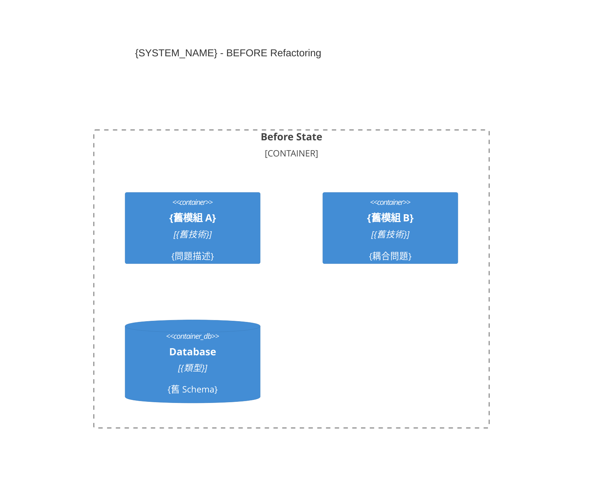
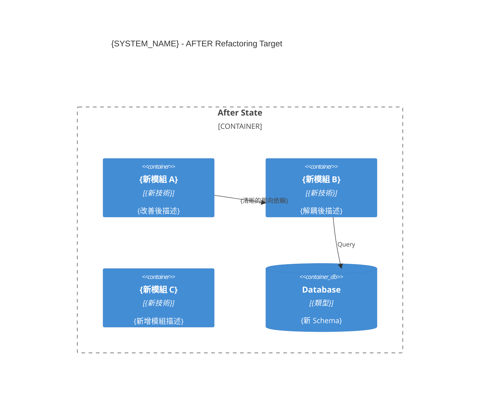
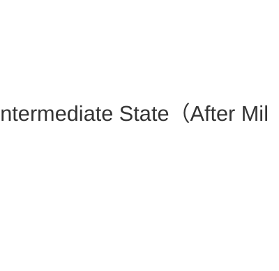

# 重構後目標架構規格（After Architecture）
# After Architecture Specification

**專案**: {PROJECT_NAME}
**系統**: {SYSTEM_NAME}
**版本**: v1.0
**建立日期**: YYYY-MM-DD
**建立者**: sd-architect（`architecture_comparison` Skill）
**適用情境**: Refactoring（Stage 2 必要文件）
**前置文件**: BEFORE-ARCH-{system}.md

---

## 1. Before vs After 架構對比

### 1.1 Before C4 Container（重構前）



### 1.2 After C4 Container（重構後目標）



---

## 2. Before → After 變更對照表

| 元件 | Before | After | 改變類型 | 改變原因 |
|------|--------|-------|---------|---------|
| {模組 A} | {現況技術/設計} | {目標技術/設計} | 修改 / 拆分 / 合併 / 新增 | {ADR 引用} |
| {模組 B} | 存在（高耦合）| 拆分為 B1 + B2 | 拆分 | ADR-REFACTOR-001 |
| {模組 C} | 不存在 | 新增（解耦用）| 新增 | ADR-REFACTOR-002 |

---

## 3. 目標技術棧

| 元件 | Before 技術 | After 技術 | 變更說明 |
|------|------------|-----------|---------|
| {元件} | {舊版本} | {新版本} | {升級/替換原因} |

---

## 4. 目標依賴關係

```
{系統名稱}（After）
├── {Module A}（已解耦）
│   └── 依賴：Interface（抽象層）
├── {Module B1}（從 B 拆分）
│   └── 依賴：Database
└── {Module B2}（從 B 拆分）
    └── 依賴：External API
```

**改善說明**：
1. 消除循環依賴（Before: A↔B，After: A→Interface←B）
2. {其他改善}

---

## 5. 重構 ADR 列表

| ADR | 決策（Before→After）| 狀態 |
|-----|-------------------|------|
| [ADR-REFACTOR-001](adr/ADR-REFACTOR-001-{title}.md) | {Before} → {After} | ✅ Accepted |

---

## 6. 目標品質指標（After Baseline 目標）

| 指標 | Before 基準 | After 目標 | 改善目標 |
|------|-----------|-----------|---------|
| 平均 Cyclomatic Complexity | {Before 數值} | ≤ {目標} | 降低 ≥ 20% |
| 測試覆蓋率（Line）| {Before%} | ≥ {目標%} | 不低於 Before |
| 技術債比率 | {Before%} | ≤ {目標%} | 降低 ≥ 30% |

---

## 7. 重構進度記錄

| 里程碑 | 完成日期 | Intermediate C4 | INV 測試 | Mutation |
|-------|---------|----------------|---------|---------|
| Milestone 1 | YYYY-MM-DD | [查看] | 100% ✅ | {%} |
| Milestone 2 | （進行中）| - | - | - |

### 當前中間狀態 C4（最新里程碑後）



---

## 🔷 SCG-2 架構規格審查 Checklist

- [ ] After C4 Context 圖（L1）已產出
- [ ] After C4 Container 圖（L2）已產出
- [ ] Before vs After 對照表完整
- [ ] 所有重構決策有 ADR-REFACTOR-*.md
- [ ] 目標品質指標已定義（可量化）
- [ ] Business Invariants 不受任何架構決策影響

## 🔴 Human 確認（After Architecture 規格凍結）

**確認日期**: YYYY-MM-DD  
**確認者**: {Tech Lead}  

- [ ] After Architecture 技術可行性確認
- [ ] 目標品質指標可達成
- [ ] 規格凍結，不再變更

---

**相關文件**:
- [Before Architecture](./BEFORE-ARCH-{system}.md)
- [Refactoring Plan](../04_planning/REFACTOR-PLAN-{system}.md)
- [Business Invariants](../01_requirements/INVARIANT-SPEC-{system}.md)
- [Code Quality Baseline](../06_quality/CODE-QUALITY-BASELINE.md)
