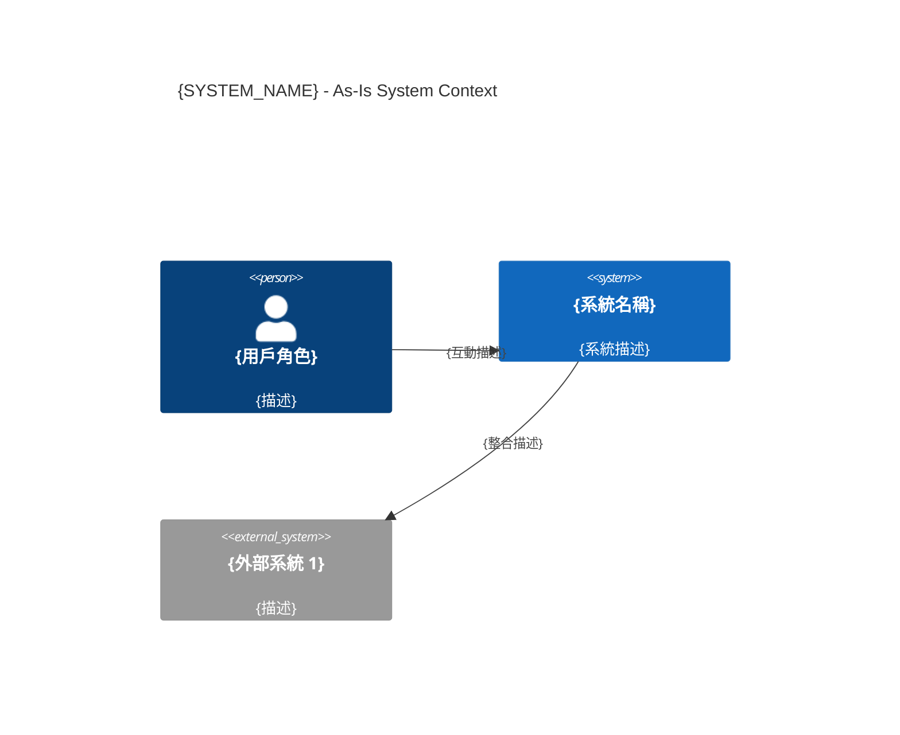
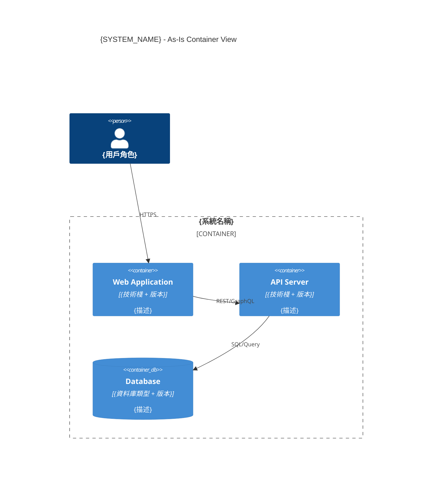

# 現況系統規格文件（As-Is SRD）
# As-Is System Requirements Document

**專案**: {PROJECT_NAME}
**系統**: {SYSTEM_NAME}
**版本**: v1.0
**建立日期**: YYYY-MM-DD
**建立者**: sd-architect（`as_is_c4_generation` Skill）+ sa-analyst
**適用情境**: Brownfield（Stage 1 強制文件）

---

## ⚠️ 文件說明

> 本文件由逆向規格工程（Reverse Spec Engineering）產出。
> 所有內容均從現有程式碼、部署環境和 git history 逆向提取。
> **可信度標記**：✅ 高（程式碼直接讀取）/ ⚠️ 中（推斷）/ ❓ 低（假設）

---

## 1. As-Is C4 架構圖

### 1.1 C4 Context 圖（L1）



**可信度**: ✅ 高 / ⚠️ 中 / ❓ 低

### 1.2 C4 Container 圖（L2）



**可信度**: ✅ 高 / ⚠️ 中 / ❓ 低

---

## 2. As-Is 技術棧

| 元件 | 技術 | 版本 | 可信度 |
|------|------|------|--------|
| Frontend | {框架} | {版本} | ✅/⚠️/❓ |
| Backend | {框架} | {版本} | ✅/⚠️/❓ |
| Database | {資料庫} | {版本} | ✅/⚠️/❓ |
| Cache | {快取} | {版本} | ✅/⚠️/❓ |
| Message Queue | {MQ} | {版本} | ✅/⚠️/❓ |

---

## 3. As-Is 模組依賴關係

```
{系統名稱}
├── {模組 A}
│   ├── 依賴：{模組 B}
│   └── 依賴：{外部套件}
└── {模組 B}
    └── 依賴：{資料庫}
```

---

## 4. As-Is 業務流程摘要

| 業務流程 | 入口 API | 核心邏輯位置 | 資料表 | 可信度 |
|---------|---------|------------|--------|--------|
| {流程名稱} | `{HTTP Method} /path` | `src/{file}.js:{行號}` | `{table}` | ✅/⚠️/❓ |

---

## 5. 已知設計問題（Why Refactoring / Brownfield Issues）

| # | 問題描述 | 影響範圍 | 嚴重程度 |
|---|---------|---------|---------|
| 1 | {設計問題描述} | {影響範圍} | 高/中/低 |

---

## 6. As-Is ADR 列表（歷史決策索引）

| ADR | 決策 | 狀態 | 可信度 |
|-----|------|------|--------|
| [ADR-AS-IS-001](adr/ADR-AS-IS-001-{title}.md) | {決策摘要} | Accepted | ✅ |

---

## 🔴 Human 確認

**確認日期**: YYYY-MM-DD  
**確認者**: {Tech Lead / Senior Developer}  
**確認內容**:
- [ ] C4 圖反映實際生產架構
- [ ] 技術棧版本號準確
- [ ] 業務流程描述無重大遺漏
- [ ] 設計問題清單完整

**差異記錄**（Human 發現的不準確之處）:
- {差異項目 1}（已修正）

---

**相關文件**:
- [As-Is FRD](../01_requirements/AS-IS-FRD-{system}.md)
- [To-Be SRD](./TO-BE-SRD-{feature}.md)
- [Gap Analysis](../04_planning/GAP-ANALYSIS-{feature}.md)
