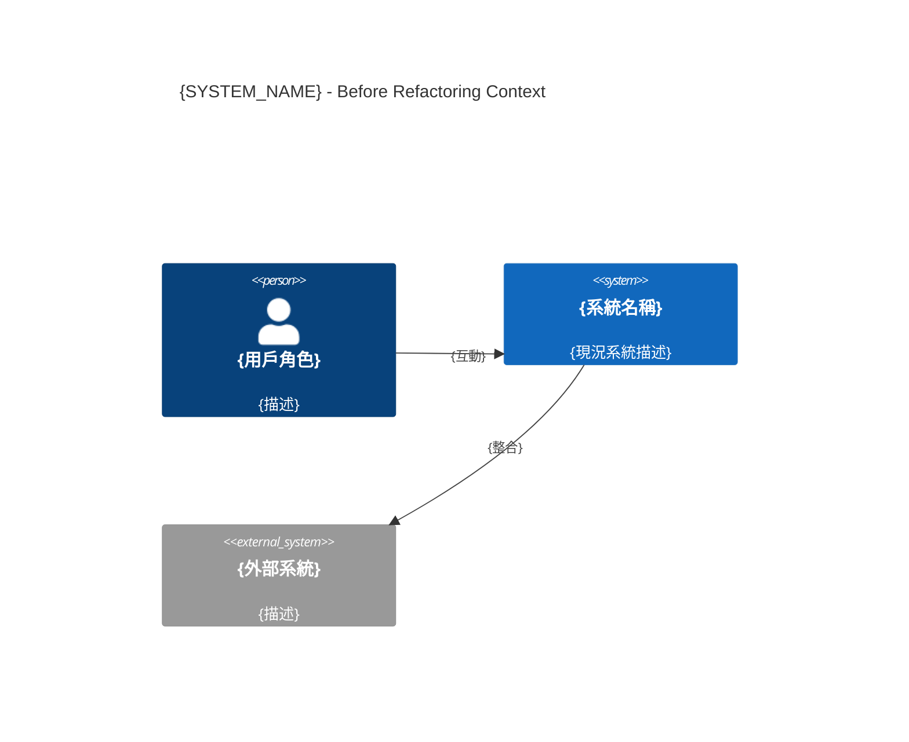
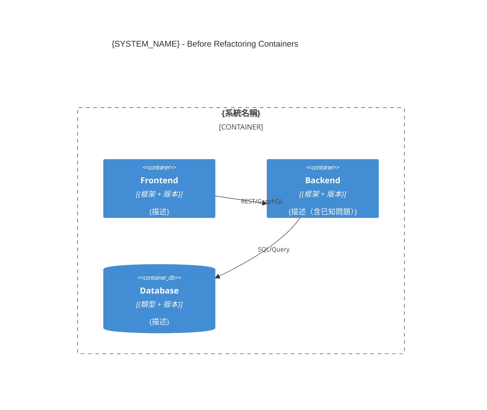

# 重構前架構規格（Before Architecture）
# Before Architecture Specification

**專案**: {PROJECT_NAME}
**系統**: {SYSTEM_NAME}
**版本**: v1.0
**建立日期**: YYYY-MM-DD
**建立者**: sd-architect（`as_is_c4_generation` Skill）
**適用情境**: Refactoring（Stage 0 強制文件）

---

## ⚠️ 重要說明

> 此文件是重構的「起點快照」，必須在任何重構開始前由 dev-senior 確認準確性。
> Before Architecture 一旦凍結，作為重構前後比較的基準，不可再修改。

---

## 1. Before C4 架構圖

### 1.1 Before C4 Context 圖（L1）



### 1.2 Before C4 Container 圖（L2）



---

## 2. 當前技術棧

| 元件 | 技術 | 版本 | 說明 |
|------|------|------|------|
| Frontend | {框架} | {版本} | |
| Backend | {框架} | {版本} | |
| Database | {資料庫} | {版本} | |
| Infrastructure | {部署方式} | {版本} | |

---

## 3. 當前模組依賴關係

```
{系統名稱}（Before）
├── {Module A}（{問題：高複雜度/高耦合等}）
│   ├── 依賴：{Module B}（循環依賴！）
│   └── 依賴：{外部套件}
└── {Module B}
    ├── 依賴：{Module A}（循環依賴！）
    └── 依賴：{資料庫}
```

**已知設計問題**：
1. {問題描述（例如：循環依賴、上帝類、過度耦合等）}

---

## 4. 程式碼品質基準（Before Baseline）

| 指標 | 數值 | 狀態 |
|------|------|------|
| 平均 Cyclomatic Complexity | {數值} | ⚠️/❌ |
| 測試覆蓋率（Line）|  | ⚠️/❌ |

詳細報告：`docs/06_quality/CODE-QUALITY-BASELINE.md`（Before 版本）

---

## 5. 重構動機

> **Why Refactoring**：為什麼當前架構需要重構？

1. {問題 1 - 例如：Cyclomatic Complexity 過高導致維護困難}
2. {問題 2 - 例如：模組間循環依賴導致測試困難}
3. {問題 3 - 例如：無法有效水平擴展}

**重構目標**：
- {目標 1}（After Architecture 中如何解決）
- {目標 2}

---

## 重構進度追蹤（後續更新）

| 里程碑 | 完成日期 | 架構狀態描述 | Intermediate C4 |
|-------|---------|------------|----------------|
| Baseline（重構前）| {建立日期} | 初始狀態 | 本文件 |
| Milestone 1 | （未完成）| - | - |
| Milestone 2 | （未完成）| - | - |
| Final（重構後）| （未完成）| - | AFTER-ARCH 文件 |

---

## 🔴 Human 確認（Before Architecture 凍結）

**確認日期**: YYYY-MM-DD  
**確認者**: {dev-senior / Tech Lead}  

- [ ] C4 圖反映實際生產架構（dev-senior 確認）
- [ ] 技術棧版本號準確
- [ ] 已知設計問題清單完整
- [ ] 程式碼品質基準由工具生成（非估算）
- [ ] Before Architecture 凍結，不再修改

---

**相關文件**:
- [After Architecture](./AFTER-ARCH-{system}.md)
- [Code Quality Baseline](../06_quality/CODE-QUALITY-BASELINE.md)
- [Business Invariants](../01_requirements/INVARIANT-SPEC-{system}.md)
- [Refactoring Plan](../04_planning/REFACTOR-PLAN-{system}.md)
