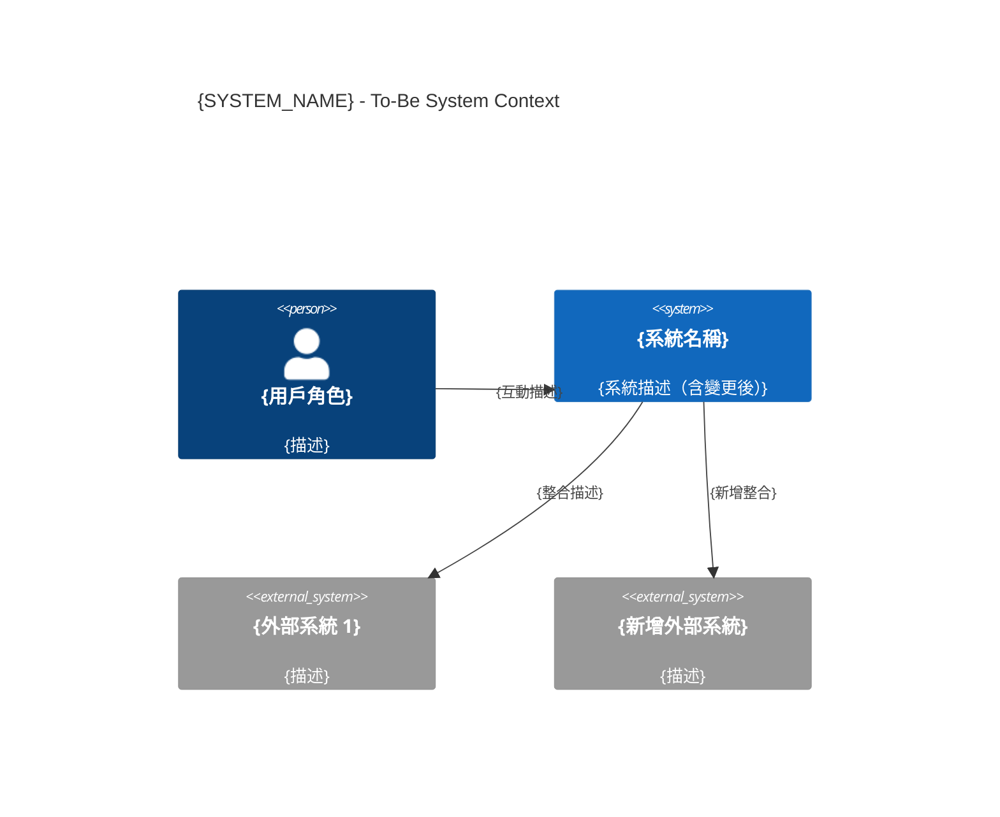
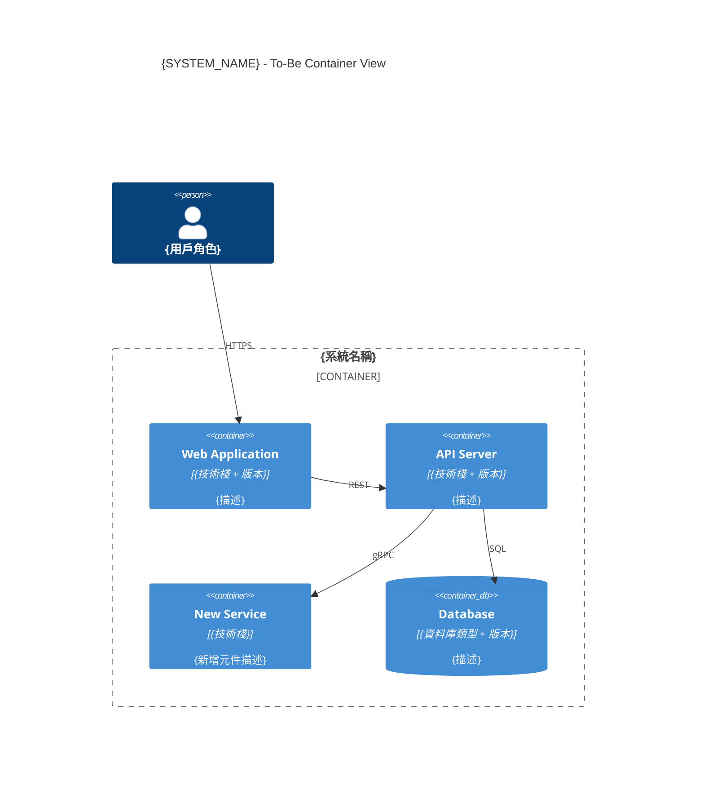

# 目標系統規格文件（To-Be SRD）
# To-Be System Requirements Document

**專案**: {PROJECT_NAME}
**功能/模組**: {FEATURE_NAME}
**版本**: v1.0
**建立日期**: YYYY-MM-DD
**建立者**: sd-architect
**適用情境**: Brownfield（Stage 3 必要文件）
**前置文件**: AS-IS-SRD + GAP-ANALYSIS

---

## 1. To-Be C4 架構圖

### 1.1 C4 Context 圖（L1）

### 1.2 C4 Container 圖（L2）

---

## 2. As-Is → To-Be 對照表

| 元件/功能 | As-Is 狀態 | To-Be 狀態 | 變更類型 | 說明 |
|----------|-----------|-----------|---------|------|
| {元件名稱} | {現況} | {目標} | 新增/修改/刪除/不變 | {說明} |

---

## 3. 變更影響分析（Impact Analysis）

### 3.1 受影響模組清單

| 模組 | 影響類型 | 影響範圍 | 說明 |
|------|---------|---------|------|
| {Module A} | 直接修改 | 高 | {修改內容} |
| {Module B} | 間接影響 | 中 | {影響說明} |

### 3.2 API 版本影響

| API 端點 | 影響類型 | Breaking? | 說明 |
|---------|---------|-----------|------|
| `{端點}` | 修改 / 新增 / 廢棄 | YES/NO | {說明} |

**API Compat 聲明位置**: `docs/02_architecture/api/API-COMPAT-{version}.md`

### 3.3 資料庫 Schema 影響

| 表格 | 影響類型 | 說明 | 遷移腳本 |
|------|---------|------|---------|
| `{table_name}` | 新增欄位 / 修改欄位 / 新增表格 | {說明} | `migrations/{版本}.sql` |

### 3.4 下游系統影響

| 下游系統 | 影響說明 | 通知狀態 |
|---------|---------|---------|
| {系統名稱} | {影響描述} | ✅ 已通知 / ⏳ 待通知 |

---

## 4. To-Be 技術決策（ADR 引用）

| 決策 | ADR 文件 | 狀態 |
|------|---------|------|
| {架構決策描述} | [ADR-{NNN}](adr/ADR-{NNN}-{title}.md) | ✅ Accepted |

---

## 5. 非功能需求規格（To-Be NFR）

| NFR 類型 | 指標 | To-Be 目標 | As-Is 現況 | 改善量 |
|---------|------|-----------|-----------|--------|
| 效能 | P95 回應時間 | ≤ {N}ms | {現況}ms | -{Δ}ms |
| 可用性 | SLA | ≥  | +{Δ%} |
| 安全 | 認證機制 | {目標} | {現況} | {改善} |

---

## 🔷 SCG-2 架構規格審查 Checklist

- [ ] To-Be C4 Context 圖（L1）已產出
- [ ] To-Be C4 Container 圖（L2）已產出
- [ ] As-Is → To-Be 對照表完整（無遺漏元件）
- [ ] 變更影響分析完整（所有受影響模組已列出）
- [ ] API 向後相容性聲明已建立
- [ ] 資料庫遷移計畫已建立
- [ ] 下游系統已通知
- [ ] 每個技術決策有對應 ADR

## 🔴 Human 確認（To-Be 規格凍結）

**確認日期**: YYYY-MM-DD  
**確認者**: {Tech Lead / Product Owner}  
**確認內容**:
- [ ] 技術架構可行性已確認
- [ ] 影響範圍已完整評估
- [ ] NFR 目標可達成
- [ ] 規格凍結，不再變更

---

**相關文件**:
- [As-Is SRD](./AS-IS-SRD-{system}.md)
- [Gap Analysis](../04_planning/GAP-ANALYSIS-{feature}.md)
- [API Compat](./api/API-COMPAT-{version}.md)
