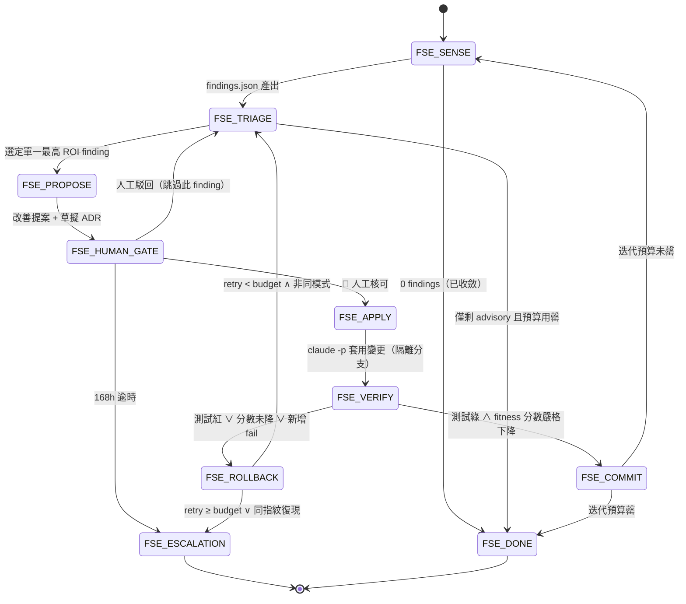

# SDD Self-Evolution Dynamic Workflow（框架自我演化動態工作流）

> **定位**：這是一條**具自我修正能力的動態工作流（Dynamic Workflow）**，用於讓
> AISDLC-SDD 框架**自身的架構**隨 AI 演進而持續優化（dogfooding）。它把過去 Phase A~J
> 那種「人工讀藍圖 → 手動改 → 手動驗收」的 ad-hoc 演化，升級為**可重複、有界停機、
> 收斂可證**的閉環。
>
> **架構決策（重要）**：本工作流是**協調層 / meta-loop**，刻意**不**併入單軌
> `formal/SDD_FSM.tla`（與 `fleet_orchestrator` 同樣「協調層不污染單軌 FSM」的原則）。
> 它**消費** SDD 既有 runtime（FSMRuntime、rule_loader、value_planner），但用獨立的
> `FSE-*` 狀態命名空間，避免破壞 Rule 9.18.1 三源一致性與既有 TLC 證明。
>
> **版本**：v0.10（2026-06-02 §7.2 候選位移：+FF-15 docs_template 索引 ↔ 磁碟一致性〔R15，
> 補齊 Skill〔FF-11〕/ Agent〔FF-13〕/ Template 三支柱 artifact 結構守門；SENSE 真實 surface
> 8 個未索引模板〔51→59〕，APPLY 收斂、15 FF 全綠 score=0〕）
> ｜v0.09（2026-06-02 §7.2 候選清空：+FF-14 CI workflow 工具模組引用一致性〔R13〕
> +FF-9 Scaffold-ROI 代謝〔R14，structural schema + data-gated 0-fire advisory〕，14 FF 全綠 score=0）
> ｜v0.08（2026-06-02 R12 收斂：修復 FF-13 surface 的 5 個非嚴格合法 agent YAML，
> 25 agent 全 safe_load_all 綠、score→0，閉環在 12 維重抵不動點）
> ｜v0.07（2026-06-02 +FF-13 Agent YAML schema 完整性：測量出 5 個非嚴格合法 agent
> YAML 的 Agent 層盲區，advisory surfac，修復交人工閘）
> ｜v0.06（2026-06-02 +FF-12 critical 規則治理錯置偵測：守 critical 規則 trigger
> 不得全為非阻塞觀測態，防 critical-in-name-only）
> ｜v0.05（2026-06-02 +FF-11 Skill frontmatter 結構完整性：收斂 test-failure-analyzer
> 缺 frontmatter 的真實 structural 缺陷，Skill 層 measurement blindness 補上）
> ｜v0.04（2026-06-02 +FF-10 死規則偵測：守規則 trigger_states ⊆ FSM 39 態宇宙，
> 與 FF-8 夾住 active 規則生效的兩個前提「會被注入 ∧ 注入後有測試強制」）
> ｜v0.03（2026-06-02 再擴 SENSE 孔徑：+FF-8 治理規則→強制測試可追溯性，
> 守「圖靈完備閉環的每條 guard ↔ halting test 連結」）
> ｜v0.02（2026-06-02 擴大 SENSE 孔徑：+FF-6 連結完整性、+FF-7 引用健康度、+R4 趨勢）
> ｜v0.01（2026-06-01 建立）｜**對應工具**：`tools/arch_fitness/arch_fitness.py`

---

## 0. 為什麼需要它（最脆弱環節）

`arch_fitness` 首跑即量化出框架自身的三個結構性脆弱點：

| 訊號 | fitness | 本質 |
|------|---------|------|
| FSM 三源（`_HAPPY_PATH` / `SDD_FSM.tla` / `SDD_FSM_ENGINE.md`）手動同步 | FF-1 | 高耦合、靠人工紀律維持，無自動 SENSE |
| Governance 漸進揭露遷移**停滯 18%**（4/22 條抽出），CLAUDE.md Rule 9 仍 eager-load ≈18 頁 | FF-2 | 框架違反自己 Phase H ACT-051 的設計意圖 |
| `state_loader` 路徑誤用洩漏巢狀 `.tmp` 孤兒 | FF-3 | 缺乏持久層自我巡檢 |

共通根因：**框架有大量「自我治理規則」（Rule 9.1~9.22），卻沒有一條把「治理規則本身的
熵增」收斂回去的自動工作流。** 本工作流補上這個閉環。

> **狀態更新（2026-06-02）**：上述 FF-1/FF-2/FF-3 三個原始脆弱點**已全部收斂**
> （FSM 三源 39 態一致、§9 已裁剪 724→43 行入 registry、持久層無孤兒），`arch_fitness`
> 首版 4 個 FF 已達 `score=0` 不動點。**真正的脆弱點隨之位移到「量測盲區（measurement
> blindness）」**——`score=0` 不代表架構完美，而是 SENSE 孔徑已看不到新東西。故 v0.02
> 擴大孔徑：新增 **FF-6**（INIT 樞紐連結硬訊號 + workflow 內容連結衛生軟訊號）、**FF-7**
> （Agent↔Workflow↔Skill 數量漂移 + auto_load_config 引用完整性）、**R4 趨勢記錄**。
> 擴孔後 `score 0→3`，重新給閉環三條真實、有界、advisory 的可收斂 finding。
>
> **狀態更新（2026-06-02，v0.03）**：FF-1~FF-7 在 R1~R6 全數收斂回 `score=0` 後，盲區
> 再度位移——這次位移到**治理層**：框架有 23 條 active 治理規則（`governance/rules/R-*.yaml`），
> 每條以 `test_ref` 宣告強制它的測試，但此「規則→測試」連結**先前無任何守門**
> （`test_rules_index_sync` 只守 id/title/trigger_states/severity/maturity，不碰 `test_ref`；
> FF-1~FF-7 亦不碰）。一條被改名/刪除的測試或漏填的 `test_ref` 會使規則悄然降為
> **governance theater**——這正是本工作流 §0 自陳根因「治理規則本身的熵增無收斂閘」最尖銳的
> 體現，也是「圖靈完備閉環」論述最脆弱的接縫（guard 宣稱存在、實際無 halting test 接地）。
> 故新增 **FF-8**：三道 structural 不變量（缺 test_ref / dangling / 無 def test_）+ 一道
> advisory（測試未反向引用規則 id）。首跑 `score 0→1`（22/23 規則僅單向可追溯），經 R7
> 收斂回 `score=0`（8 FF 全綠），閉環在更深的治理涵蓋面上重抵不動點。

---

## 1. 狀態機（FSE State Machine）



### 1.1 狀態定義

| 狀態 | 類型 | 角色 |
|------|------|------|
| `FSE_SENSE` | 量測 | 執行 `arch_fitness` 產出 findings + 基準分數 |
| `FSE_TRIAGE` | 決策 | 分類 findings（cosmetic / structural / spec-impacting），選**單一**最高 ROI |
| `FSE_PROPOSE` | 生成（唯讀） | `claude -p` 產出改善提案 + 草擬 ADR；**不**改檔 |
| `FSE_HUMAN_GATE` | 🔴 閘門 | 人工核可（Rule 8）；168h 逾時 → ESCALATION（鏡像 Rule 9.1） |
| `FSE_APPLY` | 生成（寫入） | `claude -p` 在隔離分支/worktree 套用變更 |
| `FSE_VERIFY` | 量測 | 重跑 pytest + `arch_fitness --strict`（+ 動到 FSM 則 `run_tlc`） |
| `FSE_COMMIT` | 收斂 | 提交 + 開 PR；回 `FSE_SENSE` 或 `FSE_DONE` |
| `FSE_ROLLBACK` | 回復 | `git restore` / 丟棄 worktree；retry++ |
| `FSE_ESCALATION` | 終局 | 產出 Abort Report，停機等待人工（不可自動退出） |
| `FSE_DONE` | 終局 | 達不動點（fixpoint）或預算罄，乾淨收工 |

---

## 2. Trigger / Action / Validation 矩陣

> 所有 `Action` 使用**真實且當前**的 Claude Code CLI（見 §4 指令對照）。

| 狀態 | Trigger（觸發） | Action（Claude Code 執行） | Validation（驗收） |
|------|----------------|---------------------------|-------------------|
| `FSE_SENSE` | 排程（nightly）/ post-merge / 手動 | `python -m tools.arch_fitness.arch_fitness --json build/reports/fse/findings.json` | JSON 可解析；記錄 `score_before` |
| `FSE_TRIAGE` | SENSE 完成且 findings>0 | `claude -p "讀 findings.json，依 (severity×可逆性÷blast_radius) 排序，只回傳最高 ROI 的單一 finding fingerprint 與分類" --output-format json --max-turns 2 --allowedTools "Read"` | 恰選 1 個 fingerprint；structural 優先於 advisory |
| `FSE_PROPOSE` | TRIAGE 選定 | `claude -p "針對 finding <fp> 產出：①根因 ②最小變更方案 ③blast radius ④rollback 步驟 ⑤是否需 ADR" --max-turns 6 --allowedTools "Read" "Grep" "Glob" --permission-mode plan` | 提案含 finding id + rollback 段 + blast radius |
| `FSE_HUMAN_GATE` | 提案產出 | （人工）；逾時由 `timeout_checker` 守門 | 人工輸入「核可」/「駁回」；≤168h |
| `FSE_APPLY` | 人工核可 | `git switch -c fse/<fp>` 後 `claude -p "依已核可提案實作 finding <fp> 的修正" --max-turns 12 --allowedTools "Edit" "Write" "Bash(python -m pytest:*)" --permission-mode acceptEdits` | `git diff` 非空且僅落在提案宣告的檔案集 |
| `FSE_VERIFY` | APPLY 有 diff | `python -m pytest -m "not chaos" -q && python -m tools.arch_fitness.arch_fitness --strict --json build/reports/fse/findings-after.json` | 測試綠 ∧ `score_after < score_before` ∧ 目標 finding 消失 ∧ 無新 fail |
| `FSE_COMMIT` | VERIFY 通過 | `git commit` + `gh pr create`（人工最終 merge） | commit 成功；PR 連結回 finding |
| `FSE_ROLLBACK` | VERIFY 失敗 | `git restore .` / `git switch -` / 丟棄 worktree | 工作區回到乾淨；retry_count++ |

---

## 3. 有界停機保證（反死循環設計）

> 對應嚴苛自檢「是否存在死循環風險」。本工作流以**五道獨立防線**保證必然停機。

1. **硬迭代上限** `FSE_MAX_ITERATIONS`（預設 5）— 每次 run 最多處理 5 個 finding，之後強制 `FSE_DONE`。
2. **單一 finding retry budget**（預設 3，鏡像 Rule 9.1 `RETRY_LIMITS`）— 同一 finding 修正失敗 3 次 → `FSE_ESCALATION`。
3. **收斂不變量（核心）** — 每次 `FSE_VERIFY` 必須滿足 `score_after < score_before`（加權缺陷分數**嚴格遞減**）。fitness 分數有**有限下界 0**，嚴格遞減的有界序列必收斂 ⇒ 工作流是朝不動點的**收斂映射**，不可能無限執行。
4. **同指紋復現偵測** — 若某 finding `fingerprint` 在 APPLY 後**原樣復現**（pattern_matcher 語意同模式），判定「修正未生效」→ `FSE_ESCALATION`（鏡像 Rule 9.1 PR_REVIEW 同模式 ×3）。
5. **每次 `claude -p` 帶 `--max-turns`** — agent 內部回合有界，單步不會無限自走。

> **形式化論證**：令 `Sₙ` = 第 n 迭代後的 fitness 分數，`Sₙ ∈ ℕ ∧ Sₙ ≥ 0`。VERIFY 閘強制
> `Sₙ₊₁ < Sₙ`（否則 ROLLBACK，不前進 n）。由良序原理（well-ordering），嚴格遞減的非負
> 整數序列長度有限 ⇒ 迭代必終止於 `FSE_DONE`（S 達局部極小）或 `FSE_ESCALATION`（防線 2/4 觸發）。
> 與既有 `chaos_runner` 的 `bounded_ratio==1.0` 驗收同構：**所有路徑都停在終局態**。

---

## 4. Claude Code CLI 指令對照（嚴苛自檢修正）

> 原始需求 few-shot 使用了 `claude m '...'`、`claude edit` —— **這兩個並非有效的
> Claude Code 指令**，會直接失敗。以下為**當前正確**的 headless 用法。

| 意圖 | ❌ 無效（需求範例） | ✅ 正確（當前 CLI） |
|------|-------------------|---------------------|
| 跑一段 prompt | `claude m '同步更新...'` | `claude -p "同步更新..."` |
| 編輯檔案 | `claude edit FILE` | `claude -p "編輯 FILE：..." --allowedTools "Edit" --permission-mode acceptEdits` |
| 取得機器可讀結果 | —（無） | `claude -p "..." --output-format json` |
| 限制 agent 回合（防失控） | —（無） | `claude -p "..." --max-turns N` |
| 限制可用工具 | —（無） | `claude -p "..." --allowedTools "Read" "Grep"` |
| 只規劃不寫入 | —（無） | `claude -p "..." --permission-mode plan` |
| 以管線餵資料 | —（無） | `Get-Content findings.json \| claude -p "分析此 JSON"` |

關鍵旗標：`-p/--print`（headless）、`--max-turns`（**有界**）、`--allowedTools`/`--disallowedTools`、
`--permission-mode {plan,acceptEdits,default}`、`--output-format {text,json,stream-json}`、`--model`、`--add-dir`。

---

## 5. 與既有框架的整合點

| 既有元件 | 整合方式 |
|---------|---------|
| `FSMRuntime` | FSE 為其上的協調層；不直接寫 `FSM-STATE-*.yaml`，僅讀分數 |
| `rule_loader.load_for_state` | FSE_TRIAGE 可載對應狀態規則輔助判斷；FF-2 修正即逐條 `governance/rules/R-*.yaml` 抽出 |
| `value_planner`（ACT-068） | FSE_TRIAGE 的 ROI 排序可直接複用其 `business_value×confidence/cost` |
| `timeout_checker`（ACT-023） | FSE_HUMAN_GATE 的 168h 逾時守門 |
| `pattern_matcher`（ACT-021） | 防線 4 同指紋復現偵測 |
| nightly CI | `arch-fitness.yml`（repo root）跑 FSE_SENSE 的量測，advisory 留言 |

---

## 6. 使用方式

```powershell
# 單次量測（SENSE）
python -m tools.arch_fitness.arch_fitness

# CI 阻擋模式（structural fail → exit 2；advisory warn → exit 1）
python -m tools.arch_fitness.arch_fitness --strict --json build/reports/fse/findings.json

# 有界自我演化驅動（含人工閘）— Windows
pwsh tools/arch_fitness/run_self_evolution.ps1 -MaxIterations 3

# 同上 — bash / CI
bash tools/arch_fitness/run_self_evolution.sh --max-iterations 3
```

### 6.1 退出碼契約（SSOT）

`run_self_evolution.sh` 與 `run_self_evolution.ps1` 的退出碼**逐碼同語意**，本節為唯一真相源。

**為何需要 SSOT**：R68 前兩側各自在檔頭註解裡枚舉「自己已占用」的碼、沒有人看對面，
於是同一個失敗條件（PATH 上無可用 python）bash 回 5、pwsh 回 7，而 6 在兩側各有不同意思。
R68 統一了碼值並在兩側檔頭寫下「規格側見本檔『退出碼契約』節」——**但該節當時並不存在**
（grep 零命中），契約落地即孤兒。R69 補建本節，並由 `tools/check_script_parity.py::
_check_exit_code_contract()` 機械比對「本表 ↔ .sh 檔頭 ↔ .ps1 檔頭」三處的
`rc=<碼> <代號>` 枚舉必須逐筆相等，且兩側腳本內每個字面 `exit <碼>` 都必須在本表有登記。
三處任一漂移即紅，不再靠人工同步。

**維護規則**：新增/變更退出碼時**先改本表**，再同步兩側檔頭的 `rc=` 枚舉行（三處字面必須
一致）。**已退役的碼不得重用**：保留在表內並標註適用側，否則會重演 R68 的碼值碰撞。

<!-- exit-code-contract:begin -->

| rc | 代號 | 適用側 | 語意 |
|----|------|--------|------|
| 0 | CONVERGED | 兩側 | 收斂／乾淨收工（含 `--help`／`-?`） |
| 1 | DRYRUN_ADVISORY | 兩側 | dry-run advisory 訊號（僅 warn，不阻擋） |
| 2 | DRYRUN_STRUCTURAL | 兩側 | dry-run structural fail 訊號 |
| 3 | NO_CLAUDE_CLI | 兩側 | 缺 claude CLI（`--apply`／`-Apply` 需要） |
| 4 | ESCALATION | 兩側 | ESCALATION（單 finding retry budget 用盡） |
| 5 | NO_PYTHON | 兩側 | PATH 上無可用 python 直譯器（含 WindowsApps 空殼） |
| 6 | PLATFORM_PREREQ | .ps1 | 平台前置不足（PowerShell < 7）；bash 側不適用，**保留不重用** |
| 7 | GIT_FAILED | 兩側 | git 操作失敗（`git switch -c`） |
| 8 | SSOT_GUARD_MISSING | .ps1 | SSOT `WindowsAppsGuard.ps1` 缺席；bash 側因 POSIX 無 WindowsApps 空殼陷阱而採降級回退，兩側於此**刻意不對等**（理由就地記於 `.ps1` guard 區段註解） |
| 64 | USAGE | .sh | 未知參數（usage）；`.ps1` 由 PowerShell 參數繫結自行處理 |

<!-- exit-code-contract:end -->

---

## 7. 路線圖（由本工作流自身消化）

- ✅ **R1（已完成）**：FF-2 的 governance 遷移已推進至 **CLAUDE.md §9 裁剪完成**（724→43 行，23 條 Rule 9.x 入 `governance/rules/R-*.yaml`，由 `rule_loader` 逐態注入），FF-2 現為 info。
- ✅ **R2（已完成）**：FF-1 升級為「真三源」。MD 解析抽取為共用模組 `tools/fsm_runtime/fsm_md_parser.py`（與 `test_md_python_sync.py` 共用單一 parser，消除雙 parser 脆弱點）；FF-1 新增 ②每個 canonical 狀態須記載於 `SDD_FSM_ENGINE.md`（structural）③轉換表來源欄不得含 stale token（advisory）。現報 `Python ⇄ TLA ⇄ MD` 三源一致（39 態）。
- ✅ **R3（已完成，v0.02）**：文件相對連結完整性已落為 **FF-6**（INIT 樞紐 per-link 硬訊號 + workflow 內容連結衛生聚合軟訊號；fence 內示意連結排除）。註：FF-5 名額先前被 §9 頁數守門借用，故連結檢查改編號為 FF-6。
- ✅ **R4（已完成，v0.02）**：`arch_fitness --trend` 將 `score / n_fail / n_warn / fingerprints` 追加進 `build/reports/fse/TREND.yaml`，量化框架架構熵長期趨勢（FF 檢查保持唯讀，唯 `--trend` 有副作用）。

### 7.1 由本次擴孔新 surfac、待人工閘消化的 backlog

> 以下為 v0.02 擴孔後 `FSE_SENSE` 首次 surfac 的真實 finding（全 advisory），是 `FSE_PROPOSE → 🔴 FSE_HUMAN_GATE` 的輸入，**未自動套用**（鏡像 Rule 8）。

- ✅ **R5（已完成）— workflow 連結衛生批次清理**：37 條 `ff6-workflow-linkrot` 全數修正為已驗證存在的真實目標（陳舊檔名 `AISDLC_INIT`→`AISDLC_SDD_INIT`、agent 相對深度、`docs/`→`docs_template`/`guides`、`CLAUDE.md` 深度、`QUICK_START_GUIDE` 路徑等；唯框架未內建的 `Change_Log_Template` 去連結化）。`ff6` 收斂消失（**score 1→0**），**7 個 FF 全綠**。

> **v0.02 擴孔 backlog 已全數消化**：`score 0（4 FF 盲區）→ 3（擴孔）→ 1（R6）→ 0（R5）`，閉環在更寬涵蓋面（7 FF）上重抵不動點。R2（FF-1 真三源）亦已補齊——FF-1 由雙源升級為 Python ⇄ TLA ⇄ MD 三源守門。**R1~R6 全數完成**。

- ✅ **R7（已完成，v0.03）— FF-8 治理規則→強制測試可追溯性**：新增第 8 條 fitness function，把「每條 active 治理規則必須接上一個會停機的測試」從紙上承諾升級為靜態可稽核的不變量。實作於 `tools/arch_fitness/arch_fitness.py`（`check_ff8_rule_enforcement_traceability`），回歸守門於 `tests/test_arch_fitness.py`（+8 測試：3 道 structural fail 合成案例、deprecated 豁免、clean pass、repo structural 守門、repo backref 收斂）。
>
>   - **SENSE**：首跑 surface 1 條 advisory `ff8-weak-backref`（22/23 active 規則的 `test_ref` 測試未字面反向引用規則 id，`score 0→1`）。
>   - **APPLY（收斂）**：於 18 個 `test_ref` 目標測試檔頂端補 `# enforces (governance rules): <rule-id>` 錨點（comment-only、零行為變更、完全可逆），使 rule⇄test 雙向且可 grep。`test_phase_h.py` 已帶 R-9.20 故跳過。
>   - **VERIFY**：`pytest -m "not chaos"` → 606 passed（原 598 +8）；`arch_fitness` → `ff8-ok`、8 FF 全綠 `score=0`。
>   - **整合**：FF-8 自動流入既有 `arch-fitness.yml`（PR-advisory + nightly-strict）與 `run_self_evolution` 腳本，無需新建 artifact——擴孔即接入既有閉環。

> **R7 後狀態**：`score 0（FF-1~7 盲區）→ 1（FF-8 擴孔）→ 0（R7 收斂）`，閉環在涵蓋**治理規則強制接地**的第 8 個維度上重抵不動點。

- ✅ **R8（已完成，v0.04）— FF-10 死規則偵測（規則 trigger_states 可達性）**：新增第 9 條 fitness function（編號 FF-10；FF-9 預留動態 Scaffold-ROI）。規則靠 `rule_loader.load_for_state(state)` 依當前 FSM 狀態注入，`trigger_states` 是規則與 39 態 canonical 宇宙的唯一連結；若 trigger 指向幽靈狀態（typo / 狀態改名移除未同步）或為空，規則永不觸發 = 死規則。實作 `check_ff10_rule_trigger_reachability`（structural fail），回歸守門 +5 測試（ghost / empty fail 合成案例、wildcard+真實狀態 pass、deprecated 豁免、repo 無死規則守門）。
>
>   - **SENSE/VERIFY**：`arch_fitness --only FF-10` → `ff10-ok`（23 條 active 規則 trigger 全 ⊆ 39 態宇宙，**0 死規則**）；`pytest -m "not chaos"` → 611 passed（R7 後 606 +5）；完整 9 FF `score=0`。
>   - **本輪為 `FSE_SENSE → FSE_DONE`（0 findings 已收斂）**：FF-10 為綠燈型擴孔——不 surface 新缺陷，而是把一條先前無人守的不變量（規則→狀態引用完整）轉為自動回歸守門。誠實結論：架構於此維度健康，且未來狀態改名/規則 typo 將被 nightly-strict 擋下。
>   - **FF-8 ⊗ FF-10 的互補性**：一條 active 規則要真正生效需兩個前提——**會被注入**（FF-10：trigger 可達）∧ **注入後有測試強制**（FF-8：test_ref 接地）。兩 FF 夾住這兩個前提，使「規則宣稱 vs 規則實效」的落差不再有盲區。

- ✅ **R9（已完成，v0.05）— FF-11 Skill frontmatter 結構完整性**：新增第 10 條 fitness function（編號 FF-11）。42 個 `.claude/skills/<name>/SKILL.md` 是框架能力的調用入口，harness 靠其 YAML frontmatter 的 name/description 註冊 skill；缺 frontmatter 會退化成佔位字串（Skill 層 measurement blindness）。實作 `check_ff11_skill_frontmatter`（structural fail，4 類：缺 SKILL.md / 缺 frontmatter / 缺 name / 缺 description）。
>
>   - **SENSE**：首跑 surface **真實 structural finding** `ff11-no-frontmatter`——`test-failure-analyzer/SKILL.md` 完全無 YAML frontmatter（以 `# ...` H1 起首），這也是它在 harness skill 清單中描述退化成佔位字串「test-failure-analyzer Skill」的根因（`score 0→10`）。
>   - **APPLY（收斂）**：替 `test-failure-analyzer/SKILL.md` 補上符合 SDD-core 慣例的 frontmatter（name/description/user-invocable/disable-model-invocation/argument-hint/allowed-tools）。
>   - **VERIFY**：`arch_fitness --only FF-11` → `ff11-ok`（42 skill 全完整）；`pytest -m "not chaos"` → 617 passed（R8 後 611 +6）；完整 10 FF `score=0`。
>   - **關鍵設計（防假陽性）**：12 個 skill 的 `name`≠目錄名為**刻意短別名**（`ba-analyst`→`ba-validate`、`sd-architect`→`sd-design` 等，frontmatter 完整），故 FF-11 **不檢查 name-vs-dir 相等**；附 `test_ff11_alias_name_not_flagged` 守此不回歸。

- ✅ **R10（已完成，v0.06）— FF-12 critical 規則治理錯置偵測**：新增第 11 條 fitness function（編號 FF-12）。`severity=critical`＝CLAUDE.md「違反即停機」；但 `OBSERVATION_STATES`（12 態）為非阻塞瞬態觀測窗，critical 規則若 trigger 全落觀測態，則永遠無法在阻塞點觸發 = critical-in-name-only 的治理錯置。實作 `check_ff12_severity_placement`（structural fail）。
>
>   - **本輪為 `FSE_SENSE → FSE_DONE`（0 findings）**：8 條 active critical 規則 trigger 落點全部正確（`ff12-ok`）；綠燈型擴孔，鎖不變量。
>   - **精煉 §7.2 草擬定義（誠實修正）**：原候選「critical 必掛 happy-path 主幹」會**誤報** R-9.5（ESCALATION/ESCALATION_FINAL/TERMINATED）與 R-9.14（ESCALATION）——這兩條 critical 規則**刻意**掛在緊急/終端態，那正是其關鍵性所在。偵察後改採低假陽性定義「critical 不得 observation-only」，並附 `test_ff12_critical_with_blocking_state_passes` 守此。
>   - **FF-10 ⊗ FF-12 互補**：FF-10 守「trigger 可達」，FF-12 守「critical 的 trigger 落在能真正停機的狀態」。
>   - **回歸守門 +5 測試**；`pytest -m "not chaos"` 622 passed（R9 後 617 +5）；完整 11 FF `score=0`。

- ✅ **R11（已完成，v0.07）— FF-13 Agent YAML schema 完整性（advisory）**：新增第 12 條 fitness function（編號 FF-13），與 FF-11（Skill 層）對稱補齊「能力定義層」結構守門。25 個 `agent/**/*.yaml` 由 Runtime/LLM 以**文字**載入，故嚴格 YAML 失效不會即時崩潰——典型 Agent 層 measurement blindness。實作 `check_ff13_agent_yaml_schema`（advisory，`safe_load_all` 掃描 + 缺頂層 `agent` 鍵）。
>
>   - **SENSE（重要真實發現）**：首跑 surface **5 個非嚴格合法的 agent YAML**（聚合單一 advisory `ff13-yaml-invalid`，`score +1`）：
>     - `agent/core/05.sd-architect-zh.yaml`（L428 mapping 內混入 list 項）
>     - `agent/specialized/integration-specialist-zh.yaml`（L261 縮排錯置）
>     - `agent/specialized/qa-automation-zh.yaml`（L312 縮排錯置）
>     - `agent/specialized/compliance-officer-zh.yaml`（L492/516 誤插 `---` + 未引號反引號）
>     - `agent/specialized/security-engineer-zh.yaml`（L431/455 同上）
>   - **不自動修復（Rule 8 / FSE_HUMAN_GATE）**：這 5 個是 500~650 行的**核心 agent artifact**，修復屬高 blast-radius 變更，且 PyYAML 在首個錯誤即停（修一處可能 surface 下一處）。依框架自身憲法，此類核心 artifact 結構修復應走 🔴 人工閘，不在 sensor commit 內硬修。FF-13 的價值在於**把這個先前不可見的盲區轉為被測量、被追蹤的 advisory backlog**（鏡像 §7.1、FF-2 漸進式哲學）。
>   - **VERIFY**：FF-13 advisory-only，無 structural fail；`pytest -m "not chaos"` 626 passed（R10 後 622 +4）；CI 保持綠（nightly-strict fitness step 結尾 `exit 0`，advisory 不阻擋）。

- ✅ **R12（已完成，v0.08）— 收斂 FF-13 surface 的 5 個非嚴格合法 agent YAML**（人工閘核可後執行）。逐檔小步修、每修一檔即 `safe_load_all` 驗證，**僅修 YAML 結構、保留語意內容**：
>   - `05.sd-architect-zh.yaml`：孤立 list 項 `- "更新 ADR-INDEX.md"` → 改為 mapping 鍵 `adr_index_sync`。
>   - `integration-specialist-zh.yaml`：4 個 `*_integration` 區塊的 bare list + `best_practices` 混用 → list 包進 `use_cases:` 子鍵。
>   - `qa-automation-zh.yaml`：3 個 flakiness 區塊的 bare list + `solutions` 混用 → list 包進 `causes:` 子鍵。
>   - `compliance-officer-zh.yaml` / `security-engineer-zh.yaml`：誤插的文件分隔 `---` + 內嵌 Markdown（含 ` ```yaml ` 反引號）→ 改置於 `workflow_integration_doc: |` 區塊純量（逐字保留），版本歷史改 `version_history` list。
>   - **VERIFY**：25 個 agent 全數 `safe_load_all` 綠且含頂層 `agent` 鍵；`arch_fitness` → `ff13-ok`、**12 FF 全綠 `score=0`**；`pytest -m "not chaos"` 623 passed（3 個 test_phase_h docker 測試因本機 docker daemon 未啟動而 skip，與本次無關）。

> **R1~R12 全數完成**；閉環涵蓋面 12 維，`score` 重抵 **0** 不動點。

- ✅ **R13（已完成，v0.09）— FF-14 CI workflow → 工具模組引用一致性**：新增第 13 條 fitness function。`.github/workflows/*.yml` 以 `python -m tools.*` 呼叫的專案模組必須可解析（structural fail）；模組改名/移除未同步會讓 CI step runtime 失敗。**僅驗 `tools.*` 自有命名空間**，`pip`/`pytest` 等外部工具略過以免假陽性。本輪 `SENSE → DONE`（0 findings）：2 個 `tools.*` 引用（`tools.arch_fitness.arch_fitness`、`tools.fsm_runtime.chaos_runner`）皆可解析（`ff14-ok`），綠燈鎖不變量。與 FF-6/FF-7 同屬「引用完整性」家族延伸至 CI 層。回歸 +4 測試。

- ✅ **R14（已完成，v0.09）— FF-9 Scaffold-ROI 代謝**：補齊先前預留的 FF-9（第 14 條 fitness function）。`scaffold_roi` 是 Rule 9.20 GAE / `sdd-gc` 判斷鷹架退役的計數基座。**雙層設計**：①structural — 每條 active 規則須有完整 `scaffold_roi`（fire/catch/false_positive 三非負整數）；②**data-gated** advisory — 當全系統 `aggregate fire ≥ 門檻`（env `SDD_FF9_STALE_MIN_AGGREGATE`，預設 20）才把長期 0-fire 規則標為過時鷹架候選，否則 gate 關閉、不誤報。本輪 `SENSE → DONE`：23 規則 schema 全完整、`aggregate fire=0 < 20`（gate 關閉），`ff9-ok`。**誠實設計**：解決了「全 0 → 全部誤報」的陷阱，FF-9 隨 runtime 累積自動啟動。回歸 +5 測試。

> **R1~R14 全數完成**；閉環涵蓋面 **14 維**，`score` 維持 **0** 不動點。**§7.2 候選清單已清空**（FF-9~FF-14 全數實作）。下一個盲區候選見 §7.2。

- ✅ **R15（已完成，v0.10）— FF-15 docs_template 索引 ↔ 磁碟一致性**：依「`score=0` ⇒ 盲區位移」演化律，14 FF 飽和後盲區位移回 **artifact 結構層**。FF-11 守 Skill 層、FF-13 守 Agent 層結構完整性，但框架第三大 artifact 家族 **docs_template（51+ 模板）先前無任何結構守門**——INIT.md「SDD 模板索引」是場景複製模板的導覽樞紐，卻無人驗證它與磁碟一致。新增第 15 條 fitness function（`check_ff15_docs_template_index`），兩道與既有家族同源：
>   - **(A) structural** — 索引引用的模板必須在磁碟存在（dangling = 場景依索引複製到 `docs/` 時靜默失敗；與 FF-7/10/14 引用完整性家族同源）。
>   - **(B) advisory** — 索引宣稱數 / 涵蓋面 vs 磁碟漂移（未索引模板 = 樞紐量測盲區，鏡像 FF-7 數量漂移）。
>
>   - **SENSE（真實發現）**：首跑 surface 真實 advisory `ff15-index-drift`——INIT 宣稱 **51 個**，磁碟實為 **59 個**，**8 個 Phase E~J 新增模板從未進索引**（`AMBIGUITY-SCORER-SPEC`、`AMBIGUITY-WAIVER`、`SPEC-PATCH`、`PATH-COST-MODEL-SPEC`、`SPEC-ANCHOR`、`PBS-DRIFT-REPORT`、`TEST-CONTRACT-NEGOTIATION`、`SDD_ABORT_REPORT`），`score 0→1`。結構檢查 (A) 全綠（51 個索引項皆解析）。**歷史驗證**：Phase 09 曾手動修 18→51 漂移，此後再漂移無守門——FF-15 把反覆人工對賬轉為自動回歸閘。
>   - **APPLY（收斂）**：補 8 列入 INIT.md 索引表（新增 `build` 類）、校正宣稱數 51→59，並同步 CLAUDE.md / `docs_template/README.md`（含目錄樹細目 + 新增代謝歷史條目）/ FILE_DIRECTORY_RULES.md 三處 live 計數（frozen release/archive/dated-history 記錄不動）。
>   - **VERIFY**：`arch_fitness --only FF-15` → `ff15-ok`（59 個全索引、全解析）；完整 15 FF `score=0`；回歸 +6 測試（dangling fail / drift warn / clean pass / section 邊界 / repo 無 dangling / repo 收斂）。
>   - **artifact 三支柱閉合**：FF-11（Skill）⊗ FF-13（Agent）⊗ FF-15（Template）夾住框架三大可調用 artifact 家族的結構完整性，measurement blindness 在 artifact 層再無盲區。

> **R1~R15 全數完成**；閉環涵蓋面 **15 維**，`score` 維持 **0** 不動點。

### 7.2 下一個盲區候選（待人工閘）

> FF-12 收斂後，量測再度飽和。依「`score=0` ⇒ 盲區位移」的演化律，下列為尚未被任何 FF 覆蓋、ROI 待評估的候選孔徑（**僅記錄，未實作**，是未來迭代 `FSE_TRIAGE` 的輸入）：
>
> - ✅ ~~**FF-10 候選｜規則 trigger_states ⊆ FSM 狀態宇宙**~~ — **已於 R8 實作**（綠燈鎖不變量，0 死規則）。
> - ✅ ~~**FF-11 候選｜Skill frontmatter 結構完整性**~~ — **已於 R9 實作**（surface + 收斂 test-failure-analyzer 缺 frontmatter）。
> - ✅ ~~**FF-12 候選｜規則 severity↔trigger 一致性**~~ — **已於 R10 實作**（精煉為「critical 不得 observation-only」，綠燈鎖不變量）。
> - ✅ ~~**FF-13 候選｜Agent YAML schema 完整性**~~ — **已於 R11 實作**（advisory，surface 5 個非嚴格合法 agent YAML）。
> - ✅ ~~**R12 候選（待人工閘）｜修復 5 個非嚴格合法 agent YAML**~~ — **已於 R12 完成**（人工閘核可後執行，25 agent 全 `safe_load_all` 綠、`score→0`）。
> - ✅ ~~**FF-9 候選｜Scaffold ROI 代謝**~~ — **已於 R14 實作**（structural schema + data-gated 0-fire advisory；隨 runtime 累積自動啟動）。
> - ✅ ~~**FF-14 候選｜CI workflow ↔ 工具引用一致性**~~ — **已於 R13 實作**（僅驗 `tools.*`，2 引用皆解析）。
>
> - ✅ ~~**docs_template 結構完整性候選**~~ — **已於 R15 實作（FF-15）**（structural dangling 守門 + advisory 涵蓋面漂移；SENSE 真實 surface 8 個未索引模板 51→59，APPLY 收斂）。
>
> **§7.2 候選清單再度清空（FF-15 收口 artifact 三支柱）。** 後續若 `score` 再度長期飽和於 0，依「盲區位移」演化律可考慮的新孔徑方向：cicd 規格 ↔ 場景對照一致性、knowledge/failure-patterns ↔ SLV 規則追溯、scenarios SOP ↔ auto_load_config 對照——**僅為方向記錄，未列為承諾項**。
- ✅ **R6（已完成）— INIT 數量摘要對賬**：經框架擁有者裁定「4 個系統級 runtime agent（`sdd-orchestrator / sdd-diagnostic / sdd-evaluator / sdd-gc`）**計入** specialized 清單」，已一次校正三處：INIT.md specialized 14→18（補 4 列）、skills 39→42（補 `test-failure-analyzer`），CLAUDE.md agent 22/21→25、skills 39→42。`ff7-count-*` 兩條 finding 收斂消失（**score 3→1**，見 `TREND.yaml`）。
