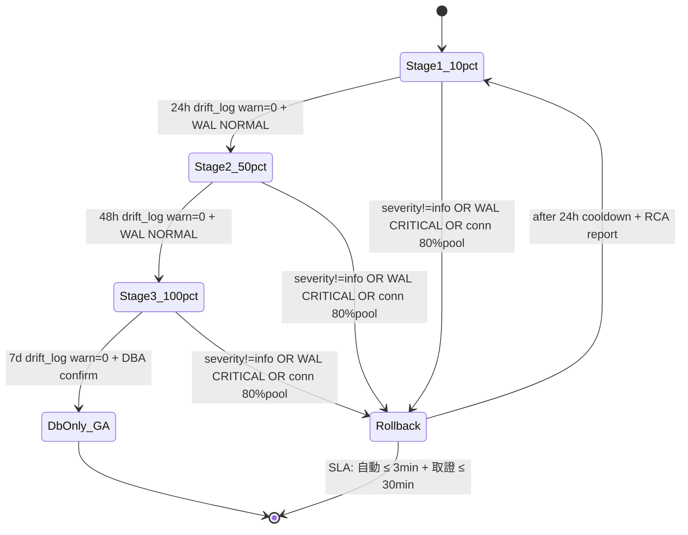

# ADR-SD09-005 — PG canary 三階梯閾值與回滾觸發條件

| 項目 | 內容 |
|------|------|
| 文件版本 | **v1.0（PM 形式核准 2026-05-20）** |
| 建立日期 | 2026-05-19 |
| 最後更新 | **2026-05-20**（T0-7 PM 形式核准）（二輪修復：drift_log schema 對齊 + 三觸發 race 處理 + SLA 拆兩段 + 連線數 pool_size 來源 + Rollback cooldown）|
| 狀態 | **ACCEPTED — PM 形式核准 2026-05-20（場景 A dev 自核）** |
| 對應 Sprint | SD_Improving_09 議題 A（PG production SOP §4 切換時序）|
| 接續文件 | [ADR-SD09-001](ADR-SD09-001-pg-db-only-cutover.md) §2.1 業務不可逆 |

---

## §1. 背景

首輪四方審查（**Architect M1 + QA M6**）指出：PG canary 三階梯（10%/50%/100%）為 PG 上線最關鍵架構決策，但僅出現在 SD09_Execution_Guide.md T3-A2 步驟描述，**未有 ADR 鎖定百分比閾值、觀察時長、回滾觸發精確條件、drift_count 容忍值**。

本 ADR 新增鎖定。

---

## §2. 決策

### §2.1 三階梯 canary 參數

| 階梯 | 流量百分比 | 觀察時長 | 條件 |
|------|----------|---------|------|
| **Stage 1** | 10% | 24h | `drift_log` 0 筆 warn/critical + WAL lag NORMAL + 連線數穩定 |
| **Stage 2** | 50% | 48h | 同上 |
| **Stage 3** | 100% | 7d | 同上 + DBA 親自確認 |

> **drift 判定（SD-C1 修復）**：對齊 `alembic/versions/0013_drift_log.sql` 真實 schema — 既無 `drift_count` 欄位也無 `created_at` 欄位；真實欄位為 `detected_at` (timestamptz) + `severity` ('info' / 'warn' / 'critical') + `field_drift` (jsonb)。**drift 事件 = `severity != 'info'` 即任一筆 warn/critical 寫入**。

### §2.2 三觸發回滾條件

任一條件觸發即立即 rollback（SOP §5）：

| 條件 | 觸發值 | 來源 |
|------|--------|------|
| **drift 事件**（SD-C1 修復） | 任一筆 drift_log 寫入 `severity != 'info'` | PG `drift_log` 表（pg_first reconcile）— `SELECT count(*) FROM drift_log WHERE detected_at > now() - interval '30 day' AND severity != 'info'` |
| **WAL lag CRITICAL** | ≥ 10s 持續 ≥ 60s | `PgHealthMonitor.classify_lag()` 三閾值（SD_08 W5） |
| **連線數異常**（Arch-m5 修復） | `active_connections > 80% × pool_size` 持續 ≥ 5 min | `PgHealthMonitor.get_active_connections()`；`pool_size` 來源 — 優先 `config.storage.pg_pool_size` (ConfigResolver layer 3) > `max_connections` PG 系統設定（fall-back） |

> **三觸發 race condition 處理（Arch-M1 修復）**：
> - **rollback 鎖定窗口 30 min**：首次觸發後 30 min 內忽略後續觸發（避免重複觸發切換）
> - **同時觸發**：以「最嚴重者」為依據 — **連線數 > WAL > drift** 優先級
> - **單次回滾至 yaml_only**：同時觸發場景**直接跳過階梯回退**（不走 100% → 50% → 10% → yaml_only 路徑，直接 100% → yaml_only）

### §2.3 rollback SLA（**Arch-M4 修復：拆兩段**）

| 段次 | 範圍 | SLA | 備注 |
|------|------|------|------|
| **自動回退** | 流量切換（storage.mode 切換 + PgHealthMonitor record_event） | **≤ 3 min** | DAL 切換 + cache invalidation 實證 < 60s；保守加 buffer |
| **取證歸檔** | drift_log 取證 + DBA/PM 通知 + Slack/email + 寫入 `SD09_Rollback_Forensics_*.md` | **≤ 30 min**（含人工通知）| Slack webhook + email 含人為查看延遲 |

實證來源：SD_06 W3 staging dry-run（`tools/sd06_w3_staging_dryrun.sh`）量測 storage.mode 切換 wall time < 60s（含 cache invalidation 全量重建）。

流程：
1. 切 `storage.mode` 至 yaml_only（**單次回滾不走階梯**，§2.2 race 處理規則）
2. 觸發 PgHealthMonitor `record_event("pg_degrade_yaml_only")`
3. 通知 DBA + PM（Slack + email）
4. drift_log 取證 → 寫入 `docs/06_quality/SD09_Rollback_Forensics_*.md`

### §2.4 PM 拍板替代選項（SD_09.md §6 #7）

PM 可選：
- **(a)** 10/50/100 × 24h/48h/7d（本 ADR 預設）
- **(b)** 5/25/100 × 12h/24h/7d（更保守，總長 ~9 天）
- **(c)** 0/100 × 7d（無中間階梯，激進；**不建議**）（Arch-m4 修復：明標不建議）

PM 拍板後寫入 SD_09.md §6 #7 + 本 ADR §2.1。

---

## §3. SOP §4 對齊（W3 T3-A2）

`Production_Migration_SOP.md` §4 切換時序必含：
- 三階梯 canary 表（§2.1）
- 三觸發回滾條件（§2.2）
- rollback SLA ≤ 10 min（§2.3）
- **state machine 圖（mermaid）**：canary 三階梯 × PgHealthMonitor WAL lag 三閾值聯動

範例 mermaid（**QA-m5 修復：Rollback 24h cooldown + RCA**）：

---

## §4. 對應參考

- [SD_Improving_09.md](../SD_Improving_09.md) §1.1 議題 A + §6 #7
- [SD09_Execution_Guide.md](../../05_development/SD09_Execution_Guide.md) W3 T3-A2
- [ADR-SD09-001](ADR-SD09-001-pg-db-only-cutover.md) §2 雙條件
- [ADR-SD08-005](ADR-SD08-005-pg-production-dual-track.md) 雙軌制
- [Production_Migration_SOP.md](../../08_deployment/Production_Migration_SOP.md) §4-§5

---

**簽核**：✅ ACCEPTED — 2026-05-21（SD_09 W0 T0-7 PM 形式核准；場景 A 個人開發 dev 自核 commit）
