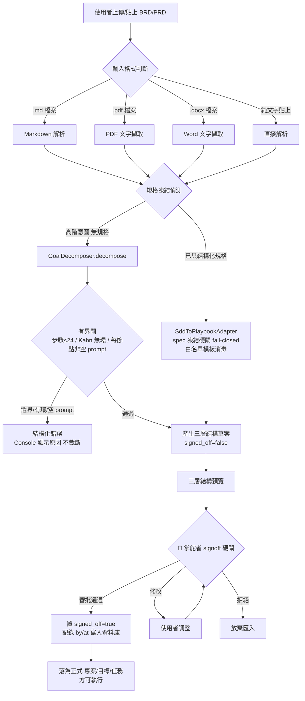
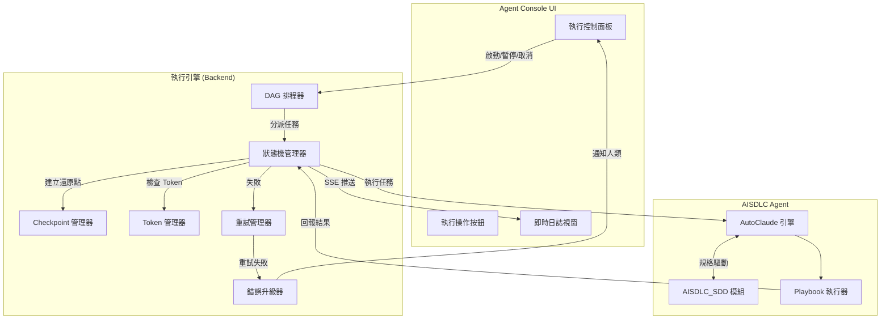
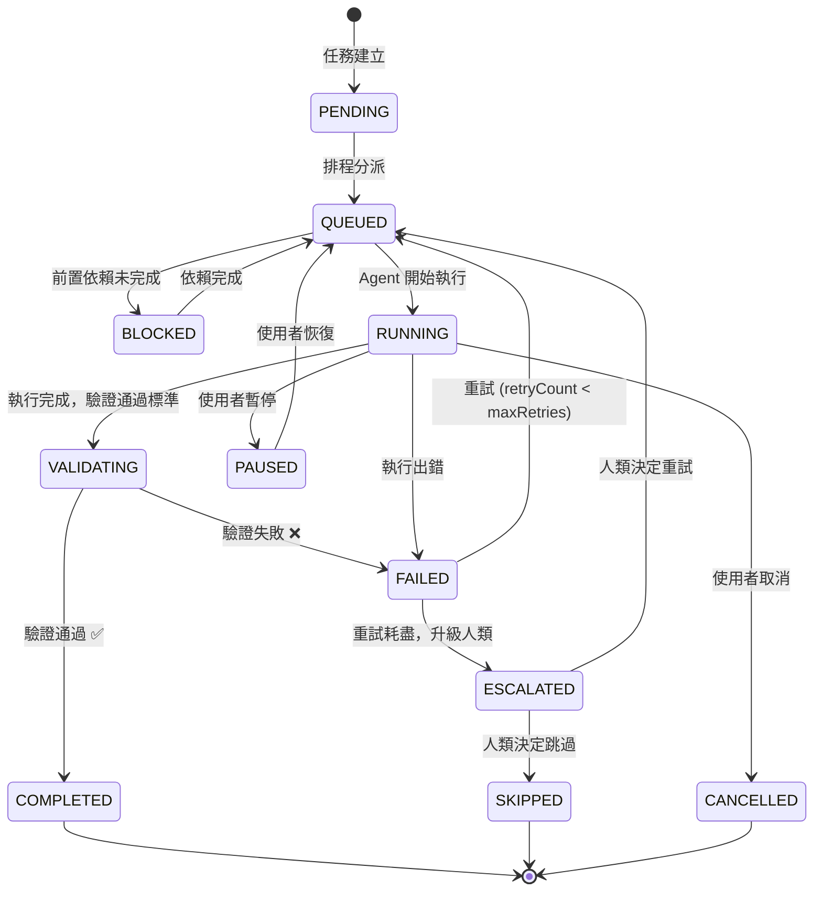
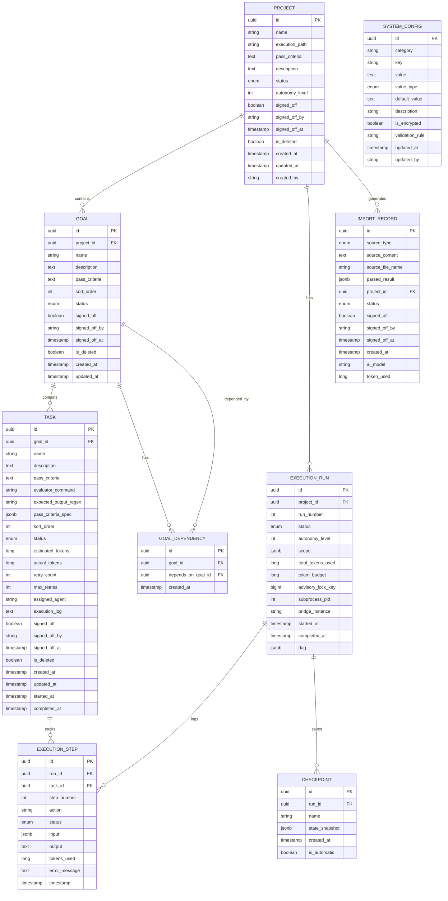
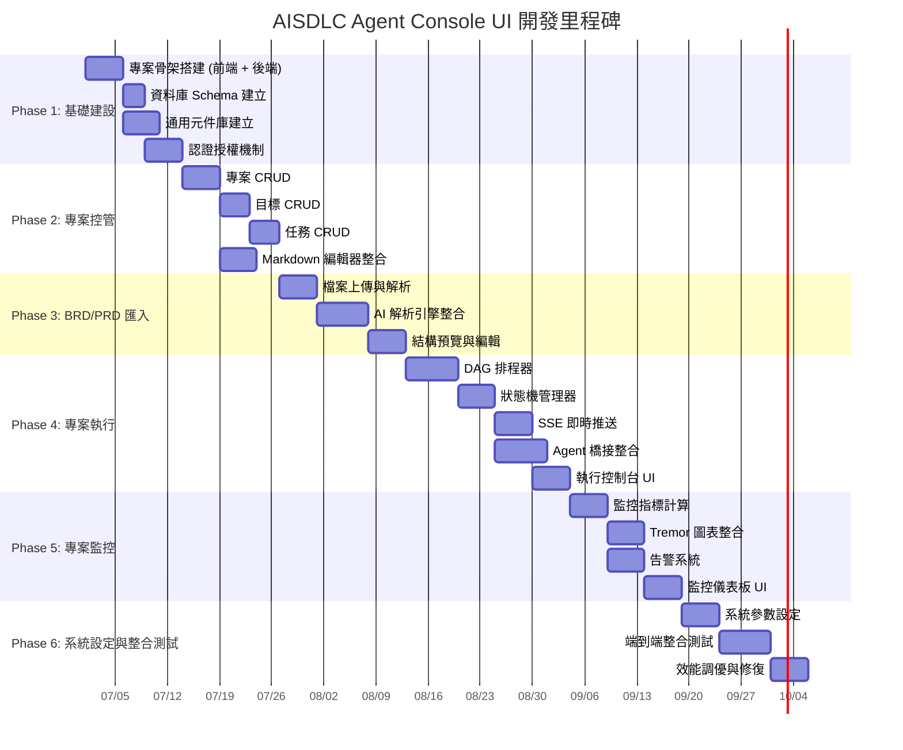
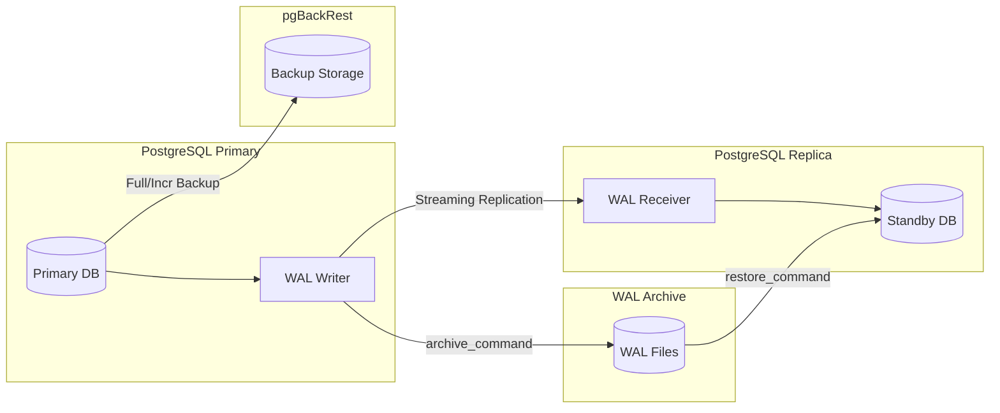

# AISDLC Agent Console UI — 產品需求文件 (PRD)

> **文件版本**：v1.1.0（整合 zero-trust 校正版）  
> **建立日期**：2026-06-17  
> **最後更新**：2026-06-18  
> **文件狀態**：Draft  
> **負責人**：AISDLC 架構團隊  

---

## 目錄

- [1. 文件概述](#1-文件概述)
- [2. 系統背景與定位](#2-系統背景與定位)
- [3. 技術棧規格](#3-技術棧規格)
- [4. 系統架構總覽](#4-系統架構總覽)
- [5. 功能模組需求](#5-功能模組需求)
  - [5.1 專案控管（三層管理架構）](#51-專案控管三層管理架構)
  - [5.2 BRD / PRD 智能解析引擎](#52-brd--prd-智能解析引擎)
  - [5.3 專案執行引擎](#53-專案執行引擎)
  - [5.4 專案監控中心](#54-專案監控中心)
  - [5.5 系統參數設定](#55-系統參數設定)
- [6. 資料模型設計](#6-資料模型設計)
- [7. API 規格概要](#7-api-規格概要)
- [8. UI/UX 設計規範](#8-uiux-設計規範)
- [9. 非功能性需求](#9-非功能性需求)
- [10. 里程碑與交付計畫](#10-里程碑與交付計畫)
- [11. Docker 容器化部署架構](#11-docker-容器化部署架構)
- [12. PostgreSQL 18 備援副本與災難復原（DR）策略](#12-postgresql-18-備援副本與災難復原dr策略)
- [附錄 A：名詞定義](#附錄-a名詞定義)
- [附錄 B：狀態機定義](#附錄-b狀態機定義)

---

## 0. Zero-Trust 現況實測基線與整合校正（權威區塊，凌駕後文衝突細節）

> **本區塊為 2026-06-18 對既有三模組的階段一實測（zero-trust）結果，是本 PRD 整合 `Agent_ConsoleUI_PRD.md` 與 `Agent_ConsoleUI_PRD_Claude_00.md` 兩稿後的權威事實層。** 凡後文（§2~§12）任何描述與本區塊衝突，**一律以本區塊為準**；後文保留為豐富的 UI/資料模型/流程細節參考。

### 0.1 系統現況實測（禁引用宣稱值）

| 主張 | 實測事實（2026-06-18） | 證據來源 |
|------|----------------------|---------|
| AutoClaude 架構 | Hexagonal 微核心，`core/ports/` **17 個 Port 介面（16 檔，`state_repository.py` 含 `IStateRepository` + `IQueryableStateRepository` 兩介面）**、`plugins/` **17 active / 18 靜態（`hotkey_plugin` 為條件式註冊，非 GUI/TTY 環境不啟用）**、DAL **三後端 File/InMemory/Pg + Dual**（非「9 Ports / 13 Plugin」宣稱值）；**Port／Plugin 數量以 `AutoClaude/CLAUDE.md` 的 `[Architecture Snapshot]` 區段為 SSOT** | `AutoClaude/autoclaude/core/ports/` + `plugins/` + `infra/repositories/factory.py` + `AutoClaude/CLAUDE.md` `[Architecture Snapshot]` |
| AutoClaude 對外介面 | **僅 CLI**：`python -m autoclaude <playbook.yaml> [--config config.yaml] [--fresh]`；**無內建 HTTP/REST API server**（無 FastAPI/Flask）| `AutoClaude/autoclaude/main.py` |
| AutoClaude 修正腦 / 執行器 | **MiniMax**（修正決策 + 自主分解，env `MINIMAX_API_KEY`/`MINIMAX_BASE_URL`/`MINIMAX_MODEL`）+ **Claude Code CLI**（步驟執行器）| `config.yaml`（minimax / claude 區段）|
| 持久化模型 | 三層任務模型 `playbook_runs`→`checkpoints`→`goal_progress`（alembic 16 migrations）；checkpoint additive 寫入 | `AutoClaude/alembic/versions/`（0001/0016）|
| PostgreSQL | 既用 **`pgvector/pgvector:pg18`（PG18 + pgvector 0.8.2）**，與本 PRD 指定 PG18 **完全一致** → Console 可共享同一實例 | `AutoClaude/docker-compose.yml` |
| AISDLC_SDD 版本/資產 | 最新 **v0.14**（v0.01~v0.14）；26 Agents / **10 Scenarios**（brownfield/devops/documentation/greenfield/integration/migration/performance/refactoring/security/testing）/ 39 治理規則(R-9.x) / 45 Skills / 5 Hooks | `AISDLC_SDD/AISDLC_SDD_v0.14/scenarios/` |
| AISDLC_SDD 對外介面 | **純 CLI / Markdown / Python Hook，無 UI/API**；PRD/FRD 模板存在、**無獨立 BRD 模板**（以 PRD 起點）| `AISDLC_SDD_v0.14/docs_template/core/prd/PRD_Universal_Template.md` |
| A 軌橋接 | `SddToPlaybookAdapter`（有規格→規格驅動，spec 凍結硬閘+白名單模板消毒）/ `GoalDecomposer`（無規格高階 goal→DAG，三道有界閘 ≤24/Kahn 無環/非空 + **🔴 人工 signoff 硬閘**）| `AutoClaude/autoclaude/infra/adapters/sdd_to_playbook_adapter.py`、`execution/goal_decomposer.py` |
| 既有 web 程式碼 | repo 內**零** Next.js / Spring Boot / Java 程式碼（全新綠地開發）| repo 全域搜尋 |

### 0.2 整合架構校正：Engine Bridge 旁車（reconcile「引擎無 API server」）

**衝突**：後文 §5.5.1.5/5.5.1.6 將 `autoclaude.engineUrl=http://localhost:8081`、`sdd.engineUrl=http://localhost:8082` 視為引擎本身的 HTTP 服務。**實測兩引擎皆純 CLI、無任何 HTTP server**，Java（Spring Boot）無法直接 HTTP 呼叫。

**校正決策（ADR-候選，SCG-1/2 將正式化）**：新增 **單一 Engine Bridge（Python 3.11 + FastAPI 薄旁車，固定 port 8081）** 包裝**兩既有引擎於同一服務**，對外為 REST + SSE；**§5.5 的 `engineUrl` 一律實指向此唯一 Engine Bridge（`http://engine-bridge:8081`），而非引擎本體，也不是兩個獨立旁車**。AutoClaude 與 AISDLC_SDD 兩引擎以 **path 前綴區分**（`/autoclaude/...`、`/sdd/...`），而非兩個 host/port。
- 職責：`POST /runs`（物化 config.yaml/env → spawn `python -m autoclaude` 子程序）、`/runs/{id}:pause|resume|stop`、`GET /runs/{id}/stream`（SSE 推 log + ExecutionObservation + FSM 狀態）、`GET /runs/{id}/checkpoints` + `POST /runs/{id}/restore`（checkpoint 列舉與歷史續跑，見 §0.2.1）、`POST /decompose`（呼叫 GoalDecomposer / SDD skill）、`GET /fsm/{project}`（讀 FSM-STATE / RTM coverage）；並發互斥與子程序治理見 §0.2.2。
- 理由 vs 替代：替代 A（Java 直接 spawn subprocess + 解析檔案）把 Python 細節滲入 Java；替代 B（在 AutoClaude 核心內加 server）**違架構紅線**（污染微核心）；替代 C（兩個獨立旁車 :8081/:8082）徒增容器與 DNS 表面、無益。採**單一旁車多路徑** → **零侵入引擎核心**、Java 維持 Clean Architecture/DDD 純度、Python 解析邏輯重用引擎自身程式、部署面最小。
- 部署拓樸：`console-web(Next.js16)` → `console-api(Spring Boot3.2/Java21/DDD)` → **`engine-bridge(FastAPI 包 AutoClaude+AISDLC_SDD CLI，單一容器 port 8081)`**；四者共享 **PostgreSQL 18**（`schema: console.*` + `schema: autoclaude.*`）。

#### 0.2.1 Engine Bridge checkpoint 續跑語意（resume vs restore）

| 操作 | 端點 | 語意 |
|------|------|------|
| **resume** | `POST /runs/{id}:resume` | 將**暫停（PAUSED）態**的 run 恢復為執行中，從暫停點接續分派任務（不回退進度）|
| **list checkpoints** | `GET /runs/{id}/checkpoints` | 列出該 run 所有可用 checkpoint（對應 AutoClaude `checkpoints` 表 additive 寫入）|
| **restore** | `POST /runs/{id}/restore`（body 指定 `checkpoint_id`）| 從**指定歷史 checkpoint** 重建狀態續跑（時間回退到該還原點），對應 §7.1.5 console-api restore API |

> resume 是「同一進度恢復暫停」；restore 是「回退到歷史還原點再續跑」。二者不可混用：restore 必帶 `checkpoint_id`，resume 不帶。

#### 0.2.2 並發互斥與子程序治理

- **同專案並發互斥**：Engine Bridge 啟動 run 前取 PostgreSQL advisory lock `pg_advisory_lock(hashtext(project || ':' || execution_path))`；同專案同路徑已有 run 持鎖時，新 `POST /runs` 回 **409 Conflict**（不排隊、不靜默覆寫）。鎖於 run 終態（COMPLETED/FAILED/CANCELLED）或 Bridge 偵測子程序退出時釋放。
- **pause / stop 信號語意**：`pause` = 當前步驟完成後**不再分派新任務**（子程序不殺，等步驟自然結束）；`stop` = 對子程序送 **SIGTERM**，逾 grace period（預設 30s）未退則升級 **SIGKILL**。
- **孤兒回收與 reconciliation**：Bridge 記錄每 run 的子程序 PID 與 `bridge_instance`（見 `execution_runs` 補欄位）；Bridge 崩潰重啟後掃描 `RUNNING` 但無對應存活 PID 的 run，標記為 `FAILED`（reason=`orphaned`）並釋放 advisory lock，杜絕殭屍 run 永久持鎖。
- 狀態真相單一：console-api 對引擎遙測一律**唯讀投影**（read-model），唯一寫入點在引擎/Bridge，杜絕雙寫漂移。

### 0.3 概念↔引擎映射（SSOT — 三層治理對接真實引擎概念）

| Console 概念 | AutoClaude | AISDLC_SDD |
|--------------|-----------|------------|
| Project | `Playbook.project` / `playbook_runs.project` / 工作目錄 | `SDD_PROJECT` + `docs/` 編號工作區 |
| Goal | `global_goal` / `goal_progress.goal_task_id` | Scenario + Sprint |
| Task | `PlaybookTask`（step_id/prompt/expected_output_regex/evaluator_command）| User Story（US-XXX）+ AC |
| 通過標準 | `expected_output_regex` + `evaluator_command`（白名單模板消毒）| AC-XXX 驗收標準 / SCG gate |
| Run | `playbook_runs.run_id` + `checkpoints` | `FSM-STATE-{project}.yaml` session |
| 監控遙測 | checkpoint / RTM sink / observability port | FSM decision_trace / retry_history / RTM |

> **任務「通過標準」物化安全紅線**：凡 UI 輸入 → 引擎指令/路徑之物化路徑，**強制套 `SddToPlaybookAdapter` 等級 CONDITIONAL 三層消毒**（白名單模板 + 黑名單字元集 `{!,` + "`" + `,>,<,~,$,&,;}` + shell=False/shlex）。見 §0.5 NFR-SEC-03。

### 0.4 BRD/PRD 拆解的 🔴 人工 signoff 硬閘（校正 §5.2 流程）

§5.2 的 AI 解析流程**必須**疊加以下實測既有機制（不可自動跳過）：
- **雙路徑**：已具結構化規格 → `SddToPlaybookAdapter`（spec 凍結硬閘 fail-closed）；高階意圖 → `GoalDecomposer.decompose()`（三道機械有界閘：步驟 ≤24 / Kahn 無環 / 每節點非空 prompt）。
- **🔴 人工 signoff 硬閘**：AI 產出之三層草案標 `signed_off=false`，**必須**掌舵者在 Console 審批（對應 `GoalDecomposer.approve()` 與 SDD `HUMAN_PENDING`）後才落為正式 Goal/Task 並可執行；未 signoff **禁止啟動執行**（後端二次校驗）。
- **逾界不靜默**：拆解 >24 步 / 有環 / 空 prompt 時回傳結構化錯誤，Console 顯示原因，不截斷。

### 0.5 NFR 校正補強（與 §9 合併適用）

| 編號 | 類別 | 補強需求（凌駕 §9 衝突項）|
|------|------|------|
| NFR-SEC-03 | 注入防護 | 凡「UI 輸入生成引擎指令/路徑」套等強度 CONDITIONAL 三層消毒（白名單+黑名單字元+shell=False/shlex），等同引擎既有防線 |
| NFR-SEC-04 | 對外 I/O | Engine Bridge 外呼（模型/HTTP/訊息）**預設 deny + allowlist domain + 全程審計 log**（對齊 AutoClaude `IToolInvocation` 威脅模型，SSRF/畸形 URL/allowlist 繞過攻防測試）|
| NFR-SEC-05 | Token 閘 | **禁止經 Console 提高 Token 預算上限以繞過安全收斂**；`halt_threshold_pct` 必 > `compact_threshold_pct`（後端硬校驗）|
| NFR-OBS-01 | 狀態一致 | 四源真相一致：`FSM-STATE-{project}.yaml` / 引擎執行邏輯 / Console 渲染 / PG 持久化，抽查比對；漂移即缺陷 |
| NFR-REL-03 | 備份 | §9.3「每日一次」備份**以 §12 PG18 備援/DR 方案為準**（WAL 連續歸檔 + 串流複製 standby + PITR + pgBackRest + **離站 S3/MinIO 預設啟用** + 每日 pg_dump 邏輯離站 + 定期真實 restore 演練）；離站備份為**必要**非選配 |
| NFR-COMPAT-01 | 零侵入 | 不改 AutoClaude/AISDLC_SDD 核心；框架演進遵 Copy-on-Evolve（v0.0X 凍結、複製 v0.0(X+1)）|

### 0.6 系統參數真相校正（與 §5.5.1.1 合併）

§5.5.1.1「AI 模型設定」僅描述單一 Anthropic API，**實測引擎為雙腦**，系統參數須涵蓋：
- **Claude Code CLI**（步驟執行器）：command / extra_args / continue_flag / encoding。
- **MiniMax**（修正腦 + 自主分解）：`MINIMAX_BASE_URL`（模型 URL）/ `MINIMAX_MODEL`（模型名）/ `MINIMAX_API_KEY`（Token，加密）/ `enable_kernel_brain`。
- **Token/Context**：`compact_threshold_pct`(80) / `halt_threshold_pct`(90) / `auto_resume` / `max_auto_resumes`。
- **儲存後端**：`storage.mode`（yaml_only/both/db_only）/ `db_dsn`（加密）/ `dual_read_resolution`。
> §5.5.1.1 既有的 provider/apiUrl/apiKey 欄位保留為 Console 抽象層；物化到引擎時由 Bridge 對映成上述 `MINIMAX_*` 與 `claude` 區段 + `config.yaml`。

---

## 1. 文件概述

### 1.1 目的

本文件定義 **AISDLC Agent Console UI** 的完整產品需求，涵蓋五大功能模組：專案控管、BRD/PRD 智能解析、專案執行引擎、專案監控中心、系統參數設定。此 Console 作為 AISDLC 自動開發 Agent 的人機互動界面，整合 AutoClaude（多步驟 Playbook 執行引擎）、AISDLC_SDD（AI 規格驅動開發）、AISDLC Agent（自動化開發 Agent）三大既有模組，提供端到端的自治開發流程管理能力。

### 1.2 讀者對象

| 角色 | 關注重點 |
|------|----------|
| 產品經理 | 功能範圍、使用者故事、驗收標準 |
| 架構師 | 系統架構、模組邊界、整合介面 |
| 前端工程師 | UI 元件、頁面結構、互動設計 |
| 後端工程師 | API 設計、領域模型、資料庫 Schema |
| QA 工程師 | 驗收標準、測試策略 |

### 1.3 文件範圍

- ✅ 在範圍內：Console UI 五大模組功能需求、資料模型、API 概要、UI/UX 規範
- ❌ 不在範圍內：AutoClaude 核心引擎內部實作、AISDLC_SDD 規格解析演算法、底層 AI 模型訓練

### 1.4 參考文件

| 文件 | 說明 |
|------|------|
| AutoClaude 架構文件 | 微核心化架構、Hexagonal Ports、Kernel/EventBus、Plugins、DAL |
| AISDLC_SDD 規格文件 | AI 規格驅動開發流程、Level 10 自治開發目標 |
| AISDLC Agent 整合規格 | AutoClaude ↔ AISDLC_SDD 雙向橋接協定 |

---

## 2. 系統背景與定位

### 2.1 核心模組關係

```
┌─────────────────────────────────────────────────────────┐
│                 AISDLC Agent Console UI                 │
│  ┌──────────┐ ┌──────────┐ ┌──────────┐ ┌──────────┐   │
│  │ 專案控管  │ │ BRD/PRD  │ │ 專案執行  │ │ 專案監控  │   │
│  └────┬─────┘ └────┬─────┘ └────┬─────┘ └────┬─────┘   │
│       │            │            │            │          │
│  ┌────┴────────────┴────────────┴────────────┴─────┐    │
│  │              AISDLC Agent 整合層                 │    │
│  │         （雙向橋接 / 協調 / 排程）                │    │
│  └─────────┬────────────────────┬──────────────────┘    │
│            │                    │                       │
│  ┌─────────▼──────────┐ ┌──────▼──────────────────┐    │
│  │    AutoClaude       │ │    AISDLC_SDD           │    │
│  │ (Playbook 執行引擎) │ │ (AI 規格驅動開發)       │    │
│  │  Level 5 自治系統   │ │  Level 10 自治目標      │    │
│  │  Hexagonal Arch     │ │  Dynamic Workflow       │    │
│  └─────────────────────┘ └─────────────────────────┘    │
└─────────────────────────────────────────────────────────┘
```

> **註**：圖中「Level 5 自治系統 / Level 10 自治目標」為**定位敘述（產品願景定錨）**，非實測能力等級；實際自治等級以 §5.3.2 執行自治等級表（Level 1–10 行為定義）與引擎實測為準。

### 2.2 Console UI 在系統中的定位

Agent Console UI 是 **AISDLC 自動開發 Agent 的操控面板**，承擔以下職責：

1. **可視化管理層**：將 AutoClaude 與 AISDLC_SDD 的底層自治能力，封裝為使用者可理解、可操控的專案管理界面
2. **人機協作接口**：在 Agent 自治執行的過程中，提供必要的人類監督、介入、審核節點
3. **全局可觀測性**：提供專案執行的即時狀態、日誌、指標、告警，滿足「可信任的自治」要求
4. **規格輸入通道**：透過 BRD/PRD 解析，將業務需求轉化為 Agent 可執行的結構化任務

### 2.3 設計原則

| 原則 | 描述 |
|------|------|
| **Agent-First** | UI 設計以 Agent 自治執行為中心，人類是監督者與審核者，非逐步操作者 |
| **Observe > Control** | 優先提供觀測能力（Observability），其次才是控制能力（Controllability） |
| **Progressive Autonomy** | 支持從 Level 1（人工確認每步）到 Level 5+（全自治）的漸進式自治等級 |
| **Spec-Driven** | 所有開發工作由規格（Spec）驅動，規格即合約、規格即測試、規格即文件 |
| **Fail-Safe** | 任何執行失敗都不應造成不可逆的損害，支援回滾與重試 |

---

## 3. 技術棧規格

### 3.1 技術選型

| 層級 | 技術 | 版本 | 備註 |
|------|------|------|------|
| **前端框架** | Next.js (App Router) | 16.x | Server Components + Client Components 混合渲染 |
| **前端語言** | TypeScript | 5.x | Strict Mode 啟用 |
| **CSS 框架** | Tailwind CSS | 4.x | Utility-First |
| **UI 元件庫** | shadcn/ui | latest | 基於 Radix UI，可客製化 |
| **圖表元件** | Tremor | 3.x | 數據可視化、指標卡片、圖表 |
| **後端框架** | Spring Boot | 3.2.x | Java 21，Virtual Threads |
| **架構模式** | Clean Architecture + DDD | — | 四層分離：Controller → UseCase → Domain → Infrastructure |
| **資料庫** | PostgreSQL | 18.x | JSONB 支援 Markdown 內容儲存 |
| **ORM** | Spring Data JPA + QueryDSL | — | 動態查詢 |
| **API 風格** | RESTful + SSE (Server-Sent Events) | — | SSE 用於即時執行日誌推送 |
| **認證** | Spring Security + JWT | — | Bearer Token |
| **API 文件** | SpringDoc OpenAPI | 3.x | Swagger UI |

> **版本相容性風險註記（鎖定時取當時 stable）**：
> - **Tailwind 4.x × Tremor 3.x × shadcn**：Tremor 3.x 係為 **Tailwind v3** 設計，與 Tailwind 4.x（新引擎/設定格式）**未必相容**，存在 breaking risk。落地前須 **spike 驗證**；若不通過，**降 Tailwind 至 3.4** 或改用相容圖表庫（如 Recharts / Tremor 之後續相容版）。
> - **Next.js 16 / Spring Boot 3.2**：為**目標版本**，實際鎖定時取**當時 stable**。**Spring Boot 3.2 已接近 EOL**，建議升至 **3.3+**（同 Java 21 / Virtual Threads）。
> - 上述版本鎖定須於 SCG-2 架構凍結前定案並立 ADR。

### 3.2 前後端整合

```
┌─────────────────────┐        ┌─────────────────────┐
│   Next.js 16 前端    │        │  Spring Boot 後端    │
│                     │  REST  │                     │
│  App Router         │◄──────►│  REST Controllers   │
│  Server Components  │  JSON  │  (Clean Arch)       │
│  shadcn/ui + Tremor │        │                     │
│                     │  SSE   │  SSE Endpoints      │
│  EventSource API    │◄───────│  (即時推送)          │
│                     │        │                     │
│  WebSocket (可選)   │◄──────►│  WebSocket Handler  │
│  (雙向通訊)         │        │  (Agent 互動)        │
└─────────────────────┘        └──────────┬──────────┘
                                          │
                                          ▼
                               ┌─────────────────────┐
                               │   PostgreSQL 18      │
                               │   ┌───────────────┐  │
                               │   │ 專案/目標/任務  │  │
                               │   │ 執行記錄       │  │
                               │   │ 系統參數       │  │
                               │   │ 審計日誌       │  │
                               │   └───────────────┘  │
                               └─────────────────────┘
```

---

## 4. 系統架構總覽

### 4.1 後端 Clean Architecture 分層

```
src/main/java/com/aisdlc/console/
├── adapter/                        # 適配器層（Adapter Layer）
│   ├── in/
│   │   ├── web/                    # REST Controllers
│   │   │   ├── ProjectController
│   │   │   ├── GoalController
│   │   │   ├── TaskController
│   │   │   ├── ExecutionController
│   │   │   ├── MonitorController
│   │   │   └── SystemConfigController
│   │   └── sse/                    # SSE 推送端點
│   │       └── ExecutionStreamController
│   └── out/
│       ├── persistence/            # JPA Repository 實作
│       ├── agent/                  # AutoClaude / AISDLC_SDD 橋接
│       └── messaging/              # EventBus 橋接
│
├── application/                    # 應用層（Application Layer）
│   ├── port/
│   │   ├── in/                     # Input Ports (Use Cases)
│   │   │   ├── ManageProjectUseCase
│   │   │   ├── ManageGoalUseCase
│   │   │   ├── ManageTaskUseCase
│   │   │   ├── ParseBrdPrdUseCase
│   │   │   ├── ExecuteProjectUseCase
│   │   │   └── MonitorProjectUseCase
│   │   └── out/                    # Output Ports (SPI)
│   │       ├── ProjectRepository
│   │       ├── GoalRepository
│   │       ├── TaskRepository
│   │       ├── ExecutionRepository
│   │       └── AgentBridge
│   └── service/                    # Use Case 實作
│
├── domain/                         # 領域層（Domain Layer）
│   ├── model/                      # Aggregate Root / Entity / Value Object
│   │   ├── project/
│   │   ├── goal/
│   │   ├── task/
│   │   ├── execution/
│   │   └── config/
│   ├── event/                      # Domain Events
│   └── service/                    # Domain Services
│
└── infrastructure/                 # 基礎設施層（Infrastructure Layer）
    ├── config/                     # Spring 配置
    ├── security/                   # 認證授權
    └── persistence/                # JPA Entities & Repositories
```

### 4.2 前端頁面結構 (App Router)

```
app/
├── layout.tsx                      # Root Layout（側邊欄 + 主內容區）
├── page.tsx                        # Dashboard 首頁
├── projects/
│   ├── page.tsx                    # 專案列表
│   ├── new/page.tsx                # 新建專案
│   └── [projectId]/
│       ├── page.tsx                # 專案詳情
│       ├── edit/page.tsx           # 編輯專案
│       ├── goals/
│       │   ├── page.tsx            # 目標列表
│       │   ├── new/page.tsx        # 新建目標
│       │   └── [goalId]/
│       │       ├── page.tsx        # 目標詳情
│       │       ├── edit/page.tsx   # 編輯目標
│       │       └── tasks/
│       │           ├── page.tsx    # 任務列表
│       │           ├── new/page.tsx # 新建任務
│       │           └── [taskId]/
│       │               ├── page.tsx # 任務詳情
│       │               └── edit/page.tsx # 編輯任務
│       ├── execute/page.tsx        # 專案執行控制台
│       └── monitor/page.tsx        # 專案監控儀表板
├── import/
│   └── page.tsx                    # BRD/PRD 匯入解析
├── settings/
│   └── page.tsx                    # 系統參數設定
└── api/                            # Next.js API Routes (BFF 層，可選)
```

---

## 5. 功能模組需求

---

### 5.1 專案控管（三層管理架構）

#### 5.1.0 架構概述

專案控管採用 **Project → Goal → Task** 三層樹狀管理結構，每一層皆支援完整 CRUD 操作。

```
Project (專案)
├── Goal 1 (目標)
│   ├── Task 1.1 (任務)
│   ├── Task 1.2 (任務)
│   └── Task 1.3 (任務)
├── Goal 2 (目標)
│   ├── Task 2.1 (任務)
│   └── Task 2.2 (任務)
└── Goal 3 (目標)
    └── Task 3.1 (任務)
```

---

#### 5.1.1 專案管理 (Project Management)

##### 功能描述

專案是最頂層的管理單元，代表一個完整的開發專案。使用者可對專案進行 CRUD 操作，並在專案詳情頁面總覽其下所有目標與任務。

##### 資料欄位

| 欄位名稱 | 類型 | 必填 | 說明 |
|----------|------|------|------|
| `id` | UUID | 自動 | 專案唯一識別碼 |
| `name` | String(200) | ✅ | 專案名稱 |
| `executionPath` | String(500) | ✅ | 專案執行路徑（本機檔案系統路徑） |
| `passCriteria` | Text (Markdown) | ✅ | 專案通過標準（支援 .md 格式） |
| `description` | Text (Markdown) | ❌ | 專案說明描述（支援 .md 格式） |
| `status` | Enum | 自動 | `DRAFT` / `READY` / `EXECUTING` / `COMPLETED` / `FAILED` / `ARCHIVED` |
| `autonomyLevel` | Integer(1-10) | ❌ | 專案自治等級（預設 3） |
| `signedOff` | Boolean | 自動 | 🔴 人工 signoff 硬閘：AI 草案生成之專案初始 `false`，掌舵者審批後才 `true`（`true` 才可執行；手動建立之專案預設 `true`）|
| `signedOffBy` | String | ❌ | 審批者（signoff 不可匿名）|
| `signedOffAt` | Timestamp | ❌ | 審批時間 |
| `createdAt` | Timestamp | 自動 | 建立時間 |
| `updatedAt` | Timestamp | 自動 | 最後更新時間 |
| `createdBy` | String | 自動 | 建立者 |

##### 使用者故事

| ID | 故事 | 驗收標準 |
|----|------|----------|
| US-P-01 | 身為使用者，我要能建立新專案，以開始管理我的開發工作 | 填寫名稱、執行路徑、通過標準後可成功建立專案，狀態預設為 `DRAFT` |
| US-P-02 | 身為使用者，我要能查看專案列表，以總覽所有專案的狀態 | 列表顯示專案名稱、狀態、目標數量、任務數量、最後更新時間，支援搜尋與排序 |
| US-P-03 | 身為使用者，我要能查看專案詳情，以了解專案的完整資訊 | 詳情頁面顯示所有欄位、Markdown 說明描述渲染、下轄目標標題清單（含各目標下任務數量） |
| US-P-04 | 身為使用者，我要能編輯專案資訊，以更新專案設定 | 可編輯所有可編輯欄位，`EXECUTING` 狀態下限制可編輯範圍 |
| US-P-05 | 身為使用者，我要能刪除專案，以清理不需要的專案 | 軟刪除（標記 `ARCHIVED`），`EXECUTING` 中的專案不可刪除 |
| US-P-06 | 身為使用者，我要能在專案詳情頁看到所有目標的標題列表 | 每個目標標題旁顯示該目標下的任務數量 |

##### UI 頁面規格

**專案列表頁 (`/projects`)**

```
┌─────────────────────────────────────────────────────────────┐
│  📋 專案管理                            [+ 新建專案] [匯入]  │
│─────────────────────────────────────────────────────────────│
│  🔍 搜尋專案...          篩選: [狀態 ▼] [排序 ▼]            │
│─────────────────────────────────────────────────────────────│
│  ┌───────────────────────────────────────────────────────┐  │
│  │ 📁 AISDLC Core Platform          狀態: ● 執行中      │  │
│  │    目標: 5  │  任務: 23  │  更新: 2026-06-17         │  │
│  │    [查看] [編輯] [執行] [監控]                         │  │
│  ├───────────────────────────────────────────────────────┤  │
│  │ 📁 AutoClaude v2.0               狀態: ○ 草稿        │  │
│  │    目標: 3  │  任務: 12  │  更新: 2026-06-16         │  │
│  │    [查看] [編輯] [刪除]                                │  │
│  └───────────────────────────────────────────────────────┘  │
│                                                             │
│  顯示 1-10 / 共 25 筆                    [< 1 2 3 ... >]   │
└─────────────────────────────────────────────────────────────┘
```

**專案詳情頁 (`/projects/[projectId]`)**

```
┌─────────────────────────────────────────────────────────────┐
│  ← 返回列表    📁 AISDLC Core Platform                      │
│─────────────────────────────────────────────────────────────│
│  狀態: ● 就緒    自治等級: Lv.3    建立: 2026-06-17         │
│                                                             │
│  ┌─ 基本資訊 ──────────────────────────────────────────┐    │
│  │ 執行路徑: /home/user/projects/aisdlc-core           │    │
│  │ 通過標準: (Markdown 渲染區域)                        │    │
│  │   - 所有單元測試通過率 ≥ 95%                         │    │
│  │   - 整合測試全數通過                                 │    │
│  │   - 程式碼覆蓋率 ≥ 80%                              │    │
│  └──────────────────────────────────────────────────────┘    │
│                                                             │
│  ┌─ 專案說明 ──────────────────────────────────────────┐    │
│  │ (Markdown 渲染區域)                                  │    │
│  │ ## 專案概述                                          │    │
│  │ AISDLC 核心平台是...                                 │    │
│  └──────────────────────────────────────────────────────┘    │
│                                                             │
│  ┌─ 目標清單 (5) ──────────────────── [+ 新增目標] ───┐    │
│  │ ☑ 目標 1: 建立基礎架構           任務: 5 / 5 完成   │    │
│  │ ◻ 目標 2: 實作核心模組           任務: 3 / 8 完成   │    │
│  │ ◻ 目標 3: API 整合               任務: 0 / 6 完成   │    │
│  │ ◻ 目標 4: 測試與品質             任務: 0 / 3 完成   │    │
│  │ ◻ 目標 5: 部署與文件             任務: 0 / 1 完成   │    │
│  └──────────────────────────────────────────────────────┘    │
│                                                             │
│  [編輯專案] [執行專案] [查看監控] [匯出] [刪除]              │
└─────────────────────────────────────────────────────────────┘
```

---

#### 5.1.2 目標管理 (Goal Management)

##### 功能描述

目標是專案的第二層管理單元，每個專案下可包含多個目標。每個目標有獨立的說明描述（Markdown 格式）與通過標準。

##### 資料欄位

| 欄位名稱 | 類型 | 必填 | 說明 |
|----------|------|------|------|
| `id` | UUID | 自動 | 目標唯一識別碼 |
| `projectId` | UUID (FK) | ✅ | 所屬專案 ID |
| `name` | String(200) | ✅ | 目標名稱 |
| `description` | Text (Markdown) | ❌ | 目標說明描述（支援 .md 格式） |
| `passCriteria` | Text (Markdown) | ✅ | 目標通過標準 |
| `sortOrder` | Integer | 自動 | 排序順序（同專案內） |
| `status` | Enum | 自動 | `PENDING` / `IN_PROGRESS` / `COMPLETED` / `FAILED` / `SKIPPED` |
| `dependsOn` | UUID[] | ❌ | 前置依賴目標 ID 列表（**資料層改以關聯表 `goal_dependencies` 承載，可 FK + 應用層 Kahn 防環**，見 §6）|
| `signedOff` | Boolean | 自動 | 🔴 人工 signoff 硬閘：AI 草案生成之目標初始 `false`，審批後 `true`（`true` 才可執行）|
| `signedOffBy` | String | ❌ | 審批者 |
| `signedOffAt` | Timestamp | ❌ | 審批時間 |
| `createdAt` | Timestamp | 自動 | 建立時間 |
| `updatedAt` | Timestamp | 自動 | 最後更新時間 |

##### 使用者故事

| ID | 故事 | 驗收標準 |
|----|------|----------|
| US-G-01 | 身為使用者，我要能在專案下建立新目標 | 填寫名稱、通過標準後可建立，自動關聯到所屬專案 |
| US-G-02 | 身為使用者，我要能查看目標列表（含各目標下的任務數量） | 列表顯示目標名稱、狀態、任務數量、完成比例 |
| US-G-03 | 身為使用者，我要能查看目標詳情，包含 Markdown 渲染的說明與任務標題清單 | 說明描述正確渲染 Markdown，列出所有任務標題 |
| US-G-04 | 身為使用者，我要能編輯目標 | 可修改名稱、說明、通過標準、排序順序 |
| US-G-05 | 身為使用者，我要能刪除目標 | 軟刪除，關聯任務一併標記刪除 |
| US-G-06 | 身為使用者，我要能拖曳調整目標順序 | 拖曳後自動更新 `sortOrder` |
| US-G-07 | 身為使用者，我要能設定目標間的依賴關係 | 支援選取前置目標，呈現依賴拓撲 |

##### UI 頁面規格

**目標詳情頁 (`/projects/[projectId]/goals/[goalId]`)**

```
┌─────────────────────────────────────────────────────────────┐
│  ← 返回專案    🎯 目標: 實作核心模組                         │
│─────────────────────────────────────────────────────────────│
│  所屬專案: AISDLC Core Platform                             │
│  狀態: ◐ 進行中    進度: 3/8 (37.5%)                        │
│  前置依賴: [建立基礎架構 ✅]                                 │
│                                                             │
│  ┌─ 目標說明 ──────────────────────────────────────────┐    │
│  │ (Markdown 渲染區域)                                  │    │
│  └──────────────────────────────────────────────────────┘    │
│                                                             │
│  ┌─ 通過標準 ──────────────────────────────────────────┐    │
│  │ (Markdown 渲染區域)                                  │    │
│  │ - [ ] 所有核心模組通過單元測試                        │    │
│  │ - [ ] API 契約驗證通過                               │    │
│  └──────────────────────────────────────────────────────┘    │
│                                                             │
│  ┌─ 任務清單 (8) ──────────────────── [+ 新增任務] ───┐    │
│  │ ✅ 任務 1: 建立 Domain Model                        │    │
│  │ ✅ 任務 2: 實作 Repository                          │    │
│  │ ✅ 任務 3: 實作 Use Cases                           │    │
│  │ 🔄 任務 4: 建立 REST Controller       (執行中)       │    │
│  │ ⬜ 任務 5: 實作認證授權                              │    │
│  │ ⬜ 任務 6: 建立中介層                                │    │
│  │ ⬜ 任務 7: 錯誤處理                                  │    │
│  │ ⬜ 任務 8: 日誌整合                                  │    │
│  └──────────────────────────────────────────────────────┘    │
│                                                             │
│  [編輯目標] [刪除目標]                                       │
└─────────────────────────────────────────────────────────────┘
```

---

#### 5.1.3 任務管理 (Task Management)

##### 功能描述

任務是最底層的可執行單元，每個目標下可包含多個任務。任務具備獨立的說明描述與通過標準，是 Agent 實際執行的最小粒度。

##### 資料欄位

| 欄位名稱 | 類型 | 必填 | 說明 |
|----------|------|------|------|
| `id` | UUID | 自動 | 任務唯一識別碼 |
| `goalId` | UUID (FK) | ✅ | 所屬目標 ID |
| `name` | String(200) | ✅ | 任務名稱 |
| `description` | Text (Markdown) | ❌ | 任務說明描述（支援 .md 格式） |
| `passCriteria` | Text (Markdown) | ✅ | 任務通過標準（人類可讀；其機械化形式見下方 `evaluatorCommand` / `expectedOutputRegex` / `passCriteriaSpec`）|
| `evaluatorCommand` | String | ❌ | 通過標準物化：驗證命令（對映引擎 `PlaybookTask.evaluator_command`，經白名單模板消毒，見 §0.3）|
| `expectedOutputRegex` | String | ❌ | 通過標準物化：期望輸出正規表示式（對映引擎 `expected_output_regex`）|
| `passCriteriaSpec` | JSONB | ❌ | 結構化通過標準（`evaluatorCommand` + `expectedOutputRegex` 之 JSONB 封裝，供複合條件；對映 §0.3 通過標準映射）|
| `sortOrder` | Integer | 自動 | 排序順序（同目標內） |
| `status` | Enum | 自動 | `PENDING` / `QUEUED` / `BLOCKED` / `RUNNING` / `VALIDATING` / `COMPLETED` / `FAILED` / `ESCALATED` / `PAUSED` / `SKIPPED` / `CANCELLED`（與 §5.3.3 狀態機、附錄 B.3 完全自洽）|
| `estimatedTokens` | Long | ❌ | 預估 Token 消耗量 |
| `actualTokens` | Long | ❌ | 實際 Token 消耗量 |
| `retryCount` | Integer | 自動 | 已重試次數 |
| `maxRetries` | Integer | ❌ | 最大重試次數（預設 3） |
| `assignedAgent` | String | ❌ | 指派執行的 Agent 名稱 |
| `executionLog` | Text | ❌ | 執行日誌（最近一次） |
| `signedOff` | Boolean | 自動 | 🔴 人工 signoff 硬閘：AI 草案生成之任務初始 `false`，審批後 `true`（`true` 才可執行）|
| `signedOffBy` | String | ❌ | 審批者 |
| `signedOffAt` | Timestamp | ❌ | 審批時間 |
| `createdAt` | Timestamp | 自動 | 建立時間 |
| `updatedAt` | Timestamp | 自動 | 最後更新時間 |
| `startedAt` | Timestamp | ❌ | 開始執行時間 |
| `completedAt` | Timestamp | ❌ | 完成時間 |

##### 使用者故事

| ID | 故事 | 驗收標準 |
|----|------|----------|
| US-T-01 | 身為使用者，我要能在目標下建立新任務 | 填寫名稱、通過標準後可建立，自動關聯到所屬目標 |
| US-T-02 | 身為使用者，我要能查看任務詳情（含 Markdown 渲染） | 說明描述與通過標準正確渲染，顯示執行歷史 |
| US-T-03 | 身為使用者，我要能編輯任務 | 可修改名稱、說明、通過標準、最大重試次數 |
| US-T-04 | 身為使用者，我要能刪除任務 | 軟刪除，`RUNNING` 狀態的任務不可直接刪除 |
| US-T-05 | 身為使用者，我要能查看任務的執行日誌 | 顯示完整執行日誌，支援搜尋與篩選 |
| US-T-06 | 身為使用者，我要能手動重試失敗的任務 | 重試時 `retryCount` +1，重置狀態為 `QUEUED` |

##### UI 頁面規格

**任務詳情頁 (`/projects/[projectId]/goals/[goalId]/tasks/[taskId]`)**

```
┌─────────────────────────────────────────────────────────────┐
│  ← 返回目標    📝 任務: 建立 REST Controller                 │
│─────────────────────────────────────────────────────────────│
│  所屬: AISDLC Core > 實作核心模組                            │
│  狀態: 🔄 執行中    重試: 0/3    Agent: AutoClaude-01       │
│                                                             │
│  ┌──────────────┬──────────────┬──────────────┐             │
│  │ ⏱ 開始時間   │ 📊 Token     │ ⏳ 執行時長    │             │
│  │ 14:32:05    │ 12,450      │ 00:05:23     │             │
│  └──────────────┴──────────────┴──────────────┘             │
│                                                             │
│  ┌─ 任務說明 ──────────────────────────────────────────┐    │
│  │ (Markdown 渲染區域)                                  │    │
│  └──────────────────────────────────────────────────────┘    │
│                                                             │
│  ┌─ 通過標準 ──────────────────────────────────────────┐    │
│  │ (Markdown 渲染區域)                                  │    │
│  └──────────────────────────────────────────────────────┘    │
│                                                             │
│  ┌─ 執行日誌 ─────────────────── [展開] [搜尋] ───────┐    │
│  │ [14:32:05] 🚀 開始執行任務...                        │    │
│  │ [14:32:06] 📋 載入 Playbook: create-rest-controller  │    │
│  │ [14:32:10] ⚙️ 步驟 1/5: 產生 Controller 骨架...      │    │
│  │ [14:33:45] ✅ 步驟 1/5: 完成                         │    │
│  │ [14:33:46] ⚙️ 步驟 2/5: 實作端點方法...              │    │
│  │ ...                                                  │    │
│  └──────────────────────────────────────────────────────┘    │
│                                                             │
│  [編輯] [重試] [暫停] [取消] [刪除]                          │
└─────────────────────────────────────────────────────────────┘
```

---

#### 5.1.4 專案控管的 Markdown 編輯器需求

所有支援 Markdown 的欄位（`description`、`passCriteria`）需提供以下功能：

| 功能 | 說明 |
|------|------|
| **即時預覽** | 編輯區域左側為原始 Markdown，右側為即時渲染預覽（Split View） |
| **語法高亮** | Markdown 語法元素（標題、粗體、列表、代碼塊等）需有語法高亮 |
| **工具列** | 提供常用 Markdown 語法的快捷按鈕（標題、粗體、斜體、列表、表格、程式碼區塊） |
| **表格支援** | 支援 GFM (GitHub Flavored Markdown) 表格語法 |
| **代碼區塊** | 支援帶語言標示的程式碼區塊，並有語法高亮 |
| **Checklist** | 支援 `- [ ]` / `- [x]` 核取方塊語法 |
| **匯入 .md 檔案** | 支援從本機上傳 `.md` 檔案直接填入 |
| **匯出 .md 檔案** | 支援將編輯內容匯出為 `.md` 檔案 |

**建議元件**：使用 `@uiw/react-md-editor` 或 `react-markdown` + `remark-gfm` 搭配 `react-syntax-highlighter`

---

### 5.2 BRD / PRD 智能解析引擎

#### 5.2.0 功能概述

此模組負責將業務需求文件（BRD）或產品需求文件（PRD）透過 AI 智能解析，自動產生結構化的 **專案 → 目標 → 任務** 三層結構，大幅減少手動拆解需求的工作量。

#### 5.2.1 解析流程



> **流程硬規範（對齊 §0.4）**：
> 1. **雙路徑**：已具結構化規格走 `SddToPlaybookAdapter`（spec 凍結 fail-closed）；高階意圖走 `GoalDecomposer`（三道機械有界閘）。
> 2. **有界閘**：步驟數 ≤ 24（硬上限，config 可下調不可上調）、Kahn 拓撲無環、每節點 prompt 非空；任一不過即回結構化錯誤（US-I-10），**不截斷、不自動修剪**。
> 3. **🔴 人工 signoff 硬閘**：草案 `signed_off=false` 不可執行；掌舵者審批後才落為正式 Goal/Task（US-I-09）。

#### 5.2.2 資料欄位

**匯入記錄 (ImportRecord)**

| 欄位名稱 | 類型 | 必填 | 說明 |
|----------|------|------|------|
| `id` | UUID | 自動 | 匯入記錄唯一識別碼 |
| `sourceType` | Enum | ✅ | `MARKDOWN` / `PDF` / `DOCX` / `PLAIN_TEXT` |
| `sourceContent` | Text | ✅ | 原始文件內容（或檔案路徑） |
| `sourceFileName` | String | ❌ | 原始檔案名稱 |
| `parsedResult` | JSONB | ❌ | AI 解析後的結構化結果（JSON） |
| `projectId` | UUID (FK) | ❌ | 匯入後產生的專案 ID |
| `status` | Enum | 自動 | `UPLOADED` / `PARSING` / `PARSED` / `REVIEWING` / `IMPORTED` / `REJECTED` |
| `signedOff` | Boolean | 自動 | 🔴 人工 signoff 硬閘：解析草案初始 `false`，掌舵者審批（確認匯入）後 `true`，方落為正式專案（對映 `GoalDecomposer.approve()`）|
| `signedOffBy` | String | ❌ | 審批者（不可匿名）|
| `signedOffAt` | Timestamp | ❌ | 審批時間 |
| `createdAt` | Timestamp | 自動 | 建立時間 |
| `aiModel` | String | ❌ | 使用的 AI 模型名稱 |
| `tokenUsed` | Long | ❌ | 消耗的 Token 數量 |

#### 5.2.3 使用者故事

| ID | 故事 | 驗收標準 |
|----|------|----------|
| US-I-01 | 身為使用者，我要能上傳 BRD/PRD 文件（.md / .pdf / .docx） | 支援拖曳上傳與檔案選擇，檔案大小限制 10MB |
| US-I-02 | 身為使用者，我要能直接貼上純文字的需求描述 | 提供文字輸入區域，支援 Markdown 格式 |
| US-I-03 | 身為使用者，我要能看到 AI 解析後的三層結構預覽 | 以樹狀結構展示專案 > 目標 > 任務，每項可展開查看詳情 |
| US-I-04 | 身為使用者，我要能在匯入前編輯 AI 產生的結構 | 可新增/刪除/修改任何層級的項目，可拖曳調整順序 |
| US-I-05 | 身為使用者，我要能設定匯入時的專案執行路徑 | 提供路徑輸入欄位，支援瀏覽按鈕 |
| US-I-06 | 身為使用者，我要能查看歷史匯入記錄 | 列表顯示匯入時間、來源檔案、狀態、產生的專案連結 |
| US-I-07 | 身為使用者，我要能在解析前選擇自治等級 | 下拉選單選擇 Level 1-10，影響產生的任務粒度 |
| US-I-08 | 身為使用者，我要能在解析前提供額外提示（Prompt） | 提供可選的補充說明輸入框，引導 AI 解析方向 |
| US-I-09 | 身為掌舵者，我要能審批（signoff）AI 產生的三層草案後，它才落為正式可執行的 Goal/Task | AI 草案初始 `signed_off=false`，**禁止直接執行**；掌舵者在 Console 審批後系統記錄 `signed_off=true` / `signed_off_by` / `signed_off_at`（對應引擎 `GoalDecomposer.approve()` 與 SDD `HUMAN_PENDING`→已決），方落為正式 Goal/Task 並可進入執行；審批為**人工硬閘，不可自動跳過、不可匿名**（缺 approver 拒絕）|
| US-I-10 | 身為使用者，當高階意圖拆解逾越有界閘時，我要能看到明確原因而非被靜默截斷 | GoalDecomposer 三道機械有界閘任一不過（步驟 **> 24** / DAG **有環**（Kahn 偵測）/ 任一節點 **prompt 為空**）時，回傳**結構化錯誤**（含違反的閘別與細節），Console **完整顯示原因、不截斷、不自動修剪步驟**；使用者修正輸入後可重試 |

#### 5.2.4 AI 解析規格

**輸入 Prompt 模板**：

```
你是一位資深的軟體架構師。請分析以下需求文件，並將其拆解為三層結構：

1. **專案 (Project)**：整體專案名稱、執行路徑建議、通過標準、說明描述
2. **目標 (Goal)**：專案下的主要里程碑或功能模組，含說明描述與通過標準
3. **任務 (Task)**：目標下的具體可執行開發任務，含說明描述與通過標準

自治等級: {autonomyLevel}
補充說明: {additionalPrompt}

---
需求文件內容:
{documentContent}
---

請以 JSON 格式輸出結果。
```

**輸出 JSON Schema**：

```json
{
  "project": {
    "name": "string",
    "executionPath": "string (建議)",
    "passCriteria": "string (Markdown)",
    "description": "string (Markdown)"
  },
  "goals": [
    {
      "name": "string",
      "description": "string (Markdown)",
      "passCriteria": "string (Markdown)",
      "sortOrder": "integer",
      "tasks": [
        {
          "name": "string",
          "description": "string (Markdown)",
          "passCriteria": "string (Markdown)",
          "sortOrder": "integer",
          "estimatedTokens": "long (optional)"
        }
      ]
    }
  ]
}
```

#### 5.2.5 UI 頁面規格

**BRD/PRD 匯入頁 (`/import`)**

```
┌─────────────────────────────────────────────────────────────┐
│  📥 BRD / PRD 智能匯入                                      │
│─────────────────────────────────────────────────────────────│
│                                                             │
│  ┌─ 步驟 1: 輸入來源 ─────────────────────────────────┐    │
│  │                                                     │    │
│  │  [📄 上傳檔案]  [📝 貼上文字]  [📋 歷史記錄]        │    │
│  │                                                     │    │
│  │  ┌─ 拖曳檔案至此區域 ──────────────────────────┐   │    │
│  │  │                                              │   │    │
│  │  │     📁 支援格式: .md  .pdf  .docx            │   │    │
│  │  │        檔案大小限制: 10MB                    │   │    │
│  │  │                                              │   │    │
│  │  └──────────────────────────────────────────────┘   │    │
│  │                                                     │    │
│  │  自治等級: [Level 3 ▼]    執行路徑: [/path/... ]   │    │
│  │  補充說明: [可選輸入...]                            │    │
│  │                                                     │    │
│  │                               [🔍 開始解析]         │    │
│  └─────────────────────────────────────────────────────┘    │
│                                                             │
│  ┌─ 步驟 2: 結構預覽與編輯 ───────────────────────────┐    │
│  │                                                     │    │
│  │  📁 AISDLC Core Platform (專案)                     │    │
│  │  ├─ 🎯 建立基礎架構 (目標)                          │    │
│  │  │  ├─ 📝 初始化專案結構 (任務)      [✏️] [🗑️]     │    │
│  │  │  ├─ 📝 配置開發環境 (任務)        [✏️] [🗑️]     │    │
│  │  │  └─ 📝 建立 CI/CD Pipeline (任務) [✏️] [🗑️]     │    │
│  │  ├─ 🎯 實作核心模組 (目標)                          │    │
│  │  │  ├─ 📝 建立 Domain Model (任務)   [✏️] [🗑️]     │    │
│  │  │  └─ 📝 實作 Repository (任務)     [✏️] [🗑️]     │    │
│  │  └─ 🎯 測試與部署 (目標)                            │    │
│  │     └─ 📝 撰寫單元測試 (任務)        [✏️] [🗑️]     │    │
│  │                                                     │    │
│  │  [+ 新增目標] [+ 新增任務]                          │    │
│  │                                                     │    │
│  │                    [❌ 放棄]  [✅ 確認匯入]          │    │
│  └─────────────────────────────────────────────────────┘    │
└─────────────────────────────────────────────────────────────┘
```

---

### 5.3 專案執行引擎

#### 5.3.0 設計理念

專案執行引擎是 Console UI 與 AutoClaude / AISDLC Agent 之間的橋樑。其核心設計遵循以下原則：

- **漸進式自治 (Progressive Autonomy)**：依專案設定的自治等級（Level 1-10），決定 Agent 在執行過程中需要多少人類介入
- **狀態機驅動 (State Machine Driven)**：每個執行單元（專案/目標/任務）都有明確的狀態機，確保流程可控、可追蹤、可回滾
- **DAG 排程 (Directed Acyclic Graph Scheduling)**：基於目標與任務的依賴關係，建立有向無環圖進行拓撲排序與並行排程
- **斷點續行 (Checkpoint & Resume)**：支援跨 Session 持久化，中斷後可從最近的 Checkpoint 恢復執行

#### 5.3.1 執行架構



#### 5.3.2 執行自治等級

| Level | 名稱 | 行為 | 人類介入點 |
|-------|------|------|------------|
| 1 | Manual Confirm | 每個任務執行前需人類確認 | 每個任務開始前 |
| 2 | Goal Confirm | 每個目標開始前需人類確認 | 每個目標開始前 |
| 3 | **Review & Approve** (預設) | 自動執行，但失敗或完成目標時需人類審核 | 目標完成時、任務失敗時 |
| 4 | Exception Only | 全自動執行，僅錯誤升級時需人類介入 | 重試失敗後 |
| 5 | Full Autonomy | 全自動執行，含自動重試與替代方案 | 僅致命錯誤 |
| 6-10 | Advanced Autonomy | 含自動突變、自演化、目標對齊等高階能力 | 幾乎無需介入 |

#### 5.3.3 任務執行狀態機



#### 5.3.4 使用者故事

| ID | 故事 | 驗收標準 |
|----|------|----------|
| US-E-01 | 身為使用者，我要能啟動專案執行 | 點擊「執行專案」後，**後端先二次校驗該 Goal/Task 之 `signed_off=true`（前端按鈕禁用 + 後端硬校驗雙保險）**；通過才建立 DAG、排程任務、開始執行。未 signoff 之 Goal/Task **回 409 Conflict 並顯示原因（"草案未經人工審批，禁止執行"），不靜默放行** |
| US-E-02 | 身為使用者，我要能選擇執行範圍（全部目標 / 特定目標 / 特定任務） | 提供勾選介面，可選擇要執行的目標或任務子集 |
| US-E-03 | 身為使用者，我要能即時查看執行日誌 | 透過 SSE 推送即時日誌到前端，支援自動捲動與搜尋 |
| US-E-04 | 身為使用者，我要能暫停正在執行的專案 | 點擊「暫停」後，當前任務完成後不再分派新任務 |
| US-E-05 | 身為使用者，我要能恢復暫停的專案 | 點擊「恢復」後，從暫停點繼續執行 |
| US-E-06 | 身為使用者，我要能取消專案執行 | 點擊「取消」後，終止當前任務，所有 QUEUED 任務標記為 CANCELLED |
| US-E-07 | 身為使用者，我要能在 Agent 請求審核時收到通知 | 透過頁面通知 + Badge 計數提醒使用者有待審核項目 |
| US-E-08 | 身為使用者，我要能審核 Agent 的執行結果（通過/拒絕/重試） | 提供審核對話框，顯示執行結果摘要，可選擇通過、拒絕或要求重試 |
| US-E-09 | 身為使用者，我要能查看 DAG 依賴圖 | 以圖形化方式展示目標與任務的依賴關係，標示當前執行進度 |
| US-E-10 | 身為使用者，我要能設定 Token 限制 | 可設定單一任務 / 單一目標 / 整體專案的 Token 上限 |
| US-E-11 | 身為使用者，我要能從 Checkpoint 恢復執行 | 列出可用 Checkpoint，選擇後從該點恢復 |

#### 5.3.5 執行記錄資料模型

**ExecutionRun（執行批次）**

| 欄位名稱 | 類型 | 必填 | 說明 |
|----------|------|------|------|
| `id` | UUID | 自動 | 執行批次唯一識別碼 |
| `projectId` | UUID (FK) | ✅ | 所屬專案 ID |
| `runNumber` | Integer | 自動 | 執行序號（同專案內遞增） |
| `status` | Enum | 自動 | `INITIALIZING` / `RUNNING` / `PAUSED` / `COMPLETED` / `FAILED` / `CANCELLED` |
| `autonomyLevel` | Integer | ✅ | 本次執行的自治等級 |
| `scope` | JSONB | ✅ | 執行範圍（選中的目標/任務 ID 列表） |
| `totalTokensUsed` | Long | 自動 | 累計 Token 使用量 |
| `tokenBudget` | Long | ❌ | Token 預算上限 |
| `startedAt` | Timestamp | 自動 | 開始時間 |
| `completedAt` | Timestamp | ❌ | 完成時間 |
| `dag` | JSONB | 自動 | 計算出的 DAG 圖結構 |

**ExecutionStep（執行步驟日誌）**

| 欄位名稱 | 類型 | 必填 | 說明 |
|----------|------|------|------|
| `id` | UUID | 自動 | 步驟唯一識別碼 |
| `runId` | UUID (FK) | ✅ | 所屬執行批次 ID |
| `taskId` | UUID (FK) | ✅ | 對應的任務 ID |
| `stepNumber` | Integer | 自動 | 步驟序號 |
| `action` | String | ✅ | 執行動作描述 |
| `status` | Enum | 自動 | `STARTED` / `IN_PROGRESS` / `COMPLETED` / `FAILED` / `RETRYING` |
| `input` | JSONB | ❌ | 輸入參數 |
| `output` | Text | ❌ | 輸出結果 |
| `tokensUsed` | Long | ❌ | 本步驟 Token 使用量 |
| `errorMessage` | Text | ❌ | 錯誤訊息 |
| `timestamp` | Timestamp | 自動 | 時間戳 |

**Checkpoint（斷點）**

| 欄位名稱 | 類型 | 必填 | 說明 |
|----------|------|------|------|
| `id` | UUID | 自動 | 斷點唯一識別碼 |
| `runId` | UUID (FK) | ✅ | 所屬執行批次 ID |
| `name` | String | ✅ | 斷點名稱（自動生成或使用者命名） |
| `stateSnapshot` | JSONB | ✅ | 當時的完整狀態快照 |
| `createdAt` | Timestamp | 自動 | 建立時間 |
| `isAutomatic` | Boolean | ✅ | 是否為自動建立 |

#### 5.3.6 UI 頁面規格

**專案執行控制台 (`/projects/[projectId]/execute`)**

```
┌─────────────────────────────────────────────────────────────┐
│  ← 返回專案    🚀 專案執行: AISDLC Core Platform            │
│─────────────────────────────────────────────────────────────│
│                                                             │
│  ┌─ 執行控制 ────────────────────────────────────────┐      │
│  │  自治等級: [Level 3 ▼]    Token 預算: [100,000]   │      │
│  │                                                    │      │
│  │  執行範圍:                                         │      │
│  │  ☑ 全部目標                                        │      │
│  │    ☑ 目標 1: 建立基礎架構 (5 tasks)                │      │
│  │    ☑ 目標 2: 實作核心模組 (8 tasks)                │      │
│  │    ☐ 目標 3: 測試與部署 (3 tasks)                  │      │
│  │                                                    │      │
│  │  [▶ 啟動執行] [⏸ 暫停] [⏹ 取消] [🔄 從斷點恢復]  │      │
│  └────────────────────────────────────────────────────┘      │
│                                                             │
│  ┌─ 執行進度 ────────────────────────────────────────┐      │
│  │  Run #3  │  狀態: 🔄 執行中  │  13/23 任務完成     │      │
│  │  ████████████░░░░░░░░░  56.5%                      │      │
│  │                                                    │      │
│  │  Token: 45,230 / 100,000  │  耗時: 01:23:45       │      │
│  │  ███████████░░░░░░░░░░░  45.2%                     │      │
│  └────────────────────────────────────────────────────┘      │
│                                                             │
│  ┌─ DAG 視覺化 ──────────── [展開/收合] [全螢幕] ───┐      │
│  │                                                    │      │
│  │   [G1 ✅]──→[G2 🔄]──→[G3 ⬜]                     │      │
│  │      │         │                                   │      │
│  │   [T1.1✅]  [T2.1✅]  [T2.4🔄]                    │      │
│  │   [T1.2✅]  [T2.2✅]  [T2.5⬜]                    │      │
│  │   [T1.3✅]  [T2.3✅]  [T2.6⬜]                    │      │
│  │                                                    │      │
│  └────────────────────────────────────────────────────┘      │
│                                                             │
│  ┌─ 即時日誌 ─────────── [自動捲動 ✅] [搜尋] ──────┐      │
│  │ [15:01:23] 🚀 Run #3 開始執行                      │      │
│  │ [15:01:24] 📋 載入 DAG: 2 目標, 13 任務            │      │
│  │ [15:01:25] ⚙️ [目標1/任務1] 開始: 初始化專案結構   │      │
│  │ [15:02:30] ✅ [目標1/任務1] 完成 (Token: 3,200)    │      │
│  │ [15:02:31] ⚙️ [目標1/任務2] 開始: 配置開發環境     │      │
│  │ ...                                                │      │
│  │ [15:45:12] ⚠️ [目標2/任務4] 執行失敗，自動重試 1/3 │      │
│  │ [15:45:13] 🔄 [目標2/任務4] 重試中...              │      │
│  └────────────────────────────────────────────────────┘      │
│                                                             │
│  ┌─ 待審核項目 (2) ──────────────────────────────────┐      │
│  │ ⚠ [目標2] 目標完成，等待人類審核                    │      │
│  │   [👀 查看結果] [✅ 通過] [❌ 拒絕] [🔄 重試]      │      │
│  │                                                    │      │
│  │ ⚠ [目標2/任務7] 重試 3 次仍失敗，需要人類介入       │      │
│  │   [👀 查看日誌] [🔄 重試] [⏭ 跳過] [📝 修改任務]  │      │
│  └────────────────────────────────────────────────────┘      │
└─────────────────────────────────────────────────────────────┘
```

---

### 5.4 專案監控中心

#### 5.4.0 設計理念

專案監控中心提供 **全域可觀測性 (Observability)**，涵蓋三大面向：

1. **Metrics（指標）**：量化的數值指標（Token 使用量、執行時間、成功率等）
2. **Logs（日誌）**：結構化的事件日誌，支援查詢與篩選
3. **Traces（追蹤）**：端到端的執行鏈路追蹤

#### 5.4.1 監控儀表板架構

```
┌─────────────────────────────────────────────────────────────┐
│                    專案監控中心                               │
│                                                             │
│  ┌─────────────────────────────────────────────────────┐    │
│  │                 全域概覽 (Global Overview)            │    │
│  │   指標卡片 / 趨勢圖 / 告警摘要                       │    │
│  └─────────────────────────────────────────────────────┘    │
│                                                             │
│  ┌─────────────┐ ┌─────────────┐ ┌─────────────────────┐   │
│  │  專案執行    │ │  Token     │ │  Agent 健康度       │   │
│  │  趨勢圖     │ │  使用趨勢   │ │  狀態面板           │   │
│  └─────────────┘ └─────────────┘ └─────────────────────┘   │
│                                                             │
│  ┌─────────────────────────────────────────────────────┐    │
│  │             事件時間軸 (Event Timeline)               │    │
│  └─────────────────────────────────────────────────────┘    │
│                                                             │
│  ┌─────────────────────────────────────────────────────┐    │
│  │             結構化日誌查詢 (Log Explorer)             │    │
│  └─────────────────────────────────────────────────────┘    │
└─────────────────────────────────────────────────────────────┘
```

#### 5.4.2 監控指標定義

##### 指標卡片（KPI Cards）

| 指標 | 計算方式 | 圖表類型 | 元件 |
|------|----------|----------|------|
| **專案完成率** | 已完成專案數 / 總專案數 × 100% | 環形進度圖 | Tremor `DonutChart` |
| **目標達成率** | 已完成目標數 / 總目標數 × 100% | 環形進度圖 | Tremor `DonutChart` |
| **任務成功率** | 成功任務數 / 已執行任務數 × 100% | 百分比指標卡 | Tremor `Card` + `BadgeDelta` |
| **平均重試次數** | 總重試次數 / 已執行任務數 | 數值指標卡 | Tremor `Card` |
| **Token 總消耗** | 所有執行批次的 Token 累計 | 數值指標卡 + 趨勢 | Tremor `Card` + `SparkChart` |
| **Token 預算使用率** | 已使用 Token / Token 預算 × 100% | 進度條 | Tremor `ProgressBar` |
| **平均任務執行時間** | 所有已完成任務的平均執行時長 | 數值指標卡 | Tremor `Card` |
| **Agent 可用率** | Agent 正常回應時間 / 總時間 × 100% | 狀態指示燈 | 自訂元件 |

##### 趨勢圖表

| 圖表 | X 軸 | Y 軸 | 圖表類型 | 元件 |
|------|------|------|----------|------|
| **任務執行趨勢** | 時間（小時/天） | 任務數量 | 堆疊面積圖 | Tremor `AreaChart` |
| **Token 使用趨勢** | 時間（天/週） | Token 數量 | 折線圖 | Tremor `LineChart` |
| **成功/失敗比率** | 時間（天） | 比率 | 堆疊柱狀圖 | Tremor `BarChart` |
| **執行時間分佈** | 任務 | 執行時長(秒) | 柱狀圖 | Tremor `BarChart` |
| **重試次數分佈** | 重試次數 | 任務數量 | 柱狀圖 | Tremor `BarChart` |

#### 5.4.3 使用者故事

| ID | 故事 | 驗收標準 |
|----|------|----------|
| US-M-01 | 身為使用者，我要能在儀表板看到專案的整體健康度 | 顯示完成率、成功率、Token 使用量等 KPI 卡片 |
| US-M-02 | 身為使用者，我要能查看 Token 使用趨勢 | 以折線圖展示每日/每週 Token 消耗量，含預算線 |
| US-M-03 | 身為使用者，我要能查看任務執行的時間線 | 以時間軸展示任務開始、完成、失敗等事件 |
| US-M-04 | 身為使用者，我要能搜尋與篩選執行日誌 | 支援依時間範圍、日誌等級、任務 ID、關鍵字篩選 |
| US-M-05 | 身為使用者，我要能收到異常告警通知 | Token 超預算、連續失敗、Agent 無回應時觸發告警 |
| US-M-06 | 身為使用者，我要能比較不同執行批次的效能 | 提供批次比較表，橫向對比 Token、時間、成功率 |
| US-M-07 | 身為使用者，我要能匯出監控報表 | 支援匯出 PDF / CSV 格式的監控報表 |
| US-M-08 | 身為使用者，我要能設定自訂儀表板 | 可拖曳排列監控元件，自訂顯示的指標與圖表 |
| US-M-09 | 身為使用者，我要能查看執行批次的詳細追蹤鏈 | 展示從專案啟動到任務完成的完整執行鏈路 |
| US-M-10 | 身為使用者，我要能查看 Agent 的即時狀態 | 顯示 Agent 連線狀態、當前任務、資源使用情況 |

#### 5.4.4 告警規則

| 告警名稱 | 觸發條件 | 嚴重等級 | 通知方式 |
|----------|----------|----------|----------|
| Token 預算警告 | Token 使用達預算 80% | ⚠️ Warning | 頁面通知 + Badge |
| Token 預算超限 | Token 使用超過預算 | 🔴 Critical | 頁面通知 + 自動暫停執行 |
| 連續任務失敗 | 同一目標下連續 3 個任務失敗 | 🔴 Critical | 頁面通知 + 自動暫停目標 |
| Agent 無回應 | Agent 超過 5 分鐘未回應 | 🔴 Critical | 頁面通知 |
| 執行時間過長 | 單一任務執行時間超過預設閾值的 200% | ⚠️ Warning | 頁面通知 |
| 高重試率 | 目標內重試率超過 50% | ⚠️ Warning | 頁面通知 |

#### 5.4.5 UI 頁面規格

**專案監控儀表板 (`/projects/[projectId]/monitor`)**

```
┌─────────────────────────────────────────────────────────────┐
│  ← 返回專案    📊 專案監控: AISDLC Core Platform            │
│─────────────────────────────────────────────────────────────│
│  時間範圍: [最近24小時 ▼]  執行批次: [Run #3 (最新) ▼]      │
│                                                             │
│  ┌──────────┐ ┌──────────┐ ┌──────────┐ ┌──────────┐       │
│  │ 📈 完成率 │ │ ✅ 成功率 │ │ 🔄 重試率 │ │ 🔥 Token │       │
│  │   56.5%  │ │   92.3%  │ │   7.7%   │ │  45,230  │       │
│  │  ↑ 12.3% │ │  ↓ 2.1%  │ │  ↑ 1.5%  │ │  ↑ 8,430 │       │
│  └──────────┘ └──────────┘ └──────────┘ └──────────┘       │
│                                                             │
│  ┌─ Token 使用趨勢 ──────────────────────────────────┐      │
│  │  12K ┤                                     ╱──    │      │
│  │  10K ┤                              ╱─────╱       │      │
│  │   8K ┤                       ╱─────╱              │      │
│  │   6K ┤                ╱─────╱                     │      │
│  │   4K ┤         ╱─────╱                            │      │
│  │   2K ┤  ╱─────╱                                   │      │
│  │   0K ┤─╱─────┬──────┬──────┬──────┬──────┬──     │      │
│  │       10:00  11:00  12:00  13:00  14:00  15:00   │      │
│  │  ── Token 使用   ─ ─ 預算線                       │      │
│  └────────────────────────────────────────────────────┘      │
│                                                             │
│  ┌─ 任務執行狀態分佈 ─────── ┌─ 執行時間分佈 ────────┐      │
│  │   ████ Completed (13)    │ │   T1 ████████ 45s    │      │
│  │   ██ Running (2)         │ │   T2 ██████ 32s      │      │
│  │   █ Failed (1)           │ │   T3 ████████████ 68s│      │
│  │   ░░░░ Pending (7)       │ │   T4 ███ 18s         │      │
│  └───────────────────────────┘ └──────────────────────┘      │
│                                                             │
│  ┌─ 事件時間軸 ──────────────────────────────────────┐      │
│  │ ●━━━━●━━━●━━━━━━●━━●━━━━━━━━━━●━━━━●━━━━►        │      │
│  │ 10:00 10:30 11:00  12:00 12:30      14:00 15:00   │      │
│  │  ↑      ↑    ↑      ↑    ↑          ↑     ↑      │      │
│  │ 啟動  T1完 T2完  T3完  T4失敗      T4重試  T4完   │      │
│  └────────────────────────────────────────────────────┘      │
│                                                             │
│  ┌─ 執行日誌查詢 ─── Level:[ALL▼] 搜尋:[_______] ───┐      │
│  │ 15:01:23 INFO  [Run#3] 專案執行開始               │      │
│  │ 15:01:24 INFO  [DAG] 載入 2 目標, 13 任務         │      │
│  │ 15:45:12 ERROR [T2.4] NullPointerException...     │      │
│  │ 15:45:13 WARN  [Retry] 任務 T2.4 開始重試 (1/3)   │      │
│  │ ...                                               │      │
│  └────────────────────────────────────────────────────┘      │
│                                                             │
│  ┌─ 告警 (1) ────────────────────────────────────────┐      │
│  │ ⚠️ 15:45:12 [Token 預算警告] 已使用 80% Token 預算 │      │
│  │             [📋 查看詳情] [✅ 確認]                 │      │
│  └────────────────────────────────────────────────────┘      │
│                                                             │
│  [📥 匯出報表] [⚙ 設定告警] [🔧 自訂儀表板]                │
└─────────────────────────────────────────────────────────────┘
```

---

### 5.5 系統參數設定

#### 5.5.0 功能概述

系統參數設定提供集中式的配置管理，涵蓋 AI 模型連接、Agent 行為、執行引擎、監控告警等各面向的可調參數。

#### 5.5.1 參數分類

##### 5.5.1.1 AI 模型設定 (Model Configuration)

> **校正（見 §0.6）**：實測引擎為**雙腦**——Claude Code CLI（步驟執行器）+ MiniMax（修正腦/自主分解，`MINIMAX_*`）。下表為 Console 抽象層欄位，物化時由 Engine Bridge 對映成 `config.yaml` 的 `claude` 與 `minimax` 區段；另須涵蓋 `storage.mode` 與 token_guard 閾值（`halt > compact`，見 §0.5 NFR-SEC-05）。

| 參數名稱 | 型別 | 預設值 | 說明 |
|----------|------|--------|------|
| `model.provider` | Enum | `ANTHROPIC` | 模型提供者 (`ANTHROPIC` / `OPENAI` / `LOCAL` / `CUSTOM`) |
| `model.apiUrl` | String | `https://api.anthropic.com` | 模型 API 基礎 URL（**與 `MINIMAX_BASE_URL` 同受 SEC-04 domain allowlist 校驗，非自由 URL；SSRF 防護見 §7.1.8**）|
| `model.apiKey` | String (加密) | — | API Key（加密儲存） |
| `model.name` | String | `claude-sonnet-4-20250514` | 預設模型名稱 |
| `model.maxTokensPerRequest` | Integer | `8192` | 單次請求最大 Token 數 |
| `model.temperature` | Float | `0.3` | 溫度參數 |
| `model.topP` | Float | `0.9` | Top-P 參數 |
| `model.timeout` | Integer | `120` | 請求逾時秒數 |
| `model.rateLimitPerMinute` | Integer | `60` | 每分鐘最大請求數 |

##### 5.5.1.2 Agent 行為設定 (Agent Behavior)

| 參數名稱 | 型別 | 預設值 | 說明 |
|----------|------|--------|------|
| `agent.defaultAutonomyLevel` | Integer | `3` | 預設自治等級 (1-10) |
| `agent.maxConcurrentTasks` | Integer | `3` | 最大並行任務數 |
| `agent.taskTimeout` | Integer | `600` | 單一任務逾時秒數 |
| `agent.maxRetries` | Integer | `3` | 預設最大重試次數 |
| `agent.retryBackoffMs` | Integer | `5000` | 重試退避毫秒數 |
| `agent.retryBackoffMultiplier` | Float | `2.0` | 重試退避倍數 |
| `agent.checkpointInterval` | Integer | `5` | 自動 Checkpoint 間隔（每 N 個任務） |
| `agent.enableAutoMutation` | Boolean | `false` | 啟用自動突變（Level 6+） |
| `agent.enableSelfEvolution` | Boolean | `false` | 啟用自演化（Level 7+） |

##### 5.5.1.3 執行引擎設定 (Execution Engine)

| 參數名稱 | 型別 | 預設值 | 說明 |
|----------|------|--------|------|
| `execution.globalTokenBudget` | Long | `1000000` | 全域 Token 預算 |
| `execution.tokenBudgetWarningThreshold` | Float | `0.8` | Token 預算警告閾值 (80%) |
| `execution.maxParallelGoals` | Integer | `2` | 最大並行目標數 |
| `execution.dagSchedulerStrategy` | Enum | `TOPOLOGICAL` | 排程策略 (`TOPOLOGICAL` / `PRIORITY` / `SHORTEST_FIRST`) |
| `execution.enableRollback` | Boolean | `true` | 啟用失敗回滾 |
| `execution.logRetentionDays` | Integer | `90` | 日誌保留天數 |
| `execution.compactThresholdPct` | Integer | `80` | Token Guard：達此百分比觸發 `/compact`（對映引擎 `compact_threshold_pct`）|
| `execution.haltThresholdPct` | Integer | `90` | Token Guard：達此百分比 checkpoint 收斂（對映 `halt_threshold_pct`；**硬約束 `halt > compact`，見 §0.5 NFR-SEC-05 / SEC-05**）|

> **SEC-05 Token 閘群組校驗**：`compactThresholdPct` 與 `haltThresholdPct` 為 token_guard 群組，**禁止經 Console 提高上限以繞過安全收斂**；二者須滿足 `halt > compact`（皆 ≤ 100），由 settings API 以**原子/跨鍵校驗**強制（見 §7.1.8），非純逐鍵更新。

##### 5.5.1.4 監控告警設定 (Monitoring & Alerting)

| 參數名稱 | 型別 | 預設值 | 說明 |
|----------|------|--------|------|
| `monitor.refreshIntervalMs` | Integer | `3000` | 監控儀表板刷新間隔（毫秒） |
| `monitor.alertConsecutiveFailures` | Integer | `3` | 連續失敗告警閾值 |
| `monitor.alertAgentTimeoutSec` | Integer | `300` | Agent 無回應告警閾值（秒） |
| `monitor.alertTaskDurationMultiplier` | Float | `2.0` | 任務執行過長告警倍數 |
| `monitor.enableEmailNotification` | Boolean | `false` | 啟用 Email 通知 |
| `monitor.notificationEmail` | String | — | 通知 Email 地址 |

##### 5.5.1.5 AutoClaude 橋接設定 (AutoClaude Bridge)

> **校正（見 §0.2）**：AutoClaude 本體為純 CLI、無 HTTP server；以下 `engineUrl` 實指向**單一 Engine Bridge 旁車**（FastAPI 包裝 `python -m autoclaude` 子程序），非引擎本體，且**與 AISDLC_SDD 共用同一旁車（同 host:port），以 path 前綴 `/autoclaude` 區分**。`dalBackend` 對映 `storage.mode`（FILE=yaml_only / POSTGRESQL=db_only / 另有 both=Dual）。

| 參數名稱 | 型別 | 預設值 | 說明 |
|----------|------|--------|------|
| `autoclaude.engineUrl` | String | `http://engine-bridge:8081` | **單一 Engine Bridge** 服務 URL（AutoClaude 路徑前綴 `/autoclaude`）|
| `autoclaude.healthCheckPath` | String | `/health` | 健康檢查端點 |
| `autoclaude.eventBusType` | Enum | `INTERNAL` | EventBus 類型 (`INTERNAL` / `KAFKA` / `RABBITMQ`) |
| `autoclaude.dalBackend` | Enum | `POSTGRESQL` | DAL 後端 (`FILE` / `IN_MEMORY` / `POSTGRESQL`) |
| `autoclaude.playbookPath` | String | `./playbooks` | Playbook 儲存路徑 |

##### 5.5.1.6 AISDLC_SDD 橋接設定 (AISDLC_SDD Bridge)

> **校正（見 §0.2）**：AISDLC_SDD 為純 CLI/Markdown/Hook、無 HTTP server；`engineUrl` 實指向**與 AutoClaude 共用的單一 Engine Bridge 旁車（同 host:port），以 path 前綴 `/sdd` 區分**（非另一個 :8082 旁車）。最新版本為 **v0.14**（框架演進遵 Copy-on-Evolve，凍結唯讀）。

| 參數名稱 | 型別 | 預設值 | 說明 |
|----------|------|--------|------|
| `sdd.engineUrl` | String | `http://engine-bridge:8081` | **單一 Engine Bridge** 服務 URL（AISDLC_SDD 路徑前綴 `/sdd`）|
| `sdd.specFormat` | Enum | `YAML` | 規格格式 (`YAML` / `JSON` / `TOML`) |
| `sdd.workflowEngine` | Enum | `DYNAMIC` | 工作流引擎 (`STATIC` / `DYNAMIC` / `ADAPTIVE`) |
| `sdd.validationLevel` | Enum | `STRICT` | 驗證等級 (`LAX` / `NORMAL` / `STRICT`) |

#### 5.5.2 資料模型

**SystemConfig（系統參數）**

| 欄位名稱 | 類型 | 必填 | 說明 |
|----------|------|------|------|
| `id` | UUID | 自動 | 參數唯一識別碼 |
| `category` | String(50) | ✅ | 參數分類（`model` / `agent` / `execution` / `monitor` / `autoclaude` / `sdd`） |
| `key` | String(200) | ✅ | 參數鍵名 (UNIQUE within category) |
| `value` | Text | ✅ | 參數值 |
| `valueType` | Enum | ✅ | 值類型 (`STRING` / `INTEGER` / `LONG` / `FLOAT` / `BOOLEAN` / `ENUM` / `ENCRYPTED`) |
| `defaultValue` | Text | ❌ | 預設值 |
| `description` | String(500) | ❌ | 參數說明 |
| `isEncrypted` | Boolean | ✅ | 是否加密儲存（如 API Key） |
| `validationRule` | String | ❌ | 驗證規則（正規表示式或 JSON Schema） |
| `updatedAt` | Timestamp | 自動 | 最後更新時間 |
| `updatedBy` | String | 自動 | 最後更新者 |

#### 5.5.3 使用者故事

| ID | 故事 | 驗收標準 |
|----|------|----------|
| US-S-01 | 身為使用者，我要能查看所有系統參數（依分類分組顯示） | 以 Tab 或 Accordion 分組顯示各類別參數 |
| US-S-02 | 身為使用者，我要能修改系統參數 | 修改後立即儲存，敏感參數需二次確認 |
| US-S-03 | 身為使用者，我要能重置參數為預設值 | 每個參數旁有「重置」按鈕，可恢復預設值 |
| US-S-04 | 身為使用者，API Key 等敏感參數要加密顯示 | 以 `••••••••` 遮罩顯示，點擊「顯示」才揭露 |
| US-S-05 | 身為使用者，我要能測試模型連線 | 點擊「測試連線」按鈕，顯示連線結果（成功/失敗/延遲） |
| US-S-06 | 身為使用者，我要能匯出/匯入系統設定 | 支援 JSON 格式的設定檔匯出/匯入 |
| US-S-07 | 身為使用者，我要能查看參數修改歷史 | 顯示參數的修改紀錄（時間、舊值、新值、修改者） |
| US-S-08 | 身為使用者，修改關鍵參數時要有影響範圍提示 | 修改自治等級、Token 預算等參數時，顯示影響說明 |

#### 5.5.4 UI 頁面規格

**系統參數設定頁 (`/settings`)**

```
┌─────────────────────────────────────────────────────────────┐
│  ⚙ 系統參數設定                     [匯出設定] [匯入設定]    │
│─────────────────────────────────────────────────────────────│
│                                                             │
│  [🤖 AI模型] [🕹 Agent行為] [⚡ 執行引擎] [📊 監控告警]     │
│  [🔌 AutoClaude] [📐 AISDLC_SDD]                           │
│                                                             │
│  ═══════════════════════════════════════════════════════     │
│  🤖 AI 模型設定                                             │
│  ───────────────────────────────────────────────────────     │
│                                                             │
│  模型提供者      [Anthropic        ▼]                       │
│                                                             │
│  API URL         [https://api.anthropic.com    ]            │
│                  ℹ️ 模型 API 的基礎 URL                     │
│                                                             │
│  API Key         [••••••••••••••••  👁 ] [測試連線]         │
│                  ℹ️ API 金鑰（加密儲存）                    │
│                  ✅ 連線成功 (延遲: 230ms)                  │
│                                                             │
│  模型名稱        [claude-sonnet-4-20250514    ]             │
│                                                             │
│  最大 Token/請求  [8192     ] 🔄                            │
│  溫度             [0.3      ] 🔄                            │
│  Top-P            [0.9      ] 🔄                            │
│  請求逾時(秒)     [120      ] 🔄                            │
│  每分鐘請求上限   [60       ] 🔄                            │
│                                                             │
│  ───────────────────────────────────────────────────────     │
│  📋 修改歷史                                                │
│  ───────────────────────────────────────────────────────     │
│  │ 2026-06-17 15:30 │ model.temperature │ 0.5 → 0.3 │ admin│
│  │ 2026-06-16 10:00 │ model.name        │ gpt-4 → claude │ │
│  ───────────────────────────────────────────────────────     │
│                                                             │
│  [儲存變更]  [全部重置為預設值]                               │
└─────────────────────────────────────────────────────────────┘
```

---

## 6. 資料模型設計

### 6.1 ER 圖（Entity-Relationship Diagram）



### 6.2 PostgreSQL DDL 概要

```sql
-- 專案表
CREATE TABLE projects (
    id UUID PRIMARY KEY DEFAULT gen_random_uuid(),
    name VARCHAR(200) NOT NULL,
    execution_path VARCHAR(500) NOT NULL,
    pass_criteria TEXT NOT NULL,
    description TEXT,
    status VARCHAR(20) NOT NULL DEFAULT 'DRAFT'
        CHECK (status IN ('DRAFT','READY','EXECUTING','COMPLETED','FAILED','ARCHIVED')),
    autonomy_level INTEGER DEFAULT 3 CHECK (autonomy_level BETWEEN 1 AND 10),
    -- 🔴 人工 signoff 硬閘
    signed_off BOOLEAN NOT NULL DEFAULT FALSE,
    signed_off_by VARCHAR(100),
    signed_off_at TIMESTAMP WITH TIME ZONE,
    is_deleted BOOLEAN DEFAULT FALSE,
    created_at TIMESTAMP WITH TIME ZONE DEFAULT NOW(),
    updated_at TIMESTAMP WITH TIME ZONE DEFAULT NOW(),
    created_by VARCHAR(100)
);

-- 目標表
CREATE TABLE goals (
    id UUID PRIMARY KEY DEFAULT gen_random_uuid(),
    project_id UUID NOT NULL REFERENCES projects(id),
    name VARCHAR(200) NOT NULL,
    description TEXT,
    pass_criteria TEXT NOT NULL,
    sort_order INTEGER DEFAULT 0,
    status VARCHAR(20) NOT NULL DEFAULT 'PENDING'
        CHECK (status IN ('PENDING','IN_PROGRESS','COMPLETED','FAILED','SKIPPED')),
    -- depends_on UUID[] 已移除：改用獨立關聯表 goal_dependencies（可 FK + 應用層 Kahn 防環）
    signed_off BOOLEAN NOT NULL DEFAULT FALSE,
    signed_off_by VARCHAR(100),
    signed_off_at TIMESTAMP WITH TIME ZONE,
    is_deleted BOOLEAN DEFAULT FALSE,
    created_at TIMESTAMP WITH TIME ZONE DEFAULT NOW(),
    updated_at TIMESTAMP WITH TIME ZONE DEFAULT NOW()
);

-- 目標依賴關聯表（取代 goals.depends_on 陣列：可 FK 完整性 + UNIQUE 去重；
-- 環偵測由應用層 Kahn 拓撲排序負責，新增依賴前先試算，成環則拒絕）
CREATE TABLE goal_dependencies (
    id UUID PRIMARY KEY DEFAULT gen_random_uuid(),
    goal_id UUID NOT NULL REFERENCES goals(id) ON DELETE CASCADE,
    depends_on_goal_id UUID NOT NULL REFERENCES goals(id) ON DELETE CASCADE,
    created_at TIMESTAMP WITH TIME ZONE DEFAULT NOW(),
    CONSTRAINT uq_goal_dependency UNIQUE (goal_id, depends_on_goal_id),
    CONSTRAINT chk_no_self_dependency CHECK (goal_id <> depends_on_goal_id)
);

-- 任務表
CREATE TABLE tasks (
    id UUID PRIMARY KEY DEFAULT gen_random_uuid(),
    goal_id UUID NOT NULL REFERENCES goals(id),
    name VARCHAR(200) NOT NULL,
    description TEXT,
    pass_criteria TEXT NOT NULL,
    -- 通過標準物化（對映引擎 PlaybookTask；經白名單模板消毒，見 §0.3 / NFR-SEC-03）
    evaluator_command VARCHAR(1000),
    expected_output_regex VARCHAR(1000),
    pass_criteria_spec JSONB,
    sort_order INTEGER DEFAULT 0,
    status VARCHAR(20) NOT NULL DEFAULT 'PENDING'
        CHECK (status IN ('PENDING','QUEUED','BLOCKED','RUNNING','VALIDATING',
                          'COMPLETED','FAILED','ESCALATED','PAUSED','SKIPPED','CANCELLED')),
    estimated_tokens BIGINT,
    actual_tokens BIGINT,
    retry_count INTEGER DEFAULT 0,
    max_retries INTEGER DEFAULT 3,
    assigned_agent VARCHAR(100),
    execution_log TEXT,
    -- 🔴 人工 signoff 硬閘
    signed_off BOOLEAN NOT NULL DEFAULT FALSE,
    signed_off_by VARCHAR(100),
    signed_off_at TIMESTAMP WITH TIME ZONE,
    is_deleted BOOLEAN DEFAULT FALSE,
    created_at TIMESTAMP WITH TIME ZONE DEFAULT NOW(),
    updated_at TIMESTAMP WITH TIME ZONE DEFAULT NOW(),
    started_at TIMESTAMP WITH TIME ZONE,
    completed_at TIMESTAMP WITH TIME ZONE
);

-- 執行批次表
CREATE TABLE execution_runs (
    id UUID PRIMARY KEY DEFAULT gen_random_uuid(),
    project_id UUID NOT NULL REFERENCES projects(id),
    run_number INTEGER NOT NULL,
    status VARCHAR(20) NOT NULL DEFAULT 'INITIALIZING'
        CHECK (status IN ('INITIALIZING','RUNNING','PAUSED','COMPLETED','FAILED','CANCELLED')),
    autonomy_level INTEGER NOT NULL,
    scope JSONB NOT NULL,
    total_tokens_used BIGINT DEFAULT 0,
    token_budget BIGINT,
    -- 並發互斥與子程序治理（見 §0.2.2）
    advisory_lock_key BIGINT,           -- pg_advisory_lock(hashtext(project||':'||path)) 之鍵
    subprocess_pid INTEGER,             -- Bridge spawn 的子程序 PID（孤兒回收用）
    bridge_instance VARCHAR(100),       -- 持有此 run 的 Bridge 實例識別（崩潰 reconciliation 用）
    started_at TIMESTAMP WITH TIME ZONE DEFAULT NOW(),
    completed_at TIMESTAMP WITH TIME ZONE,
    dag JSONB,
    UNIQUE (project_id, run_number)
);

-- 執行步驟日誌表
CREATE TABLE execution_steps (
    id UUID PRIMARY KEY DEFAULT gen_random_uuid(),
    run_id UUID NOT NULL REFERENCES execution_runs(id),
    task_id UUID NOT NULL REFERENCES tasks(id),
    step_number INTEGER NOT NULL,
    action VARCHAR(500) NOT NULL,
    status VARCHAR(20) NOT NULL,
    input JSONB,
    output TEXT,
    tokens_used BIGINT,
    error_message TEXT,
    timestamp TIMESTAMP WITH TIME ZONE DEFAULT NOW()
);

-- 斷點表
CREATE TABLE checkpoints (
    id UUID PRIMARY KEY DEFAULT gen_random_uuid(),
    run_id UUID NOT NULL REFERENCES execution_runs(id),
    name VARCHAR(200) NOT NULL,
    state_snapshot JSONB NOT NULL,
    created_at TIMESTAMP WITH TIME ZONE DEFAULT NOW(),
    is_automatic BOOLEAN DEFAULT TRUE
);

-- 匯入記錄表
CREATE TABLE import_records (
    id UUID PRIMARY KEY DEFAULT gen_random_uuid(),
    source_type VARCHAR(20) NOT NULL,
    source_content TEXT NOT NULL,
    source_file_name VARCHAR(500),
    parsed_result JSONB,
    project_id UUID REFERENCES projects(id),
    status VARCHAR(20) NOT NULL DEFAULT 'UPLOADED'
        CHECK (status IN ('UPLOADED','PARSING','PARSED','REVIEWING','IMPORTED','REJECTED')),
    -- 🔴 人工 signoff 硬閘（草案落為正式專案前置）
    signed_off BOOLEAN NOT NULL DEFAULT FALSE,
    signed_off_by VARCHAR(100),
    signed_off_at TIMESTAMP WITH TIME ZONE,
    created_at TIMESTAMP WITH TIME ZONE DEFAULT NOW(),
    ai_model VARCHAR(100),
    token_used BIGINT
);

-- 系統參數表
CREATE TABLE system_configs (
    id UUID PRIMARY KEY DEFAULT gen_random_uuid(),
    category VARCHAR(50) NOT NULL,
    key VARCHAR(200) NOT NULL,
    value TEXT NOT NULL,
    value_type VARCHAR(20) NOT NULL,
    default_value TEXT,
    description VARCHAR(500),
    is_encrypted BOOLEAN DEFAULT FALSE,
    validation_rule VARCHAR(500),
    updated_at TIMESTAMP WITH TIME ZONE DEFAULT NOW(),
    updated_by VARCHAR(100),
    UNIQUE (category, key)
);

-- 系統參數修改歷史表
CREATE TABLE system_config_history (
    id UUID PRIMARY KEY DEFAULT gen_random_uuid(),
    config_id UUID NOT NULL REFERENCES system_configs(id),
    old_value TEXT,
    new_value TEXT NOT NULL,
    changed_at TIMESTAMP WITH TIME ZONE DEFAULT NOW(),
    changed_by VARCHAR(100)
);

-- 索引
-- 列表查詢索引採 partial index（僅索引未軟刪除列，縮小索引、加速列表）
CREATE INDEX idx_goals_project_id ON goals(project_id) WHERE is_deleted = FALSE;
CREATE INDEX idx_tasks_goal_id ON tasks(goal_id) WHERE is_deleted = FALSE;
-- 目標依賴關聯表索引（雙向查詢 + Kahn 拓撲）
CREATE INDEX idx_goal_dependencies_goal_id ON goal_dependencies(goal_id);
CREATE INDEX idx_goal_dependencies_depends_on ON goal_dependencies(depends_on_goal_id);
CREATE INDEX idx_execution_runs_project_id ON execution_runs(project_id);
CREATE INDEX idx_execution_steps_run_id ON execution_steps(run_id);
CREATE INDEX idx_execution_steps_task_id ON execution_steps(task_id);
CREATE INDEX idx_execution_steps_timestamp ON execution_steps(timestamp);
CREATE INDEX idx_checkpoints_run_id ON checkpoints(run_id);
CREATE INDEX idx_import_records_project_id ON import_records(project_id);
CREATE INDEX idx_system_configs_category_key ON system_configs(category, key);
```

---

## 7. API 規格概要

### 7.1 RESTful API 端點

#### 7.1.1 專案管理 API

| 方法 | 路徑 | 說明 | Request Body | Response |
|------|------|------|-------------|----------|
| `POST` | `/api/v1/projects` | 建立專案 | `CreateProjectRequest` | `ProjectResponse` (201) |
| `GET` | `/api/v1/projects` | 查詢專案列表 | — | `Page<ProjectSummaryResponse>` |
| `GET` | `/api/v1/projects/{id}` | 查詢專案詳情 | — | `ProjectDetailResponse` |
| `PUT` | `/api/v1/projects/{id}` | 更新專案 | `UpdateProjectRequest` | `ProjectResponse` |
| `DELETE` | `/api/v1/projects/{id}` | 刪除專案（軟刪除） | — | `204 No Content` |

#### 7.1.2 目標管理 API

| 方法 | 路徑 | 說明 | Request Body | Response |
|------|------|------|-------------|----------|
| `POST` | `/api/v1/projects/{projectId}/goals` | 建立目標 | `CreateGoalRequest` | `GoalResponse` (201) |
| `GET` | `/api/v1/projects/{projectId}/goals` | 查詢目標列表 | — | `List<GoalSummaryResponse>` |
| `GET` | `/api/v1/goals/{id}` | 查詢目標詳情 | — | `GoalDetailResponse` |
| `PUT` | `/api/v1/goals/{id}` | 更新目標 | `UpdateGoalRequest` | `GoalResponse` |
| `DELETE` | `/api/v1/goals/{id}` | 刪除目標（軟刪除） | — | `204 No Content` |
| `PUT` | `/api/v1/goals/reorder` | 調整目標順序 | `ReorderRequest` | `204 No Content` |

#### 7.1.3 任務管理 API

| 方法 | 路徑 | 說明 | Request Body | Response |
|------|------|------|-------------|----------|
| `POST` | `/api/v1/goals/{goalId}/tasks` | 建立任務 | `CreateTaskRequest` | `TaskResponse` (201) |
| `GET` | `/api/v1/goals/{goalId}/tasks` | 查詢任務列表 | — | `List<TaskSummaryResponse>` |
| `GET` | `/api/v1/tasks/{id}` | 查詢任務詳情 | — | `TaskDetailResponse` |
| `PUT` | `/api/v1/tasks/{id}` | 更新任務 | `UpdateTaskRequest` | `TaskResponse` |
| `DELETE` | `/api/v1/tasks/{id}` | 刪除任務（軟刪除） | — | `204 No Content` |
| `POST` | `/api/v1/tasks/{id}/retry` | 重試任務 | — | `TaskResponse` |

#### 7.1.4 BRD/PRD 匯入 API

| 方法 | 路徑 | 說明 | Request Body | Response |
|------|------|------|-------------|----------|
| `POST` | `/api/v1/import/upload` | 上傳檔案 | `MultipartFile` | `ImportRecordResponse` (201) |
| `POST` | `/api/v1/import/text` | 貼上純文字 | `TextImportRequest` | `ImportRecordResponse` (201) |
| `POST` | `/api/v1/import/{id}/parse` | 觸發 AI 解析 | `ParseOptions` | `ParseResultResponse` |
| `PUT` | `/api/v1/import/{id}/result` | 編輯解析結果 | `EditParsedResultRequest` | `ParseResultResponse` |
| `POST` | `/api/v1/import/{id}/confirm` | 確認匯入（建立專案） | — | `ProjectResponse` (201) |
| `GET` | `/api/v1/import` | 查詢匯入歷史 | — | `Page<ImportRecordResponse>` |

##### 7.1.4.1 🔴 人工 signoff API（對應 §0.4 / US-I-09 / US-E-01）

| 方法 | 路徑 | 說明 | Request Body | Response |
|------|------|------|-------------|----------|
| `POST` | `/api/v1/import/{id}/signoff` | 掌舵者審批解析草案，落為正式專案/目標/任務 | `SignoffRequest`（`approver` 必填、非空、不可匿名）| `ProjectResponse` |
| `POST` | `/api/v1/projects/{id}/signoff` | 審批單一專案草案 | `SignoffRequest` | `ProjectResponse` |
| `POST` | `/api/v1/goals/{id}/signoff` | 審批單一目標草案 | `SignoffRequest` | `GoalResponse` |
| `POST` | `/api/v1/tasks/{id}/signoff` | 審批單一任務草案 | `SignoffRequest` | `TaskResponse` |

> signoff 將 `signed_off=false → true` 並記錄 `signed_off_by`（= `approver`）/ `signed_off_at`（對映引擎 `GoalDecomposer.approve()`）。`approver` 缺漏或空白回 **400**（人工棘輪不可匿名）。未 signoff 之 Goal/Task 於執行端點被二次硬校驗（見 §7.1.5）。

#### 7.1.5 專案執行 API

| 方法 | 路徑 | 說明 | Request Body | Response |
|------|------|------|-------------|----------|
| `POST` | `/api/v1/projects/{projectId}/execute` | 啟動專案執行 | `StartExecutionRequest` | `ExecutionRunResponse` (201) |
| `POST` | `/api/v1/executions/{runId}/pause` | 暫停執行（pause：當前步驟完成後不分派新任務）| — | `ExecutionRunResponse` |
| `POST` | `/api/v1/executions/{runId}/resume` | 恢復執行（resume：暫停態同進度接續，不回退）| — | `ExecutionRunResponse` |
| `POST` | `/api/v1/executions/{runId}/cancel` | 取消執行（stop：SIGTERM→逾時 SIGKILL）| — | `ExecutionRunResponse` |
| `GET` | `/api/v1/executions/{runId}` | 查詢執行狀態 | — | `ExecutionRunDetailResponse` |
| `GET` | `/api/v1/executions/{runId}/steps` | 查詢執行步驟（**分頁；亦為 SSE 斷線重播之 REST 回補基礎**）| `?page&size&afterSeq` | `Page<ExecutionStepResponse>` |
| `GET` | `/api/v1/executions/{runId}/dag` | 查詢 DAG 圖 | — | `DagResponse` |
| `GET` | `/api/v1/executions/{runId}/checkpoints` | 查詢可用斷點列表 | — | `List<CheckpointResponse>` |
| `POST` | `/api/v1/executions/{runId}/restore/{checkpointId}` | 從**指定歷史 checkpoint** 重建狀態續跑（restore：時間回退，須帶 checkpointId；語意異於 resume，見 §0.2.1）| — | `ExecutionRunResponse` |
| `POST` | `/api/v1/executions/{runId}/review/{stepId}` | 審核執行結果 | `ReviewRequest` | `204 No Content` |

> **🔴 執行前置硬校驗（對應 §0.4 / US-E-01）**：`POST /api/v1/projects/{projectId}/execute` 與所有續跑端點（resume/restore）在後端**強制校驗欲執行之 Goal/Task `signed_off=true`**；任一未 signoff 即回 **409 Conflict**（body 含 `reason: "未經人工審批的草案不可執行"` + 未 signoff 之 id 清單），**不靜默放行**。此為前端按鈕禁用之外的第二道後端硬閘。
>
> **並發互斥**：`execute` 取 PG advisory lock（`pg_advisory_lock(hashtext(project||':'||execution_path))`）；同專案同路徑已有 run 持鎖時回 **409 Conflict**（見 §0.2.2）。

#### 7.1.6 專案監控 API

| 方法 | 路徑 | 說明 | Request Body | Response |
|------|------|------|-------------|----------|
| `GET` | `/api/v1/monitor/projects/{projectId}/metrics` | 查詢專案指標 | — | `ProjectMetricsResponse` |
| `GET` | `/api/v1/monitor/projects/{projectId}/token-trend` | Token 使用趨勢 | — | `List<TokenTrendPoint>` |
| `GET` | `/api/v1/monitor/projects/{projectId}/task-trend` | 任務執行趨勢 | — | `List<TaskTrendPoint>` |
| `GET` | `/api/v1/monitor/projects/{projectId}/alerts` | 查詢告警 | — | `List<AlertResponse>` |
| `POST` | `/api/v1/monitor/alerts/{alertId}/acknowledge` | 確認告警 | — | `204 No Content` |
| `GET` | `/api/v1/monitor/projects/{projectId}/logs` | 查詢結構化日誌 | `LogQueryParams` | `Page<LogEntryResponse>` |
| `GET` | `/api/v1/monitor/projects/{projectId}/report` | 匯出監控報表 | — | `application/pdf` or `text/csv` |

#### 7.1.7 SSE 推送端點

| 路徑 | 說明 | 事件類型 |
|------|------|----------|
| `/api/v1/stream/executions/{runId}/logs` | 即時執行日誌 | `log`, `status-change`, `review-request`, `alert` |
| `/api/v1/stream/executions/{runId}/metrics` | 即時執行指標 | `metric-update`, `token-update`, `progress-update` |

> **斷線重播（at-least-once，不漏事件）**：
> - 每個 SSE event 帶單調遞增的 `id:` 序號（對應 `execution_steps.step_number` / 事件序）。
> - 客戶端斷線重連時送 `Last-Event-ID` header，伺服器**從該序號之後重播**未送達事件。
> - 若伺服器側緩衝已逾期無法重播，客戶端改以 REST `GET /api/v1/executions/{runId}/steps?afterSeq={lastId}` **分頁回補**（§7.1.5 steps 為回補基礎），補齊後再續接 SSE。

#### 7.1.8 系統參數 API

| 方法 | 路徑 | 說明 | Request Body | Response |
|------|------|------|-------------|----------|
| `GET` | `/api/v1/settings` | 查詢所有參數（依分類） | — | `Map<String, List<ConfigResponse>>` |
| `GET` | `/api/v1/settings/{category}` | 查詢特定分類參數 | — | `List<ConfigResponse>` |
| `PUT` | `/api/v1/settings/{category}/{key}` | 更新參數（單鍵；token_guard 群組鍵須改走群組端點）| `UpdateConfigRequest` | `ConfigResponse` |
| `PUT` | `/api/v1/settings/execution/token-guard` | **原子更新 token_guard 群組**（`compactThresholdPct` + `haltThresholdPct` 一併提交）| `TokenGuardRequest` | `List<ConfigResponse>` |
| `POST` | `/api/v1/settings/{category}/{key}/reset` | 重置為預設值 | — | `ConfigResponse` |
| `POST` | `/api/v1/settings/test-connection` | 測試模型連線 | — | `ConnectionTestResponse` |
| `GET` | `/api/v1/settings/history` | 查詢修改歷史 | — | `Page<ConfigHistoryResponse>` |
| `POST` | `/api/v1/settings/export` | 匯出設定 | — | `application/json` |
| `POST` | `/api/v1/settings/import` | 匯入設定 | `MultipartFile (JSON)` | `ImportSettingsResponse` |

> **SEC-05 token_guard 群組校驗**：`PUT /settings/execution/token-guard` 須以**原子事務 + 跨鍵校驗**檢查 `halt > compact`（皆 1–100）；不滿足回 **400**（`reason: "halt_threshold_pct 必須大於 compact_threshold_pct"`）。對 `PUT /settings/{category}/{key}` 直接更新 `compactThresholdPct`/`haltThresholdPct` 單鍵時，亦須讀取對端鍵一併校驗，**禁止逐鍵更新繞過約束**。
>
> **SEC-04 allowlist + SSRF 防護**：`POST /settings/test-connection` 與任何外呼（模型 / HTTP / 訊息）一律 **預設 deny + domain allowlist 白名單**校驗，且明示納入校驗的欄位包含 **`model.apiUrl` 與 `MINIMAX_BASE_URL`**（不可為 allowlist 外之自由 URL）。US-S-05「測試連線」必走 allowlist + SSRF 防護：**禁私網段/loopback/link-local（如 127.0.0.0/8、10/8、172.16/12、192.168/16、169.254/16）、禁 DNS rebinding、禁 redirect 跳出 allowlist**；全程審計 log（對齊 AutoClaude `IToolInvocation` 威脅模型）。

### 7.2 通用回應格式

```json
{
  "code": 200,
  "message": "success",
  "data": { ... },
  "timestamp": "2026-06-17T15:21:15+08:00",
  "traceId": "abc-123-def-456"
}
```

**分頁格式**：

```json
{
  "code": 200,
  "message": "success",
  "data": {
    "content": [ ... ],
    "page": 0,
    "size": 10,
    "totalElements": 25,
    "totalPages": 3
  }
}
```

**錯誤格式**：

```json
{
  "code": 400,
  "message": "Validation failed",
  "errors": [
    {
      "field": "name",
      "message": "名稱不能為空"
    }
  ],
  "timestamp": "2026-06-17T15:21:15+08:00",
  "traceId": "abc-123-def-456"
}
```

---

## 8. UI/UX 設計規範

### 8.1 全域佈局

```
┌────────────────────────────────────────────────────────────────┐
│  🤖 AISDLC Agent Console              🔔(3)  👤 Admin  ⚙    │
│────┬───────────────────────────────────────────────────────────│
│    │                                                          │
│ 📊 │                    主內容區域                             │
│    │                                                          │
│ 📋 │              (根據路由動態載入)                            │
│    │                                                          │
│ 📥 │                                                          │
│    │                                                          │
│ 🚀 │                                                          │
│    │                                                          │
│ 📈 │                                                          │
│    │                                                          │
│ ⚙  │                                                          │
│    │                                                          │
└────┴───────────────────────────────────────────────────────────┘
```

**側邊欄導航項目**：

| 圖示 | 名稱 | 路由 | 說明 |
|------|------|------|------|
| 📊 | 儀表板 | `/` | 全域概覽 Dashboard |
| 📋 | 專案管理 | `/projects` | 專案 CRUD 與瀏覽 |
| 📥 | BRD/PRD 匯入 | `/import` | 需求文件匯入解析 |
| 🚀 | 執行中心 | `/projects/[id]/execute` | 專案執行控制台（從專案進入） |
| 📈 | 監控中心 | `/projects/[id]/monitor` | 專案監控儀表板（從專案進入） |
| ⚙ | 系統設定 | `/settings` | 系統參數設定 |

### 8.2 設計系統

#### 色彩方案（Dark Mode 為主）

| 用途 | 色碼 | 說明 |
|------|------|------|
| 背景主色 | `#0F172A` | Slate-900，深色背景 |
| 背景次色 | `#1E293B` | Slate-800，卡片/面板背景 |
| 邊框 | `#334155` | Slate-700 |
| 主文字 | `#F1F5F9` | Slate-100 |
| 次文字 | `#94A3B8` | Slate-400 |
| 品牌主色 | `#6366F1` | Indigo-500 |
| 成功 | `#22C55E` | Green-500 |
| 警告 | `#F59E0B` | Amber-500 |
| 錯誤 | `#EF4444` | Red-500 |
| 資訊 | `#3B82F6` | Blue-500 |

#### 字型

- **主要字型**：`Inter`（Google Fonts）
- **等寬字型**：`JetBrains Mono`（用於程式碼區塊、日誌）
- **中文字型**：`Noto Sans TC`

#### 動畫規範

| 場景 | 動畫 | Duration | Easing |
|------|------|----------|--------|
| 頁面切換 | Fade In + Slide Up | 300ms | ease-out |
| 卡片載入 | Skeleton → Fade In | 200ms | ease-in-out |
| 狀態變更 | Color Transition | 500ms | ease |
| 通知彈出 | Slide In from Right | 300ms | ease-out |
| 進度條更新 | Width Transition | 500ms | ease-in-out |
| 側邊欄展開/收合 | Width + Opacity | 200ms | ease |

### 8.3 響應式設計

| 斷點 | 寬度 | 佈局調整 |
|------|------|----------|
| Desktop | ≥ 1280px | 完整側邊欄 + 主內容區 |
| Tablet | 768px - 1279px | 收合側邊欄（圖示 only） + 主內容區 |
| Mobile | < 768px | 底部 Tab 導航 + 全寬主內容區 |

### 8.4 可及性 (Accessibility)

- 所有互動元素需有明確的 `aria-label`
- 支援鍵盤導航（Tab / Enter / Escape）
- 色彩對比度符合 WCAG 2.1 AA 標準
- 圖表提供文字替代說明

---

## 9. 非功能性需求

### 9.1 效能

| 指標 | 目標值 | 說明 |
|------|--------|------|
| **首頁載入時間** | < 2 秒 | LCP (Largest Contentful Paint) |
| **API 回應時間** | < 200ms (P95) | 一般 CRUD 操作 |
| **SSE 延遲** | < 500ms | 從事件產生到前端收到 |
| **列表查詢** | < 500ms | 含分頁、排序、篩選 |
| **Markdown 渲染** | < 100ms | 客戶端即時渲染 |
| **並發使用者** | ≥ 50 | 同時在線使用者數 |

### 9.2 安全性

| 項目 | 說明 |
|------|------|
| **認證** | JWT Token，過期時間 30 分鐘，支援 Refresh Token |
| **授權** | RBAC（角色：Admin / Operator / Viewer） |
| **敏感資料** | API Key 等使用 AES-256 加密儲存 |
| **輸入驗證** | 所有 API 端點皆進行輸入驗證與 SQL Injection 防護 |
| **CORS** | 僅允許指定 Origin |
| **Rate Limiting** | API 請求頻率限制（每分鐘 100 次） |
| **審計日誌** | 所有寫入操作記錄審計日誌 |

### 9.3 可靠性

| 項目 | 說明 |
|------|------|
| **可用性** | 目標 99.5% Uptime |
| **資料備份** | **以 §12 PG18 WAL 連續歸檔 + PITR 為準（見 NFR-REL-03）**：WAL 連續歸檔達成 RPO < 1 小時（實為 < 1 分鐘），pgBackRest 完整備份每週/差異備份每日，**離站 pg_dump 每日**（移除原「每日一次」的單點/語意衝突描述）|
| **災難復原** | **以 §12 為準**：RTO < 15 分鐘（手動 failover）、RPO < 數秒 ～ 1 分鐘（非同步串流複製 + WAL 歸檔）|
| **軟刪除** | 所有刪除操作皆為軟刪除，支援 30 天內復原 |

### 9.4 可維護性

| 項目 | 說明 |
|------|------|
| **程式碼規範** | ESLint + Prettier（前端），Checkstyle（後端） |
| **測試覆蓋率** | 後端 ≥ 80%，前端 ≥ 70% |
| **API 文件** | 自動生成 OpenAPI 3.0 文件 |
| **日誌規範** | 結構化 JSON 日誌，含 traceId 串聯 |
| **配置外部化** | 所有環境相關設定透過環境變數或設定檔注入 |

---

## 10. 里程碑與交付計畫

### 10.1 階段規劃



### 10.2 各階段交付物

| 階段 | 交付物 | 驗收標準 |
|------|--------|----------|
| **Phase 1** | 專案骨架、DB Schema、認證機制 | 可登入、可存取 API、Swagger UI 可用 |
| **Phase 2** | 專案/目標/任務 CRUD 完整功能 | 所有 US-P/G/T 使用者故事通過驗收 |
| **Phase 3** | BRD/PRD 匯入解析功能 | 可上傳檔案、AI 解析產生三層結構、可確認匯入 |
| **Phase 4** | 專案執行引擎 | 可啟動/暫停/取消執行、即時日誌、審核機制 |
| **Phase 5** | 專案監控儀表板 | KPI 卡片、趨勢圖表、告警通知正常運作 |
| **Phase 6** | 系統設定 + 完整整合測試 | 全功能可用、效能達標、安全機制完備 |

---

## 附錄 A：名詞定義

| 名詞 | 定義 |
|------|------|
| **AISDLC** | AI Software Development Life Cycle，AI 軟體開發生命週期 |
| **AutoClaude** | 基於 Claude Code 的多步驟 Playbook 自動執行引擎 |
| **AISDLC_SDD** | AI Spec-Driven Development，AI 規格驅動開發系統 |
| **BRD** | Business Requirements Document，業務需求文件 |
| **PRD** | Product Requirements Document，產品需求文件 |
| **Playbook** | 多步驟自動化執行腳本 |
| **DAG** | Directed Acyclic Graph，有向無環圖 |
| **SSE** | Server-Sent Events，伺服器推送事件 |
| **DDD** | Domain-Driven Design，領域驅動設計 |
| **Clean Architecture** | 清潔架構，分離關注點的軟體架構模式 |
| **Checkpoint** | 執行斷點/還原點，用於中斷恢復 |
| **Autonomy Level** | 自治等級，決定 Agent 自動執行程度 |
| **Token** | AI 模型的計費與限制單位 |
| **RBAC** | Role-Based Access Control，角色型存取控制 |

---

## 附錄 B：狀態機定義

### B.1 專案狀態

| 狀態 | 說明 | 可轉移至 |
|------|------|----------|
| `DRAFT` | 草稿，初始狀態 | `READY`, `ARCHIVED` |
| `READY` | 就緒，已完成目標/任務設定 | `EXECUTING`, `DRAFT`, `ARCHIVED` |
| `EXECUTING` | 執行中 | `COMPLETED`, `FAILED`, `READY`(暫停) |
| `COMPLETED` | 完成 | `ARCHIVED` |
| `FAILED` | 失敗 | `READY`(重新執行), `ARCHIVED` |
| `ARCHIVED` | 歸檔（軟刪除） | — |

### B.2 目標狀態

| 狀態 | 說明 | 可轉移至 |
|------|------|----------|
| `PENDING` | 待執行 | `IN_PROGRESS`, `SKIPPED` |
| `IN_PROGRESS` | 執行中 | `COMPLETED`, `FAILED` |
| `COMPLETED` | 完成 | — |
| `FAILED` | 失敗 | `PENDING`(重試) |
| `SKIPPED` | 跳過 | — |

### B.3 任務狀態

| 狀態 | 說明 | 可轉移至 |
|------|------|----------|
| `PENDING` | 待執行 | `QUEUED` |
| `QUEUED` | 已排入佇列 | `RUNNING`, `BLOCKED` |
| `BLOCKED` | 等待前置依賴 | `QUEUED` |
| `RUNNING` | 執行中 | `VALIDATING`, `FAILED`, `PAUSED`, `CANCELLED` |
| `VALIDATING` | 驗證通過標準中 | `COMPLETED`, `FAILED` |
| `COMPLETED` | 完成 | — |
| `FAILED` | 失敗 | `QUEUED`(重試), `ESCALATED` |
| `ESCALATED` | 升級人類處理 | `QUEUED`(重試), `SKIPPED` |
| `PAUSED` | 暫停 | `QUEUED` |
| `SKIPPED` | 跳過 | — |
| `CANCELLED` | 取消 | — |

---

## 11. Docker 容器化部署架構

### 11.1 部署架構概述

整體系統採用 **Docker Compose** 進行容器化編排，所有服務以容器方式運行，確保環境一致性、快速部署與水平擴展能力。

```
┌─────────────────────────────────────────────────────────────────┐
│                    Docker Host / Swarm / K8s                    │
│                                                                 │
│  ┌──────────────┐  ┌──────────────┐  ┌───────────────────────┐  │
│  │  nginx        │  │  frontend    │  │  backend              │  │
│  │  (Reverse     │  │  (Next.js 16)│  │  (Spring Boot 3.2)    │  │
│  │   Proxy)      │──│  Port: 3000  │  │  Port: 8080           │  │
│  │  Port: 80/443 │  │  Node 22 LTS │  │  Temurin 21 (JVM JIT) │  │
│  └──────────────┘  └──────────────┘  └───────┬───────────────┘  │
│                                               │                 │
│                                       ┌───────▼───────────────┐  │
│                                       │  engine-bridge        │  │
│                                       │  (FastAPI / uvicorn)  │  │
│                                       │  Port: 8081           │  │
│                                       │  包 AutoClaude + SDD   │  │
│                                       │  /autoclaude  /sdd     │  │
│                                       └───────┬───────────────┘  │
│                                               │                 │
│  ┌──────────────────────────────────────────────────────────┐   │
│  │                    Internal Network                      │   │
│  └──────────────────────────────────────────────────────────┘   │
│         │              │              │             │           │
│  ┌──────▼─────┐ ┌──────▼─────┐ ┌──────▼─────┐ ┌────▼────────┐  │
│  │ PostgreSQL │ │ pg-replica │ │   Redis    │ │  pgAdmin    │  │
│  │  Primary   │ │  Standby   │ │  (Cache)   │ │  (管理工具)  │  │
│  │  Port:5432 │ │  Port:5433 │ │  Port:6379 │ │  Port:5050  │  │
│  └──────┬─────┘ └──────▲─────┘ └────────────┘ └─────────────┘  │
│         │   Streaming  │                                        │
│         └──Replication─┘                                        │
│                                                                 │
│  ┌──────────────┐  ┌──────────────┐  ┌───────────────────────┐  │
│  │  pgbackrest  │  │  Prometheus  │  │  Grafana              │  │
│  │  (備份服務)   │  │  (指標收集)   │  │  (監控儀表板)          │  │
│  │              │  │  Port:9090   │  │  Port:3001             │  │
│  └──────────────┘  └──────────────┘  └───────────────────────┘  │
└─────────────────────────────────────────────────────────────────┘

外部持久化卷：
  📁 pg_data          → PostgreSQL Primary 資料
  📁 pg_replica_data  → PostgreSQL Replica 資料
  📁 pg_backup        → pgBackRest 備份儲存
  📁 pg_wal_archive   → WAL 歸檔
  📁 redis_data       → Redis 持久化
  📁 app_logs         → 應用日誌
  📁 nginx_certs      → SSL 憑證
```

### 11.2 容器服務清單

| 服務名稱 | 映像檔 | 用途 | 依賴 | 資源限制 |
|----------|--------|------|------|----------|
| `nginx` | `nginx:1.27-alpine` | 反向代理 / SSL 終止 / 靜態資源快取 | frontend, backend | CPU: 0.5, MEM: 256MB |
| `frontend` | 自建 `aisdlc-frontend` | Next.js 16 前端應用 | backend | CPU: 1.0, MEM: 512MB |
| `backend` | 自建 `aisdlc-backend` | Spring Boot 3.2 後端 API | postgres-primary, redis, engine-bridge | CPU: 2.0, MEM: 1GB |
| `engine-bridge` | 自建 `aisdlc-engine-bridge` | FastAPI 旁車（uvicorn），包裝 AutoClaude + AISDLC_SDD CLI 為 REST/SSE，path 前綴 `/autoclaude` `/sdd` | postgres-primary | CPU: 1.0, MEM: 1GB |
| `postgres-primary` | `pgvector/pgvector:pg18` | PostgreSQL 主節點（與 AutoClaude 共享，含 pgvector）| — | CPU: 2.0, MEM: 2GB |
| `postgres-replica` | `pgvector/pgvector:pg18` | PostgreSQL 唯讀副本 | postgres-primary | CPU: 1.0, MEM: 1GB |
| `redis` | `redis:7-alpine` | 快取 / Session 儲存 | — | CPU: 0.5, MEM: 256MB |
| `pgadmin` | `dpage/pgadmin4:latest` | 資料庫管理 GUI | postgres-primary | CPU: 0.5, MEM: 256MB |
| `pgbackrest` | 自建 `pgbackrest` | 資料庫備份管理 | postgres-primary | CPU: 0.5, MEM: 512MB |
| `prometheus` | `prom/prometheus:latest` | 指標收集 | backend, postgres-primary | CPU: 0.5, MEM: 512MB |
| `grafana` | `grafana/grafana:latest` | 基礎設施監控儀表板 | prometheus | CPU: 0.5, MEM: 256MB |

### 11.3 Docker Compose 配置

```yaml
# docker-compose.yml
# 註：Compose Specification 已棄用 top-level `version` 鍵，故移除。

services:
  # ========================================
  # Reverse Proxy
  # ========================================
  nginx:
    image: nginx:1.27-alpine
    container_name: aisdlc-nginx
    ports:
      - "80:80"
      - "443:443"
    volumes:
      - ./docker/nginx/nginx.conf:/etc/nginx/nginx.conf:ro
      - ./docker/nginx/conf.d:/etc/nginx/conf.d:ro
      - nginx_certs:/etc/nginx/certs:ro
    depends_on:
      frontend:
        condition: service_healthy
      backend:
        condition: service_healthy
    deploy:
      resources:
        limits:
          cpus: "0.5"
          memory: 256M
    restart: unless-stopped
    networks:
      - frontend-net

  # ========================================
  # Frontend - Next.js 16
  # ========================================
  frontend:
    build:
      context: ./frontend
      dockerfile: Dockerfile
      args:
        - NEXT_PUBLIC_API_URL=${NEXT_PUBLIC_API_URL:-http://localhost:8080}
    container_name: aisdlc-frontend
    environment:
      - NODE_ENV=production
      - NEXT_PUBLIC_API_URL=${NEXT_PUBLIC_API_URL:-/api}
    healthcheck:
      test: ["CMD", "curl", "-f", "http://localhost:3000/api/health"]
      interval: 30s
      timeout: 10s
      retries: 3
      start_period: 40s
    deploy:
      resources:
        limits:
          cpus: "1.0"
          memory: 512M
    restart: unless-stopped
    networks:
      - frontend-net
      - backend-net

  # ========================================
  # Backend - Spring Boot 3.2
  # ========================================
  backend:
    build:
      context: ./backend
      dockerfile: Dockerfile
    container_name: aisdlc-backend
    environment:
      - SPRING_PROFILES_ACTIVE=${SPRING_PROFILES_ACTIVE:-docker}
      - SPRING_DATASOURCE_URL=jdbc:postgresql://postgres-primary:5432/${POSTGRES_DB:-aisdlc}
      - SPRING_DATASOURCE_USERNAME=${POSTGRES_USER:-aisdlc}
      - SPRING_DATASOURCE_PASSWORD=${POSTGRES_PASSWORD:?POSTGRES_PASSWORD is required}
      - SPRING_DATA_REDIS_HOST=redis
      - SPRING_DATA_REDIS_PORT=6379
      - JWT_SECRET=${JWT_SECRET:?JWT_SECRET is required}
      # 單一 Engine Bridge 旁車（path 前綴 /autoclaude /sdd 區分兩引擎）
      - ENGINE_BRIDGE_URL=${ENGINE_BRIDGE_URL:-http://engine-bridge:8081}
    healthcheck:
      test: ["CMD", "curl", "-f", "http://localhost:8080/actuator/health"]
      interval: 30s
      timeout: 10s
      retries: 5
      start_period: 60s
    volumes:
      - app_logs:/app/logs
    depends_on:
      postgres-primary:
        condition: service_healthy
      redis:
        condition: service_healthy
      engine-bridge:
        condition: service_healthy
    deploy:
      resources:
        limits:
          cpus: "2.0"
          memory: 1G
    restart: unless-stopped
    networks:
      - backend-net
      - db-net

  # ========================================
  # Engine Bridge - FastAPI 旁車（包 AutoClaude + AISDLC_SDD CLI）
  # 單一服務、port 8081、path 前綴 /autoclaude /sdd 區分兩引擎
  # ========================================
  engine-bridge:
    build:
      context: ./engine-bridge
      dockerfile: Dockerfile
    container_name: aisdlc-engine-bridge
    command: >-
      uvicorn app.main:app --host 0.0.0.0 --port 8081
    environment:
      - MINIMAX_API_KEY=${MINIMAX_API_KEY:?MINIMAX_API_KEY is required}
      - MINIMAX_BASE_URL=${MINIMAX_BASE_URL:-https://api.minimax.chat}
      - MINIMAX_MODEL=${MINIMAX_MODEL:-abab6.5-chat}
      # 引擎工作目錄持久化（spawn 子程序的執行根）
      - ENGINE_WORKSPACE=/workspace
      # DAL 後端：共享同一 PostgreSQL（schema autoclaude.*）
      - DB_DSN=postgresql://${POSTGRES_USER:-aisdlc}:${POSTGRES_PASSWORD}@postgres-primary:5432/${POSTGRES_DB:-aisdlc}
    volumes:
      # 掛載兩引擎程式碼（唯讀）與共享工作目錄（讀寫）
      - ./engine-bridge:/app:ro
      - ../AutoClaude:/engines/autoclaude:ro
      - ../AISDLC_SDD/AISDLC_SDD_v0.14:/engines/aisdlc_sdd:ro
      - engine_workspace:/workspace
      - app_logs:/app/logs
    healthcheck:
      test: ["CMD", "curl", "-f", "http://localhost:8081/health"]
      interval: 30s
      timeout: 10s
      retries: 5
      start_period: 30s
    depends_on:
      postgres-primary:
        condition: service_healthy
    deploy:
      resources:
        limits:
          cpus: "1.0"
          memory: 1G
    restart: unless-stopped
    networks:
      - backend-net
      - db-net

  # ========================================
  # PostgreSQL 18 - Primary
  # ========================================
  postgres-primary:
    image: pgvector/pgvector:pg18
    container_name: aisdlc-pg-primary
    environment:
      - POSTGRES_DB=${POSTGRES_DB:-aisdlc}
      - POSTGRES_USER=${POSTGRES_USER:-aisdlc}
      - POSTGRES_PASSWORD=${POSTGRES_PASSWORD:?POSTGRES_PASSWORD is required}
      - POSTGRES_INITDB_ARGS=--encoding=UTF-8 --lc-collate=C --lc-ctype=C
      - PGDATA=/var/lib/postgresql/data/pgdata
    volumes:
      - pg_data:/var/lib/postgresql/data
      - pg_wal_archive:/var/lib/postgresql/wal_archive
      - ./docker/postgres/primary/postgresql.conf:/etc/postgresql/postgresql.conf:ro
      - ./docker/postgres/primary/pg_hba.conf:/etc/postgresql/pg_hba.conf:ro
      - ./docker/postgres/primary/init:/docker-entrypoint-initdb.d:ro
    command: postgres -c config_file=/etc/postgresql/postgresql.conf
    healthcheck:
      test: ["CMD-SHELL", "pg_isready -U ${POSTGRES_USER:-aisdlc} -d ${POSTGRES_DB:-aisdlc}"]
      interval: 10s
      timeout: 5s
      retries: 5
      start_period: 30s
    ports:
      - "${POSTGRES_PORT:-5432}:5432"
    deploy:
      resources:
        limits:
          cpus: "2.0"
          memory: 2G
    restart: unless-stopped
    networks:
      - db-net

  # ========================================
  # PostgreSQL 18 - Read Replica (Streaming Replication)
  # ========================================
  postgres-replica:
    image: pgvector/pgvector:pg18
    container_name: aisdlc-pg-replica
    environment:
      - PGDATA=/var/lib/postgresql/data/pgdata
      - POSTGRES_USER=${POSTGRES_USER:-aisdlc}
      - POSTGRES_PASSWORD=${POSTGRES_PASSWORD:?POSTGRES_PASSWORD is required}
    volumes:
      - pg_replica_data:/var/lib/postgresql/data
      - ./docker/postgres/replica/postgresql.conf:/etc/postgresql/postgresql.conf:ro
    command: postgres -c config_file=/etc/postgresql/postgresql.conf
    healthcheck:
      test: ["CMD-SHELL", "pg_isready -U ${POSTGRES_USER:-aisdlc}"]
      interval: 10s
      timeout: 5s
      retries: 5
      start_period: 30s
    ports:
      - "${POSTGRES_REPLICA_PORT:-5433}:5432"
    depends_on:
      postgres-primary:
        condition: service_healthy
    deploy:
      resources:
        limits:
          cpus: "1.0"
          memory: 1G
    restart: unless-stopped
    networks:
      - db-net

  # ========================================
  # Redis - Cache & Session
  # ========================================
  redis:
    image: redis:7-alpine
    container_name: aisdlc-redis
    command: redis-server /usr/local/etc/redis/redis.conf
    volumes:
      - redis_data:/data
      - ./docker/redis/redis.conf:/usr/local/etc/redis/redis.conf:ro
    healthcheck:
      test: ["CMD", "redis-cli", "ping"]
      interval: 10s
      timeout: 5s
      retries: 5
    deploy:
      resources:
        limits:
          cpus: "0.5"
          memory: 256M
    restart: unless-stopped
    networks:
      - db-net

  # ========================================
  # pgBackRest - Backup Service
  # ========================================
  pgbackrest:
    build:
      context: ./docker/pgbackrest
      dockerfile: Dockerfile
    container_name: aisdlc-pgbackrest
    volumes:
      - pg_backup:/var/lib/pgbackrest
      - pg_wal_archive:/var/lib/postgresql/wal_archive
      - ./docker/pgbackrest/pgbackrest.conf:/etc/pgbackrest/pgbackrest.conf:ro
    depends_on:
      postgres-primary:
        condition: service_healthy
    deploy:
      resources:
        limits:
          cpus: "0.5"
          memory: 512M
    restart: unless-stopped
    networks:
      - db-net

  # ========================================
  # pgAdmin - Database Management
  # ========================================
  pgadmin:
    image: dpage/pgadmin4:latest
    container_name: aisdlc-pgadmin
    environment:
      - PGADMIN_DEFAULT_EMAIL=${PGADMIN_EMAIL:-admin@aisdlc.local}
      - PGADMIN_DEFAULT_PASSWORD=${PGADMIN_PASSWORD:-admin}
      - PGADMIN_LISTEN_PORT=5050
    ports:
      - "${PGADMIN_PORT:-5050}:5050"
    volumes:
      - ./docker/pgadmin/servers.json:/pgadmin4/servers.json:ro
    depends_on:
      postgres-primary:
        condition: service_healthy
    deploy:
      resources:
        limits:
          cpus: "0.5"
          memory: 256M
    restart: unless-stopped
    networks:
      - db-net

  # ========================================
  # Prometheus - Metrics Collection
  # ========================================
  prometheus:
    image: prom/prometheus:latest
    container_name: aisdlc-prometheus
    volumes:
      - ./docker/prometheus/prometheus.yml:/etc/prometheus/prometheus.yml:ro
    ports:
      - "${PROMETHEUS_PORT:-9090}:9090"
    depends_on:
      backend:
        condition: service_healthy
    deploy:
      resources:
        limits:
          cpus: "0.5"
          memory: 512M
    restart: unless-stopped
    networks:
      - db-net
      - backend-net

  # ========================================
  # Grafana - Infrastructure Dashboard
  # ========================================
  grafana:
    image: grafana/grafana:latest
    container_name: aisdlc-grafana
    environment:
      - GF_SECURITY_ADMIN_USER=${GRAFANA_USER:-admin}
      - GF_SECURITY_ADMIN_PASSWORD=${GRAFANA_PASSWORD:-admin}
    volumes:
      - ./docker/grafana/provisioning:/etc/grafana/provisioning:ro
      - ./docker/grafana/dashboards:/var/lib/grafana/dashboards:ro
    ports:
      - "${GRAFANA_PORT:-3001}:3000"
    depends_on:
      - prometheus
    deploy:
      resources:
        limits:
          cpus: "0.5"
          memory: 256M
    restart: unless-stopped
    networks:
      - backend-net

# ========================================
# Networks
# ========================================
networks:
  frontend-net:
    driver: bridge
  backend-net:
    driver: bridge
  db-net:
    driver: bridge
    internal: true    # 資料庫網路不對外暴露

# ========================================
# Volumes
# ========================================
volumes:
  pg_data:
    driver: local
  pg_replica_data:
    driver: local
  pg_wal_archive:
    driver: local
  pg_backup:
    driver: local
  redis_data:
    driver: local
  app_logs:
    driver: local
  nginx_certs:
    driver: local
  engine_workspace:        # Engine Bridge spawn 子程序的執行工作目錄
    driver: local
```

### 11.4 Dockerfile 定義

#### 11.4.1 Frontend Dockerfile

```dockerfile
# frontend/Dockerfile
# ── Stage 1: Dependencies ──
FROM node:22-alpine AS deps
WORKDIR /app
COPY package.json package-lock.json ./
RUN npm ci --frozen-lockfile

# ── Stage 2: Build ──
FROM node:22-alpine AS builder
WORKDIR /app
COPY --from=deps /app/node_modules ./node_modules
COPY . .
ARG NEXT_PUBLIC_API_URL
ENV NEXT_PUBLIC_API_URL=${NEXT_PUBLIC_API_URL}
RUN npm run build

# ── Stage 3: Production ──
FROM node:22-alpine AS runner
WORKDIR /app
ENV NODE_ENV=production

RUN addgroup --system --gid 1001 nodejs && \
    adduser --system --uid 1001 nextjs

COPY --from=builder /app/public ./public
COPY --from=builder --chown=nextjs:nodejs /app/.next/standalone ./
COPY --from=builder --chown=nextjs:nodejs /app/.next/static ./.next/static

USER nextjs
EXPOSE 3000
ENV PORT=3000
ENV HOSTNAME="0.0.0.0"

HEALTHCHECK --interval=30s --timeout=10s --retries=3 \
  CMD curl -f http://localhost:3000/api/health || exit 1

CMD ["node", "server.js"]
```

#### 11.4.2 Backend Dockerfile

```dockerfile
# backend/Dockerfile
# ── Stage 1: Build ──
FROM eclipse-temurin:21-jdk-alpine AS builder
WORKDIR /app

COPY gradlew .
COPY gradle gradle
COPY build.gradle.kts settings.gradle.kts ./
RUN chmod +x gradlew && ./gradlew dependencies --no-daemon

COPY src src
RUN ./gradlew bootJar --no-daemon -x test

# ── Stage 2: Production ──
FROM eclipse-temurin:21-jre-alpine AS runner
WORKDIR /app

RUN addgroup --system --gid 1001 spring && \
    adduser --system --uid 1001 spring

COPY --from=builder /app/build/libs/*.jar app.jar

RUN mkdir -p /app/logs && chown spring:spring /app/logs

USER spring
EXPOSE 8080

ENV JAVA_OPTS="-XX:+UseZGC \
  -XX:MaxRAMPercentage=75.0 \
  -XX:+UseStringDeduplication \
  -Djava.security.egd=file:/dev/./urandom"

HEALTHCHECK --interval=30s --timeout=10s --retries=5 --start-period=60s \
  CMD curl -f http://localhost:8080/actuator/health || exit 1

ENTRYPOINT ["sh", "-c", "java ${JAVA_OPTS} -jar app.jar"]
```

#### 11.4.3 pgBackRest Dockerfile

```dockerfile
# docker/pgbackrest/Dockerfile
FROM pgvector/pgvector:pg18

RUN apk add --no-cache pgbackrest openssh-client dcron

COPY pgbackrest.conf /etc/pgbackrest/pgbackrest.conf
COPY scripts/ /usr/local/bin/
RUN chmod +x /usr/local/bin/*.sh

# 排程備份 cron jobs
COPY crontab /etc/crontabs/root

ENTRYPOINT ["crond", "-f", "-d", "8"]
```

### 11.5 Nginx 反向代理配置

```nginx
# docker/nginx/conf.d/default.conf
upstream frontend {
    server frontend:3000;
}

upstream backend {
    server backend:8080;
}

server {
    listen 80;
    server_name localhost;

    # Frontend (Next.js)
    location / {
        proxy_pass http://frontend;
        proxy_http_version 1.1;
        proxy_set_header Upgrade $http_upgrade;
        proxy_set_header Connection 'upgrade';
        proxy_set_header Host $host;
        proxy_set_header X-Real-IP $remote_addr;
        proxy_set_header X-Forwarded-For $proxy_add_x_forwarded_for;
        proxy_set_header X-Forwarded-Proto $scheme;
        proxy_cache_bypass $http_upgrade;
    }

    # Backend API
    location /api/ {
        proxy_pass http://backend/api/;
        proxy_http_version 1.1;
        proxy_set_header Host $host;
        proxy_set_header X-Real-IP $remote_addr;
        proxy_set_header X-Forwarded-For $proxy_add_x_forwarded_for;
        proxy_set_header X-Forwarded-Proto $scheme;

        # SSE 支援
        proxy_set_header Connection '';
        proxy_buffering off;
        proxy_cache off;
        chunked_transfer_encoding off;
        proxy_read_timeout 86400s;
    }

    # Actuator (內部存取)
    location /actuator/ {
        deny all;
    }

    # 靜態資源快取
    location /_next/static/ {
        proxy_pass http://frontend;
        proxy_cache_valid 200 365d;
        add_header Cache-Control "public, max-age=31536000, immutable";
    }
}
```

### 11.6 環境變數配置 (.env)

```env
# .env — Docker Compose 環境變數（不可提交至版本控制）

# ── PostgreSQL ──
POSTGRES_DB=aisdlc
POSTGRES_USER=aisdlc
POSTGRES_PASSWORD=<YOUR_STRONG_PASSWORD>
POSTGRES_PORT=5432
POSTGRES_REPLICA_PORT=5433

# ── Application ──
SPRING_PROFILES_ACTIVE=docker
JWT_SECRET=<YOUR_JWT_SECRET_MIN_32_CHARS>
NEXT_PUBLIC_API_URL=/api

# ── Engine Bridge（單一旁車，path 前綴 /autoclaude /sdd 區分兩引擎）──
ENGINE_BRIDGE_URL=http://engine-bridge:8081
MINIMAX_API_KEY=<YOUR_MINIMAX_API_KEY>
MINIMAX_BASE_URL=https://api.minimax.chat
MINIMAX_MODEL=abab6.5-chat

# ── pgAdmin ──
PGADMIN_EMAIL=admin@aisdlc.local
PGADMIN_PASSWORD=<YOUR_PGADMIN_PASSWORD>
PGADMIN_PORT=5050

# ── Grafana ──
GRAFANA_USER=admin
GRAFANA_PASSWORD=<YOUR_GRAFANA_PASSWORD>
GRAFANA_PORT=3001

# ── Prometheus ──
PROMETHEUS_PORT=9090
```

### 11.7 Docker 部署指令

```bash
# ── 首次部署 ──

# 1. 複製環境變數模板
cp .env.example .env
# 2. 編輯 .env 填入實際密碼與金鑰
nano .env

# 3. 建置所有映像檔
docker compose build

# 4. 啟動所有服務
docker compose up -d

# 5. 驗證所有服務健康
docker compose ps
docker compose logs -f --tail=100

# 6. 初始化資料庫（首次）
docker compose exec backend java -jar app.jar --spring.flyway.enabled=true

# 7. 初始化 Streaming Replication
docker compose exec postgres-replica bash /usr/local/bin/setup-replica.sh

# ── 日常操作 ──

# 更新單一服務
docker compose build backend
docker compose up -d --no-deps backend

# 查看日誌
docker compose logs -f backend
docker compose logs -f postgres-primary

# 完全停止
docker compose down

# 停止並刪除所有資料（危險！）
docker compose down -v
```

### 11.8 Docker 部署目錄結構

```
project-root/
├── docker-compose.yml
├── docker-compose.override.yml       # 開發環境覆蓋（可選）
├── .env.example                       # 環境變數模板
├── .env                               # 實際環境變數（不入版控）
├── frontend/
│   ├── Dockerfile
│   └── ... (Next.js source)
├── backend/
│   ├── Dockerfile
│   └── ... (Spring Boot source)
├── engine-bridge/
│   ├── Dockerfile
│   ├── requirements.txt              # FastAPI / uvicorn + 兩引擎相依
│   └── app/
│       ├── main.py                   # FastAPI app（/health, /runs, /decompose, /fsm）
│       ├── routers/
│       │   ├── autoclaude.py         # path 前綴 /autoclaude
│       │   └── sdd.py                # path 前綴 /sdd
│       ├── runner.py                 # spawn `python -m autoclaude` 子程序 + 信號治理
│       └── locks.py                  # PG advisory lock 並發互斥
└── docker/
    ├── nginx/
    │   ├── nginx.conf
    │   └── conf.d/
    │       └── default.conf
    ├── postgres/
    │   ├── primary/
    │   │   ├── postgresql.conf        # Primary 配置
    │   │   ├── pg_hba.conf            # 認證配置
    │   │   └── init/
    │   │       ├── 01-init-db.sql      # Schema 初始化
    │   │       └── 02-replication.sh   # Replication Slot 設定
    │   └── replica/
    │       └── postgresql.conf        # Replica 配置
    ├── pgbackrest/
    │   ├── Dockerfile
    │   ├── pgbackrest.conf
    │   ├── crontab
    │   └── scripts/
    │       ├── backup-full.sh
    │       ├── backup-incr.sh
    │       ├── pg_dump-offsite.sh     # 每日邏輯離站備份
    │       ├── restore.sh
    │       └── verify-backup.sh       # 驗證 + 真實 restore 演練
    ├── redis/
    │   └── redis.conf
    ├── prometheus/
    │   └── prometheus.yml
    └── grafana/
        ├── provisioning/
        │   ├── datasources/
        │   │   └── prometheus.yml
        │   └── dashboards/
        │       └── dashboard.yml
        └── dashboards/
            ├── postgres-overview.json
            └── app-overview.json
```

---

## 12. PostgreSQL 18 備援副本與災難復原（DR）策略

> **名實校正（zero-trust）**：本節原稱「高可用性」，但所列 failover 程序（§12.5.2）**全為手動**，未含自動 failover 與連線路由，名實不符。**正名為「備援副本（streaming replication standby）+ 災難復原（DR）能力」**：提供唯讀副本分流、WAL 連續歸檔/PITR、定期備份與離站備援；**自動 failover 為選配增強（見 §12.2.7）**，未納入預設 compose 即不宣稱 HA。

### 12.1 設計目標

| 指標 | 目標值 | 說明 |
|------|--------|------|
| **RPO** (Recovery Point Objective) | < 數秒 ～ 1 分鐘（**非同步串流複製 + WAL 連續歸檔**）| 最大可容忍資料遺失量；預設為非同步複製（見 §12.2.2），故非 0 |
| **RTO** (Recovery Time Objective) | < 15 分鐘（**手動 failover**；若啟用 §12.2.7 自動 failover 可縮短）| 最大可容忍停機時間 |
| **可用性** | 99.5%（手動 failover 基線；啟用自動 failover 後可提升）| — |
| **備份保留** | 完整備份 **28 天（retention-full=4，每週一次）** / WAL 7 天 | 與 §12.4 排程一致 |
| **備份驗證** | 每週一次自動驗證 + **定期真實 restore 演練（見 §12.3.4 / §12.7.2）** | 確保備份確實可還原（非僅 metadata 校驗）|

### 12.2 備援副本架構（Streaming Replication Standby）

#### 12.2.1 Streaming Replication 架構



#### 12.2.2 Primary PostgreSQL 配置

```ini
# docker/postgres/primary/postgresql.conf

# ── 連線設定 ──
listen_addresses = '*'
max_connections = 200
shared_buffers = 512MB
effective_cache_size = 1536MB
work_mem = 4MB
maintenance_work_mem = 128MB

# ── WAL 設定 ──
wal_level = replica
max_wal_senders = 5
max_replication_slots = 5
wal_keep_size = '1GB'
archive_mode = on
archive_command = 'cp %p /var/lib/postgresql/wal_archive/%f'
archive_timeout = 60

# ── Replication ──
# 預設為「非同步串流複製」：synchronous_standby_names 留空即非同步。
# 故 RPO 為 < 數秒 ～ 1 分鐘（非 0）。若需 RPO≈0，須將 standby 名稱填入
# synchronous_standby_names（如 'FIRST 1 (replica_slot_1)'）並接受寫入延遲增加。
synchronous_commit = on
synchronous_standby_names = ''     # 空 = 非同步（與 §12.1 RPO<1分鐘、§12.3.1 一致）
hot_standby = on

# ── 效能調優 ──
random_page_cost = 1.1
effective_io_concurrency = 200
default_statistics_target = 100
checkpoint_completion_target = 0.9
wal_buffers = 16MB
min_wal_size = 256MB
max_wal_size = 1GB

# ── 日誌 ──
logging_collector = on
log_directory = 'pg_log'
log_filename = 'postgresql-%Y-%m-%d_%H%M%S.log'
log_rotation_age = 1d
log_rotation_size = 100MB
log_min_duration_statement = 1000
log_checkpoints = on
log_connections = on
log_disconnections = on
log_lock_waits = on
log_temp_files = 0

# ── 監控 ──
shared_preload_libraries = 'pg_stat_statements'
pg_stat_statements.max = 10000
pg_stat_statements.track = all
```

#### 12.2.3 Primary pg_hba.conf

```
# docker/postgres/primary/pg_hba.conf
# TYPE  DATABASE        USER            ADDRESS                 METHOD

# Local
local   all             all                                     trust

# IPv4 - Application
host    all             all             172.16.0.0/12           scram-sha-256
host    all             all             192.168.0.0/16          scram-sha-256

# Replication
host    replication     all             172.16.0.0/12           scram-sha-256

# Reject all other
host    all             all             0.0.0.0/0               reject
```

#### 12.2.4 Replica PostgreSQL 配置

```ini
# docker/postgres/replica/postgresql.conf

listen_addresses = '*'
max_connections = 200
shared_buffers = 256MB
effective_cache_size = 768MB

# ── Standby 模式 ──
hot_standby = on
hot_standby_feedback = on

# ── 連線到 Primary ──
primary_conninfo = 'host=postgres-primary port=5432 user=replicator password=${REPLICATION_PASSWORD}'
primary_slot_name = 'replica_slot_1'
restore_command = 'cp /var/lib/postgresql/wal_archive/%f %p || true'
recovery_target_timeline = 'latest'

# ── 效能 ──
max_standby_streaming_delay = 30s
max_standby_archive_delay = 60s
```

#### 12.2.5 Replication 初始化腳本

```bash
#!/bin/bash
# docker/postgres/primary/init/02-replication.sh
# 在 Primary 上建立 Replication 使用者與 Slot

set -e

psql -v ON_ERROR_STOP=1 --username "$POSTGRES_USER" --dbname "$POSTGRES_DB" <<-EOSQL
    -- 建立 Replication 使用者
    CREATE ROLE replicator WITH REPLICATION LOGIN PASSWORD '${REPLICATION_PASSWORD:-replicator_pass}';

    -- 建立 Replication Slot
    SELECT pg_create_physical_replication_slot('replica_slot_1');

    -- 建立監控用延伸
    CREATE EXTENSION IF NOT EXISTS pg_stat_statements;
EOSQL

echo "Replication user and slot created successfully."
```

#### 12.2.6 Replica 啟動腳本

```bash
#!/bin/bash
# docker/pgbackrest/scripts/setup-replica.sh
# 在 Replica 容器上執行，從 Primary 建立基礎備份

set -e

echo "Stopping PostgreSQL on Replica..."
pg_ctl stop -D $PGDATA -m fast || true

echo "Cleaning Replica data directory..."
rm -rf $PGDATA/*

echo "Running pg_basebackup from Primary..."
pg_basebackup \
    -h postgres-primary \
    -p 5432 \
    -U replicator \
    -D $PGDATA \
    -Fp -Xs -P -R \
    -S replica_slot_1

echo "Creating standby.signal..."
touch $PGDATA/standby.signal

echo "Starting PostgreSQL on Replica..."
pg_ctl start -D $PGDATA

echo "Replica setup completed successfully."
```

#### 12.2.7 自動 Failover（選配增強，預設未啟用）

> 預設拓樸僅提供**手動 failover**（§12.5.2），故全文不宣稱「高可用（HA）」。若需真 HA（自動偵測 + 自動提升 + 自動連線路由），須額外納入以下元件（屬選配，需另立 ADR + 容量/腦裂評估）：

| 元件 | 角色 | 說明 |
|------|------|------|
| **Patroni** 或 **pg_auto_failover** | 自動 failover 協調 | 偵測 Primary 失效、自動提升 Replica、防腦裂（quorum / fencing）|
| **etcd / Consul**（Patroni 需）| 分散式共識存儲 | 儲存叢集狀態、leader 選舉 |
| **pgbouncer** 或 **HAProxy** | 連線路由 | 應用端連到 VIP/proxy，failover 後自動指向新 Primary（免手動改 `SPRING_DATASOURCE_URL`）|

- **啟用即納入 compose**：上述元件須以容器服務加入 `docker-compose.yml`（backend 改連 pgbouncer/HAProxy 而非直連 postgres-primary），方可正名為 HA。
- **未啟用時**：維持手動 failover（§12.5.2），RTO < 15 分鐘、可用性 99.5% 基線。

### 12.3 備份策略

#### 12.3.1 備份層次

```
┌───────────────────────────────────────────────────────────────┐
│                    備份策略三層防線                             │
│                                                               │
│  第一層：Streaming Replication standby（即時）                 │
│  ├─ 預設非同步模式：RPO < 數秒（非 0）                         │
│  ├─ failover 預設為「手動」（§12.5.2）；自動 failover 為選配   │
│  │   （§12.2.7，需 Patroni/pg_auto_failover + pgbouncer/HAProxy）│
│  └─ Replica 可用於唯讀查詢分流                                 │
│                                                               │
│  第二層：WAL 連續歸檔（分鐘級）                                 │
│  ├─ RPO < 1 分鐘                                              │
│  ├─ 支援 Point-in-Time Recovery (PITR)                        │
│  └─ WAL 檔案保留 7 天                                          │
│                                                               │
│  第三層：pgBackRest 定期備份（小時/天級）                       │
│  ├─ 完整備份：每週日 02:00                                     │
│  ├─ 差異備份：每日 02:00                                       │
│  ├─ 備份保留 28 天（retention-full=4，每週一次）              │
│  ├─ 離站備份（S3/MinIO）預設啟用 + 每日 pg_dump 邏輯離站       │
│  └─ 每週驗證 + 定期真實 restore 演練                           │
└───────────────────────────────────────────────────────────────┘
```

#### 12.3.2 pgBackRest 配置

```ini
# docker/pgbackrest/pgbackrest.conf

# 本地備份（repo1）
[global]
repo1-path=/var/lib/pgbackrest
repo1-retention-full=4          # 完整備份保留 4 份（每週一次 = 28 天，與 §12.1/§12.4 一致）
repo1-retention-diff=7
repo1-cipher-type=aes-256-cbc
repo1-cipher-pass=${PGBACKREST_CIPHER_PASS}

# 離站備份（repo2，S3/MinIO）— NFR-REL-03 列為必要，預設啟用（見 §12.7.2）
repo2-type=s3
repo2-path=/aisdlc-backup
repo2-s3-bucket=${PGBACKREST_S3_BUCKET:-aisdlc-db-backup}
repo2-s3-endpoint=${PGBACKREST_S3_ENDPOINT:-s3.amazonaws.com}
repo2-s3-region=${PGBACKREST_S3_REGION:-ap-northeast-1}
repo2-s3-key=${AWS_ACCESS_KEY_ID}
repo2-s3-key-secret=${AWS_SECRET_ACCESS_KEY}
repo2-retention-full=4          # 離站亦保留 28 天（與本地對齊）
repo2-cipher-type=aes-256-cbc
repo2-cipher-pass=${PGBACKREST_CIPHER_PASS}

process-max=2
log-level-console=info
log-level-file=detail
log-path=/var/log/pgbackrest

compress-type=zst
compress-level=6

delta=y
start-fast=y

[aisdlc]
pg1-path=/var/lib/postgresql/data/pgdata
pg1-host=postgres-primary
pg1-port=5432
pg1-user=aisdlc
```

#### 12.3.3 備份排程 (Crontab)

```crontab
# docker/pgbackrest/crontab

# ── 完整備份：每週日 02:00 ──
0 2 * * 0  /usr/local/bin/backup-full.sh >> /var/log/pgbackrest/cron.log 2>&1

# ── 差異備份：每日 02:00（週一至週六）──
0 2 * * 1-6  /usr/local/bin/backup-incr.sh >> /var/log/pgbackrest/cron.log 2>&1

# ── pg_dump 邏輯離站備份：每日 02:30（防 pgBackRest 物理備份邏輯損壞單點）──
30 2 * * *  /usr/local/bin/pg_dump-offsite.sh >> /var/log/pgbackrest/cron.log 2>&1

# ── 備份驗證 + 真實 restore 演練：每週三 04:00 ──
0 4 * * 3  /usr/local/bin/verify-backup.sh >> /var/log/pgbackrest/cron.log 2>&1

# ── 清理過期備份：每日 03:00（本地 repo1 + 離站 repo2）──
0 3 * * *  pgbackrest --stanza=aisdlc expire >> /var/log/pgbackrest/cron.log 2>&1
```

#### 12.3.4 備份操作腳本

**完整備份腳本**：

```bash
#!/bin/bash
# docker/pgbackrest/scripts/backup-full.sh

set -euo pipefail

TIMESTAMP=$(date +"%Y-%m-%d %H:%M:%S")
echo "[$TIMESTAMP] Starting FULL backup..."

# 執行完整備份
pgbackrest --stanza=aisdlc --type=full backup

# 驗證最新備份
pgbackrest --stanza=aisdlc info

TIMESTAMP=$(date +"%Y-%m-%d %H:%M:%S")
echo "[$TIMESTAMP] FULL backup completed successfully."

# 可選：通知（curl webhook / email）
# curl -X POST "${WEBHOOK_URL}" -d "{\"text\": \"FULL backup completed at $TIMESTAMP\"}"
```

**差異備份腳本**：

```bash
#!/bin/bash
# docker/pgbackrest/scripts/backup-incr.sh

set -euo pipefail

TIMESTAMP=$(date +"%Y-%m-%d %H:%M:%S")
echo "[$TIMESTAMP] Starting DIFFERENTIAL backup..."

pgbackrest --stanza=aisdlc --type=diff backup

pgbackrest --stanza=aisdlc info

TIMESTAMP=$(date +"%Y-%m-%d %H:%M:%S")
echo "[$TIMESTAMP] DIFFERENTIAL backup completed successfully."
```

**pg_dump 邏輯離站備份腳本**：

```bash
#!/bin/bash
# docker/pgbackrest/scripts/pg_dump-offsite.sh
# 每日邏輯備份（pg_dump），與 pgBackRest 物理備份互補，推送離站（S3/MinIO）

set -euo pipefail

TS=$(date +"%Y%m%d-%H%M%S")
DUMP_FILE="/tmp/aisdlc-${TS}.dump"

# 邏輯備份（custom 格式，含壓縮）
pg_dump -h postgres-primary -p 5432 -U "${POSTGRES_USER:-aisdlc}" \
    -d "${POSTGRES_DB:-aisdlc}" -Fc -Z6 -f "$DUMP_FILE"

# 推送至離站物件儲存（與 pgBackRest repo2 同 bucket，路徑區隔）
aws --endpoint-url "${PGBACKREST_S3_ENDPOINT:-https://s3.amazonaws.com}" \
    s3 cp "$DUMP_FILE" \
    "s3://${PGBACKREST_S3_BUCKET:-aisdlc-db-backup}/logical/aisdlc-${TS}.dump"

rm -f "$DUMP_FILE"
echo "pg_dump offsite backup pushed: aisdlc-${TS}.dump"
```

**備份驗證 + 真實 restore 演練腳本**：

```bash
#!/bin/bash
# docker/pgbackrest/scripts/verify-backup.sh
# 不僅 metadata 校驗，更執行「還原到臨時實例 + row count 校驗」之真實演練

set -euo pipefail

TIMESTAMP=$(date +"%Y-%m-%d %H:%M:%S")
echo "[$TIMESTAMP] Starting backup verification + restore drill..."

# --- (1) pgBackRest 基本完整性校驗 ---
pgbackrest --stanza=aisdlc verify
echo "=== Current Backup Inventory ==="
pgbackrest --stanza=aisdlc info --output=json | python3 -m json.tool

# --- (2) 真實 restore 演練：還原到臨時資料目錄並啟動臨時實例 ---
DRILL_PGDATA="/tmp/restore-drill-pgdata"
DRILL_PORT=5599
rm -rf "$DRILL_PGDATA"; mkdir -p "$DRILL_PGDATA"

echo "[drill] Restoring latest backup to temporary instance..."
pgbackrest --stanza=aisdlc --pg1-path="$DRILL_PGDATA" --type=none restore

# 設定為非歸檔、獨立 port 啟動臨時實例
echo "port = ${DRILL_PORT}"            >> "$DRILL_PGDATA/postgresql.auto.conf"
echo "archive_mode = off"              >> "$DRILL_PGDATA/postgresql.auto.conf"
pg_ctl -D "$DRILL_PGDATA" -o "-p ${DRILL_PORT}" -w start

# --- (3) row count 校驗：確認關鍵表還原後資料非空且可查詢 ---
echo "=== Restore Drill: Row Count Verification ==="
for tbl in projects goals tasks execution_runs; do
    cnt=$(psql -p "$DRILL_PORT" -U "${POSTGRES_USER:-aisdlc}" -d "${POSTGRES_DB:-aisdlc}" \
          -tAc "SELECT count(*) FROM ${tbl};")
    echo "  ${tbl}: ${cnt} rows"
    if [ -z "$cnt" ]; then
        echo "❌ Restore drill FAILED: cannot query ${tbl}"
        pg_ctl -D "$DRILL_PGDATA" -m immediate stop || true
        exit 1
    fi
done

# --- (4) 清理臨時實例 ---
pg_ctl -D "$DRILL_PGDATA" -m immediate stop || true
rm -rf "$DRILL_PGDATA"

echo "=== Backup Storage Usage ==="
du -sh /var/lib/pgbackrest/backup/aisdlc/

TIMESTAMP=$(date +"%Y-%m-%d %H:%M:%S")
echo "[$TIMESTAMP] ✅ Backup verification + restore drill completed (data confirmed restorable)."
```

**還原腳本**：

```bash
#!/bin/bash
# docker/pgbackrest/scripts/restore.sh
# 用法: ./restore.sh [--target-time "YYYY-MM-DD HH:MM:SS"]

set -euo pipefail

TARGET_TIME=""

while [[ $# -gt 0 ]]; do
    case $1 in
        --target-time)
            TARGET_TIME="$2"
            shift 2
            ;;
        *)
            echo "Unknown option: $1"
            exit 1
            ;;
    esac
done

echo "╔══════════════════════════════════════════════════╗"
echo "║      PostgreSQL 還原程序 (pgBackRest)            ║"
echo "╚══════════════════════════════════════════════════╝"
echo ""

# Step 1: 停止 PostgreSQL
echo "[Step 1/5] Stopping PostgreSQL..."
docker compose stop postgres-primary

# Step 2: 清理資料目錄
echo "[Step 2/5] Cleaning data directory..."
docker compose run --rm pgbackrest bash -c "
    rm -rf /var/lib/postgresql/data/pgdata/*
"

# Step 3: 執行還原
if [ -n "$TARGET_TIME" ]; then
    echo "[Step 3/5] Restoring to point-in-time: $TARGET_TIME"
    docker compose run --rm pgbackrest bash -c "
        pgbackrest --stanza=aisdlc \
            --type=time \
            --target=\"$TARGET_TIME\" \
            --target-action=promote \
            restore
    "
else
    echo "[Step 3/5] Restoring latest backup..."
    docker compose run --rm pgbackrest bash -c "
        pgbackrest --stanza=aisdlc restore
    "
fi

# Step 4: 啟動 PostgreSQL
echo "[Step 4/5] Starting PostgreSQL..."
docker compose start postgres-primary

# Step 5: 驗證
echo "[Step 5/5] Verifying restore..."
sleep 10
docker compose exec postgres-primary pg_isready
docker compose exec postgres-primary psql -U ${POSTGRES_USER:-aisdlc} -d ${POSTGRES_DB:-aisdlc} -c "SELECT NOW(), version();"

echo ""
echo "✅ Restore completed successfully!"
```

### 12.4 備份排程時間表

| 備份類型 | 排程 | 保留期限 | 預估大小 | 備份窗口 |
|----------|------|----------|----------|----------|
| **Streaming Replication** | 即時 (24/7) | 持續 | = Primary | N/A |
| **WAL 歸檔** | 每 60 秒 | 7 天 | ~50MB/天 | < 1 秒 |
| **完整備份 (Full)** | 每週日 02:00 | 4 份 (28 天) | ~500MB | 5-15 分鐘 |
| **差異備份 (Diff)** | 每日 02:00 (週一至六) | 7 份 | ~50-200MB | 1-5 分鐘 |
| **備份驗證** | 每週三 04:00 | — | — | 2-5 分鐘 |

### 12.5 災難復原程序 (DRP)

#### 12.5.1 故障場景與復原策略

| 場景 | 嚴重度 | 復原策略 | 預估 RTO | 預估 RPO |
|------|--------|----------|----------|----------|
| **Primary 容器崩潰** | 中 | Docker 自動重啟 (`restart: unless-stopped`) | < 1 分鐘 | 0 |
| **Primary 資料損壞** | 高 | 提升 Replica 為 Primary | < 5 分鐘 | < 數秒 |
| **Primary 磁碟故障** | 嚴重 | 提升 Replica + 從備份重建新 Replica | < 15 分鐘 | < 數秒 |
| **兩節點同時失效** | 災難 | 從 pgBackRest 備份還原 (PITR) | < 30 分鐘 | < 1 分鐘 |
| **整台主機故障** | 災難 | 異地備份還原到新主機 | < 2 小時 | 依備份頻率 |
| **誤刪資料 (人為)** | 中 | PITR 還原到刪除前時間點 | < 30 分鐘 | 精確到秒 |

#### 12.5.2 手動 Failover 程序（Replica 升級為 Primary）

```bash
#!/bin/bash
# 手動 Failover：將 Replica 提升為 Primary

echo "╔══════════════════════════════════════════════════╗"
echo "║           手動 Failover 程序                     ║"
echo "╚══════════════════════════════════════════════════╝"

# Step 1: 確認 Primary 確實不可用
echo "[Step 1/6] Checking Primary status..."
if docker compose exec postgres-primary pg_isready 2>/dev/null; then
    echo "⚠️  WARNING: Primary is still reachable!"
    echo "    Are you sure you want to failover? (yes/no)"
    read -r confirm
    if [ "$confirm" != "yes" ]; then
        echo "Failover cancelled."
        exit 0
    fi
fi

# Step 2: 停止 Primary（避免腦裂）
echo "[Step 2/6] Stopping Primary (prevent split-brain)..."
docker compose stop postgres-primary || true

# Step 3: 提升 Replica
echo "[Step 3/6] Promoting Replica to Primary..."
docker compose exec postgres-replica pg_ctl promote -D $PGDATA

# Step 4: 等待 Replica 完成提升
echo "[Step 4/6] Waiting for promotion to complete..."
sleep 5
docker compose exec postgres-replica pg_isready

# Step 5: 更新應用程式連線字串
echo "[Step 5/6] Updating application connection..."
echo "  ⚠️  需要手動更新 docker-compose.yml 中的 backend 環境變數："
echo "     SPRING_DATASOURCE_URL=jdbc:postgresql://postgres-replica:5432/aisdlc"
echo "  然後重啟 backend:"
echo "     docker compose restart backend"

# Step 6: 重建新的 Replica（使用原 Primary 的容器）
echo "[Step 6/6] Rebuild new Replica from promoted Primary..."
echo "  執行以下指令重建 Replica："
echo "     docker compose up -d postgres-primary  (作為新 Replica)"
echo "     docker compose exec postgres-primary bash /usr/local/bin/setup-replica.sh"

echo ""
echo "✅ Failover completed. Please verify application connectivity."
```

### 12.6 監控與告警

#### 12.6.1 PostgreSQL 監控指標 (Prometheus)

```yaml
# docker/prometheus/prometheus.yml
global:
  scrape_interval: 15s
  evaluation_interval: 15s

scrape_configs:
  - job_name: 'spring-boot'
    metrics_path: '/actuator/prometheus'
    static_configs:
      - targets: ['backend:8080']

  - job_name: 'postgres-primary'
    static_configs:
      - targets: ['postgres-exporter-primary:9187']

  - job_name: 'postgres-replica'
    static_configs:
      - targets: ['postgres-exporter-replica:9187']
```

#### 12.6.2 關鍵監控指標

| 指標 | 說明 | 告警閾值 |
|------|------|----------|
| `pg_up` | PostgreSQL 是否在線 | = 0 時告警 |
| `pg_replication_lag_seconds` | Replica 延遲秒數 | > 30 秒告警 |
| `pg_stat_activity_count` | 活躍連線數 | > 180 (90%) 告警 |
| `pg_database_size_bytes` | 資料庫大小 | > 磁碟容量 80% 告警 |
| `pg_stat_bgwriter_buffers_alloc` | 緩衝區分配率 | 異常增長告警 |
| `pg_locks_count` | 鎖等待數量 | > 50 告警 |
| `pg_stat_statements_mean_time` | 查詢平均執行時間 | > 5 秒告警 |
| `pgbackrest_backup_since_last_full_seconds` | 距上次完整備份秒數 | > 8 天 (691200s) 告警 |
| `pgbackrest_backup_last_status` | 最近備份狀態 | ≠ 0 告警 |

#### 12.6.3 Grafana Dashboard 面板

| 面板 | 圖表類型 | 展示指標 |
|------|----------|----------|
| **PostgreSQL Overview** | Stat + Gauge | 連線數、資料庫大小、快取命中率、TPS |
| **Replication Status** | Stat + Time Series | Replica 延遲、WAL 發送/接收位置、Replication Slot 狀態 |
| **Query Performance** | Time Series + Table | Top 慢查詢、查詢次數、平均執行時間 |
| **Backup Status** | Stat + Table | 最近備份時間、備份大小、備份成功/失敗歷史 |
| **Lock & Wait** | Time Series | 鎖等待數量、死鎖次數、長時間鎖 |
| **Storage** | Gauge + Time Series | 磁碟使用率、表空間大小、WAL 歸檔大小 |

### 12.7 備份儲存規劃

#### 12.7.1 本機儲存

```
/var/lib/pgbackrest/              # pgBackRest 備份根目錄
├── backup/aisdlc/
│   ├── 20260615-020000F/         # Full Backup (每週日)
│   │   ├── backup.manifest
│   │   ├── pg_data/
│   │   └── backup.info
│   ├── 20260616-020000D/         # Diff Backup (每日)
│   ├── 20260617-020000D/
│   └── ...
├── archive/aisdlc/
│   ├── 18-1/                     # PG 18 WAL 歸檔
│   │   ├── 0000000100000000/
│   │   │   ├── 000000010000000000000001.zst
│   │   │   ├── 000000010000000000000002.zst
│   │   │   └── ...
│   │   └── ...
│   └── ...
└── log/
    └── aisdlc-backup.log
```

#### 12.7.2 離站備份（NFR-REL-03 列為**必要**，預設啟用）

> **校正**：§0.5 NFR-REL-03 已將離站備份列為**必要**，故本節由「可選擴展」升為**預設啟用**。預設方案為 **S3/MinIO（pgBackRest repo2）**，並輔以**每日 pg_dump 邏輯離站**（§12.3.4 `pg_dump-offsite.sh`），確保單一物理備份邏輯損壞時仍有邏輯備份可用。離站備份須通過 §12.3.4 的真實 restore 演練。

| 方案 | 配置方式 | 角色 |
|------|----------|----------|
| **S3 / MinIO（預設必要）** | pgBackRest `repo2-type=s3`（§12.3.2 已預設啟用）+ 每日 `pg_dump` 推送 | 雲端/異地備援主方案 |
| **NFS 掛載** | 將 `pg_backup` volume 指向 NFS 共享 | 企業內網替代 |
| **rsync 同步** | cron + rsync 到異地主機 | 簡單異地備份替代 |
| **Rclone** | 支援多種雲端儲存後端 | 多雲環境替代 |

**S3 離站備份配置範例**（repo2 已於 §12.3.2 主設定預設啟用，以下為獨立示意）：

```ini
# pgbackrest.conf — S3 異地備份（repo2）
[global]
# 本地備份（repo1）
repo1-path=/var/lib/pgbackrest
repo1-retention-full=4

# S3 異地備份（repo2）
repo2-type=s3
repo2-path=/aisdlc-backup
repo2-s3-bucket=aisdlc-db-backup
repo2-s3-endpoint=s3.amazonaws.com
repo2-s3-region=ap-northeast-1
repo2-s3-key=${AWS_ACCESS_KEY_ID}
repo2-s3-key-secret=${AWS_SECRET_ACCESS_KEY}
repo2-retention-full=4          # 與 §12.3.2 主設定一致（28 天）；如需離站長保留可調高，須同步 §12.1 說明
repo2-cipher-type=aes-256-cbc
repo2-cipher-pass=${PGBACKREST_CIPHER_PASS}
```

### 12.8 日常維運檢查清單

#### 每日檢查

| 項目 | 指令 | 預期結果 |
|------|------|----------|
| Primary 健康 | `docker compose exec postgres-primary pg_isready` | 回傳 "accepting connections" |
| Replica 健康 | `docker compose exec postgres-replica pg_isready` | 回傳 "accepting connections" |
| Replication 延遲 | `docker compose exec postgres-primary psql -U aisdlc -c "SELECT client_addr, state, sent_lsn, write_lsn, flush_lsn, replay_lsn FROM pg_stat_replication;"` | replay_lsn 接近 sent_lsn |
| 最近備份狀態 | `docker compose exec pgbackrest pgbackrest --stanza=aisdlc info` | 最近備份為今日 |
| 磁碟使用率 | `docker system df` | 使用率 < 80% |

#### 每週檢查

| 項目 | 指令 | 預期結果 |
|------|------|----------|
| 備份驗證 | `docker compose exec pgbackrest pgbackrest --stanza=aisdlc verify` | 無錯誤 |
| 慢查詢分析 | `docker compose exec postgres-primary psql -U aisdlc -c "SELECT query, mean_exec_time, calls FROM pg_stat_statements ORDER BY mean_exec_time DESC LIMIT 10;"` | 無超長查詢 |
| 表膨脹檢查 | `docker compose exec postgres-primary psql -U aisdlc -c "SELECT relname, n_dead_tup, n_live_tup FROM pg_stat_user_tables WHERE n_dead_tup > 1000 ORDER BY n_dead_tup DESC;"` | dead tuple 比例 < 20% |
| WAL 歸檔空間 | `docker compose exec postgres-primary du -sh /var/lib/postgresql/wal_archive/` | < 指定閾值 |

---

> **文件結束**  
> 版本: v1.1.0 | 最後更新: 2026-06-18 | 狀態: Draft
